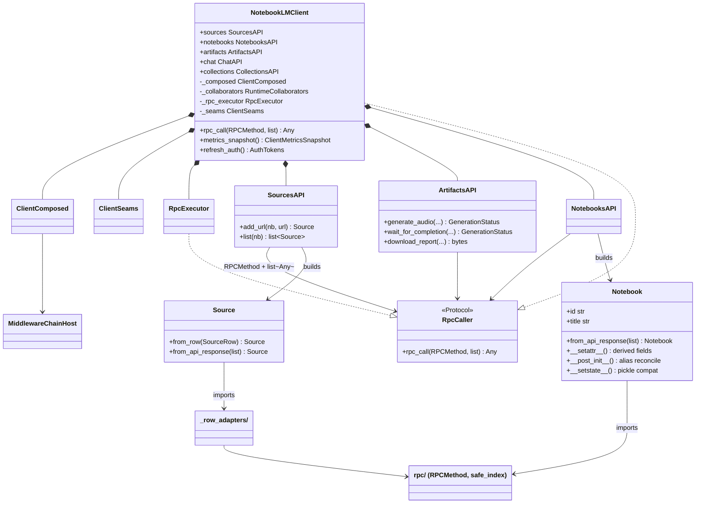
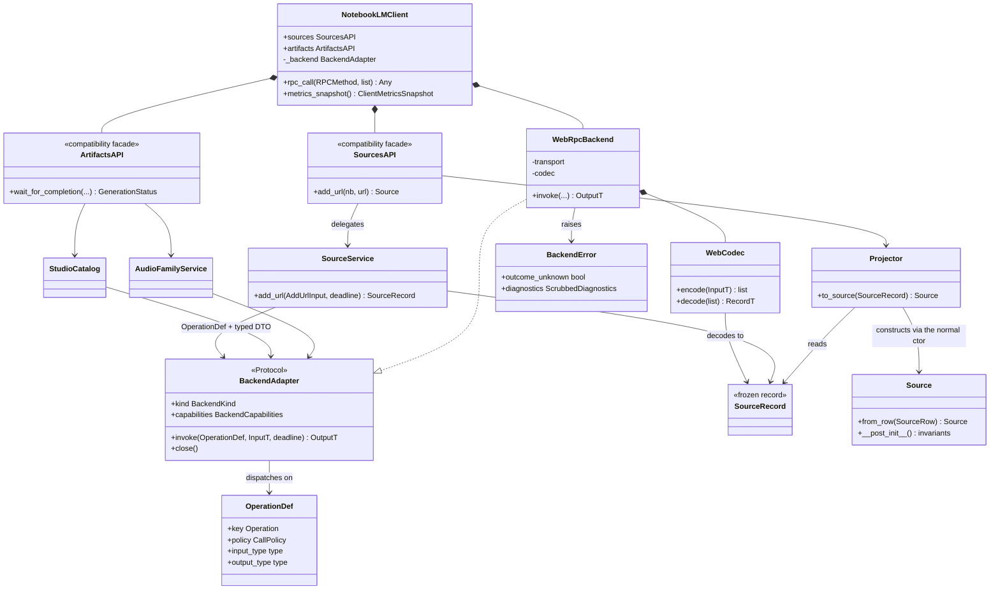
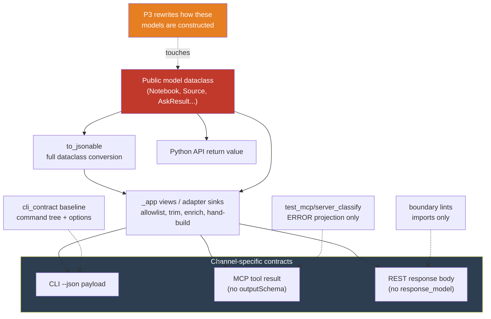
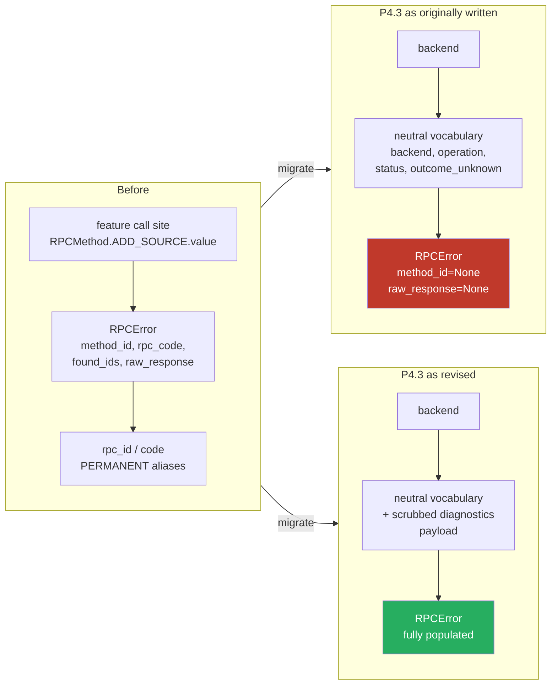
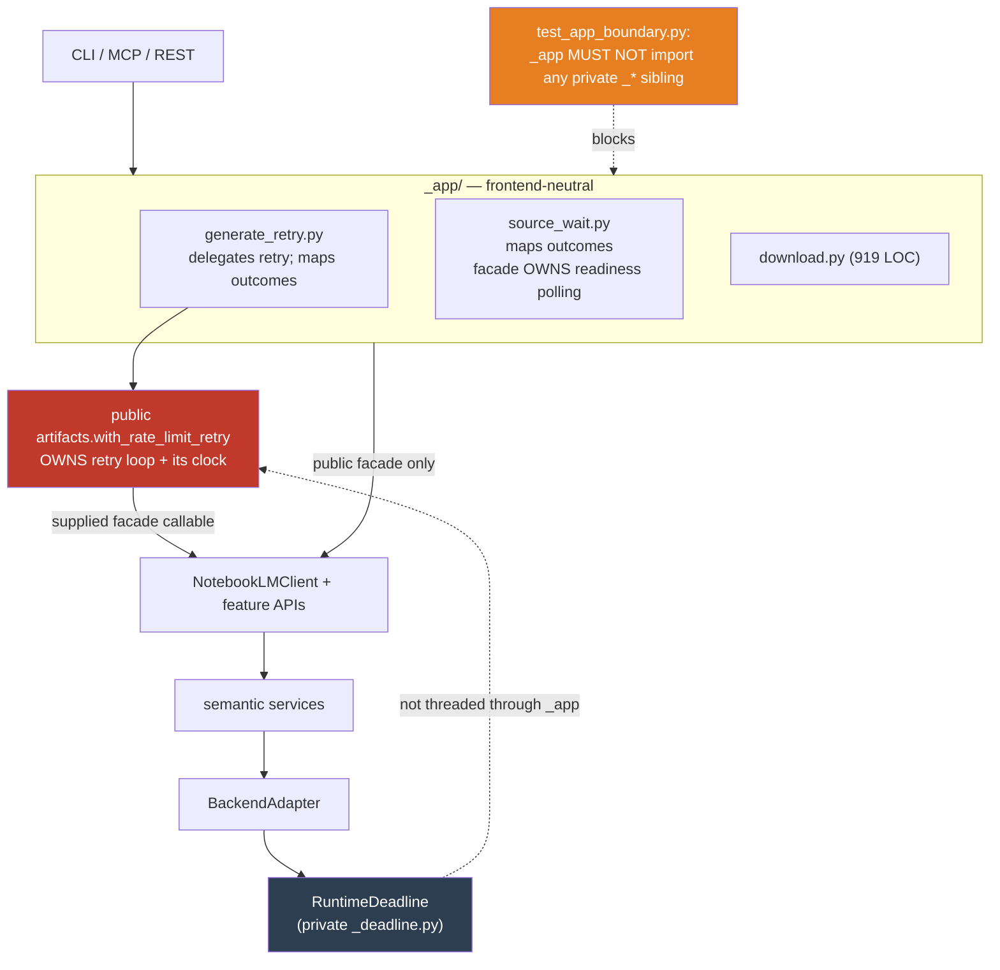

# Semantic backend refactoring plan

**Status:** Accepted for P0-P8; P7-last, P3, and P8 approved by owner decision
**Implementation status:** P0's catalog and compatibility-contract evidence are complete and
frozen. P1–P8 are implemented on `refactor/semantic-backend-dev` with per-phase completion
evidence recorded below; they are not yet merged to `main`. P9 (web-backend decomposition) is
proposed 2026-08-24, not approved and not started; its entry record is measured and its
projections are estimates.
**Planning date:** 2026-08-13
**Planning base:** `main` at `3bb0c185` (re-pinned; the original `dd710a09` base had drifted).
P0's inventory is independently measured at its PR merge base, which for this frozen baseline is
also `3bb0c185`.
**Scope:** internal architecture of the `notebooklm` package; no public API break is authorized by
this plan
**Decision:** introduce a semantic backend boundary incrementally beneath the existing public
client and `_app/` layer; do not rewrite the repository or make mobile gRPC the first milestone

## Goal

Move the current web-specific client toward a resource-oriented, backend-neutral core without
discarding the production behavior, compatibility surface, authentication hardening, delivery
adapters, or recorded evidence already present in the repository.

The refactor should make these statements true:

1. Domain services invoke typed semantic operations rather than `RPCMethod` plus positional
   `list[Any]` payloads.
2. Web positional arrays and future mobile protobuf messages terminate inside backend codecs.
3. Public models do not need to know how either wire protocol encodes a resource.
4. Protocol-specific authentication, retry rules, upload choreography, and error translation are
   owned by the selected backend.
5. The current Python API, CLI, MCP server, REST server, profiles, and on-disk formats remain usable
   throughout the migration.
6. Every migration PR is independently green, reversible, and leaves one authoritative execution
   path for each migrated operation.

The target is not a literal port of the separate greenfield design. That design is an architectural
input: its semantic backend seam, resource/service split, operation capabilities, and explicit
uncertainty model are adopted where they solve current problems. Its narrower product scope and
unimplemented public surface are not treated as reasons to remove current functionality.

## Why this refactor

The current architecture has a useful frontend-neutral boundary but lacks a protocol-neutral
boundary.

```text
CLI / MCP / REST
        |
        v
_app use cases                 frontend-neutral today
        |
        v
NotebookLMClient + features    web-RPC-specific today
        |
        v
RpcCaller(RPCMethod, list[Any])
        |
        v
batchexecute transport
```

The `_app/` layer should remain. It centralizes workflows shared by Click, FastMCP, and FastAPI and
is governed by ADR-0021. The missing layer belongs below the public client:

```text
CLI / MCP / REST
        |
        v
_app use cases                         frontend-neutral
        |
        v
legacy and future client facades
        |
        v
semantic domain services               backend-neutral
        |
        v
BackendAdapter + closed Operation
        |                         |
        v                         v
WebRpcBackend                 MobileGrpcBackend
array codec                   protobuf codec
cookie provider               bearer provider
web transport                 gRPC transport
```

The semantic boundary is valuable even if `MobileGrpcBackend` is never shipped. It isolates the
undocumented web grammar, makes workflows and retry semantics reviewable by product operation, and
gives tests a stable substitute boundary.

## Structure before and after

The diagrams below use the repository's real class names. They are the shape the phases must
produce; where a diagram and the prose disagree, the diagram is wrong and should be corrected.

### Key classes today

One runtime, web-shaped end to end. Feature APIs speak `RPCMethod` + `list[Any]`; public models
decode their own wire rows.



The two structural problems are visible in the arrows: every feature API depends on `RpcCaller`
(a `batchexecute`-shaped surface), and the **public models point down into the wire layer** rather
than being built from it.

### Key classes after P0-P8



Arrows now point **up** from the wire: codec builds a record, a projector builds the public model,
and no feature service names `RPCMethod`. `rpc_call()` survives unchanged as the documented web-only
escape hatch.

Two constraints the diagram cannot show, both load-bearing:

- **`Projector` MUST construct via `__init__` or `dataclasses.replace`.** The `object.__new__` +
  `__dict__.update` fast path silently defeats `__setattr__`, `__post_init__`, and `__setstate__` --
  and `ChatReference.__post_init__` raises `ValueError` on inverted ranges, so bypassing it converts
  a validation error into corrupt data. The compat audit cannot catch this: `collect_class` skips
  `_`-prefixed names.
- **`Source.from_row()` / `from_api_response()` stay importable** on their public runway to v1.0.
  They simply stop being the production decode path.

## Impact of the refactor

### 1. The blast radius nobody sees: four related surfaces, several projections

This is the highest-risk consequence of P3 and the reason its projector step needs the tightest
specification in the plan.



Dashed crossed edges are gates that **do not** cover the payload. A model-field change always
changes the Python contract and the full `to_jsonable` conversion, but it reaches a frontend only
where that channel's sink selects it. `Source` and `Notebook` use allowlisted views, `AskResult`
trims `raw_response` and `answer_document`, and `ShareStatus` and mind-map results have manual or
enriched shapes. P0's `json_envelope` closes the real hole by pinning the exact projection mode,
keys, nested keys, and evidence for each CLI/MCP/REST sink. Its full exported-dataclass inventory
is supplemental, not a claim that every model reaches every channel.

### 2. Error diagnostics: what P4.3 would have deleted



The middle path passes an `isinstance` mixin pin and ships green, because attribute *population* was
unpinned. `docs/stability.md` marks `rpc_id`/`code` exempt from the deprecation cycle precisely
because "removal can mask the original exception inside `except` handlers".

### 3. The `_app/` boundary problem — why P4.2 was unmeetable



The exported `notebooklm.artifacts.with_rate_limit_retry` helper is a **second execution authority**
for artifact generation when `_app/generate_retry.py` calls it around the initial facade operation.
The `_app` caller cannot receive a `RuntimeDeadline` because the guardrail forbids the import. So
"one total deadline is observable" was unmeetable, and migration rule 2's duplicate-authority
counter starts non-zero. P4.2 removes only that internal use through a public facade parameter; the
exported helper remains available to external callers.

### 4. What actually shrinks, and when

```mermaid
gantt
    title Net code impact by phase (P7 is the only approved phase that deletes)
    dateFormat X
    axisFormat %s

    section Additive
    P0 catalog + ADR            :0, 1
    P1 port + fake              :1, 2
    P2 notebook/source slice    :2, 3
    P3 codec split              :3, 4
    P4 policy + deadline        :4, 5
    P5 Studio families          :5, 6
    P6 remaining domains        :6, 7

    section Deletes
    P7 runtime collapse (-2865 LOC) :crit, 7, 8

    section Auth
    P8 cookie provider          :8, 9
```



Every phase before P7 is net-additive; the plan concedes this. P7 is the only phase whose deliverable
is deletion — the former ClientComposed module (165) + the now-retired `_client_assembly` module
(420) + the now-retired `_client_seams` module (74) + the former middleware package (2,206) =
**2,865 LOC**. Sequenced last, the effort pays roughly 40 PRs of additive
cost before collecting any simplification, and a stall anywhere in P1-P6 leaves the repository
strictly worse off than not starting. See the open sequencing decision above.

## Current-state findings

The findings below are design inputs, not criticisms of the behavior they currently protect.

| Finding | Current evidence | Refactoring consequence |
|---|---|---|
| Feature APIs are coupled to the web wire vocabulary | 435 source lines mention `RPCMethod`; the reproducible P0 measure below finds 170 direct `RPCMethod.<member>` expressions outside `rpc/`, `_idempotency*`, and `_row_adapters/`, plus many `list[Any]` request/response shapes. The figure that actually governs P6/P7 effort is the **1,740 references in `tests/`** | Add a semantic operation port below feature behavior; migrated services must not import `RPCMethod` |
| The current neutral layer is neutral only across frontends | `_app/` shares application workflows, while `RpcCaller` remains explicitly `batchexecute`-shaped | Preserve `_app/`; add backend-neutral services below it |
| Public models participate in decoding | `Notebook`, `Source`, `Artifact`, `Label`, `Collection`, and sharing types expose or use `from_api_response()` / `from_row()` paths | Move live decoding to a private web codec and project private records into models |
| Composition has accumulated mutable holders and test seams | At the P0 baseline, `NotebookLMClient`, the now-retired `_client_assembly` module, `ClientComposed`, `RuntimeCollaborators`, `RpcExecutor`, `MiddlewareChainHost`, and six middleware objects participated in one web runtime | Do not simplify this graph first; isolate it behind `WebRpcBackend`, then collapse it after feature callers leave it |
| Artifact behavior is decomposed by verb, and every verb still branches on family | `_artifacts.py` is 988 lines and already delegates to listing/generation/download services plus `_artifact/polling.py`, `formatters.py`, `validation.py`, `payloads.py`. The existing split is by **verb**; P5 proposes one by **family** | Carve family services out of the existing verb services; each verb service retires as its last family leaves. This is a re-split of already-split code, not a first decomposition |
| Retry safety is expressed primarily by native method | The idempotency registry is keyed by `RPCMethod` and variant, while one semantic workflow may use several RPCs | Add semantic `CallPolicy`; retain the existing registry as the web binding authority until parity is proven |
| Deadline handling is correct locally but not uniformly end-to-end | `RuntimeDeadline` is used in retry and polling, while research, upload, auth, and adapter workflows also manage their own budgets | Pass one absolute monotonic deadline through each semantic operation |
| Authentication mixes bootstrap, live session, persistence, and client concerns | `AuthTokens`, refresh coordination, cookie persistence, keepalive, profile recovery, account routing, and HTTP state meet at client construction | Extract a web cookie-provider seam only after the semantic backend exists; preserve profile/login subsystems |
| Some production structure exists to retain deep test mutation seams | Runtime comments and guardrails preserve live rebinding, factory-shell parity, and middleware inspection | Move service tests to fake backends and provider/clock seams before deleting the old test-shaped runtime paths |
| The current repository has evidence worth preserving | Web VCR fixtures, strict row adapters, idempotency decisions, auth concurrency tests, and public compatibility gates encode hard-won behavior | Reuse them as behavioral oracles; do not equate a new module graph with permission to re-record or weaken tests |

## Architectural principles

### 1. Semantic operations are the internal source of truth

Each supported product action has one closed semantic operation. An operation definition binds:

- a stable internal key;
- an input DTO type;
- an output record type;
- a semantic call policy;
- capability metadata for each implemented backend; and
- a backend-specific handler or explicit unsupported disposition.

Illustrative shape:

```python
InputT = TypeVar("InputT")
OutputT = TypeVar("OutputT")


class CallPolicy(Enum):
    READ = "read"
    STATEFUL_START = "stateful_start"
    MUTATION = "mutation"
    STREAM = "stream"


@dataclass(frozen=True, slots=True)
class OperationDef(Generic[InputT, OutputT]):
    key: Operation
    policy: CallPolicy
    input_type: type[InputT]
    output_type: type[OutputT]
```

`Operation` is internal. It is not a public raw-invocation API and does not replace the existing
documented `rpc_call()` escape hatch during the compatibility period.

### 2. The backend is semantic, not merely HTTP-shaped

The backend port accepts semantic DTOs and returns neutral records:

```python
class BackendAdapter(Protocol):
    kind: BackendKind
    capabilities: BackendCapabilities

    async def invoke(
        self,
        operation: OperationDef[InputT, OutputT],
        value: InputT,
        *,
        deadline: RuntimeDeadline | None,
    ) -> OutputT: ...

    async def close(self) -> None: ...
```

Streaming may use a separate typed method or context-manager protocol when chat is migrated. Do not
force streams through a unary `invoke()` result.

An adapter handler may own a composite workflow when protocols differ. Examples include source
registration/reconciliation, web file upload, and a future mobile tentative-source commit. Shared
services own only validation, projection, and workflows proven identical across backends.

### 3. Wire codecs and public projection are separate

The dependency direction is:

```text
web array/protobuf message -> private backend record -> public/domain model
```

Backend codecs may import wire types and private neutral records. They must not return raw arrays or
generated protobuf messages. Shared projectors may import records and model types. Public models
must not import backend codecs.

**The exported document graph needs an explicit ruling before P3 touches it.** Today's wire adapters
construct exported `StructuredDocument` objects directly, which contradicts "codecs never return
public models". Either introduce private document records plus a projector that preserves UTF-16
offsets and rendering, or classify the document graph as transport-neutral value types exempt from
the private-record rule. Pick one and enforce it with a guard; leaving it implicit means P3 discovers
it mid-migration.

Existing `from_api_response()` methods remain temporarily for compatibility but cease to be the
production decode path resource by resource. Their eventual deprecation/removal requires the normal
public runway and is not authorized by this plan alone.

### 4. Resource data does not perform network I/O

Resources remain plain data. Services perform reads, writes, waits, and downloads. Frozen and
slotted applies to **private neutral records only**. It is an explicit non-goal for the public
models: `Notebook`, `Source`, `Artifact`, `GenerationStatus`, `ChatReference`, and `AskResult` stay
non-frozen and non-slotted, because production mutates them in place (`_app.notebooks`' timestamp
backfill writes `last_viewed_at`) and their invariants live in `__setattr__` precisely because a
construction-only hook would let derived fields go stale. Existing public model mutability, aliases,
pickle behavior, equality, and constructor compatibility remain unchanged until a separate public
API decision.

### 5. Capabilities reject unsupported work before side effects

Capabilities are immutable backend facts. An unsupported operation or input variant must fail
before credential acquisition, file opening, or network I/O.

Capability evidence and unsupported reasons should initially remain internal diagnostics. Exposing
them publicly would freeze research metadata and is deferred until there is a demonstrated caller
need.

### 6. One deadline covers one semantic call

A service starts or receives one `RuntimeDeadline`. Credential acquisition, queueing, transport
attempts, backoff, upload phases, polling, and reconciliation consume the same remaining budget
unless a workflow explicitly documents a separately reserved reconciliation budget.

No nested layer may silently reset the caller's total budget. Adapter-native connect/read timeout
settings may clamp individual attempts but do not extend the semantic deadline.

### 7. Mutation uncertainty is explicit and selective

Operations with a real commit-lost or partial-commit state expose a safe receipt or structured error
containing only the information needed for reconciliation. Do not create phase/result classes for
simple commands whose success is unambiguous.

Absence after an ambiguous write is not automatically proof of failure. A backend may promote an
unknown result only with operation-specific positive evidence.

### 8. Authentication is a backend dependency

The eventual runtime seams are distinct:

- `WebCookieProvider` supplies immutable cookie/account-route generations to `WebRpcBackend`.
- `AccessTokenProvider` supplies short-lived bearers to `MobileGrpcBackend`.

Interactive login, browser capture, master-token storage, profile migration, and operator commands
remain outside domain services. Sharing a durable profile source does not imply sharing sessions,
cookie jars, channels, retry state, or locks.

### 9. Frontend adapters remain thin and shared workflows stay in `_app/`

ADR-0021 remains in force. CLI, MCP, and REST do not call backend adapters or wire codecs directly.
They continue to use `_app/` functions and client/service facades.

Do not move semantic backend behavior into `_app/`; do not duplicate `_app/` workflow logic in the
new services. The dividing question is:

The two-question form of this test is unusable, because for a large class of real code both
questions answer "yes" and the resulting placement is structurally impossible: `_app/` is forbidden
by `tests/_guardrails/test_app_boundary.py` from importing any private sibling, so anything
classified as a semantic service becomes unreachable from `_app/`. Use three rules instead:

- **(a)** Needs a backend call -> semantic service. `_app/` reaches it only through a public facade
  method.
- **(b)** Composes several facade calls plus presentation-neutral policy -> stays in `_app/`.
- **(c)** Both -> the backend-touching half moves down; `_app/` keeps the composition and **gains a
  public facade parameter** for anything it used to own (deadline, retry budget).

`_app/` never imports a private module. `test_app_boundary.py` is the arbiter, not this principle.

**`_app/` needs a real disposition, and P0 must produce it.** A material share of the orchestration
this plan wants semantic services to own already lives *above* the public facade:
`_app/generate_retry.py` delegates to the exported `notebooklm.artifacts.with_rate_limit_retry`
loop, `_app/source_wait.py` validates and maps outcomes while the source facade alone polls,
`_app/download.py` (919 lines) owns download choreography, and `_app/pagination.py` reasons about a
*protocol* fact (that the underlying
`batchexecute` RPCs do not paginate) inside the frontend-neutral layer. Until P0 records, per
operation, which of these `_app/` orchestrators stop orchestrating and which public facade
signatures grow to accept a budget, principle 6's single-deadline goal and migration rule 2's
single-authority goal are both structurally unreachable.

## Compatibility contract

This plan preserves the existing public surface while internal slices migrate. Note the governing
policy: `docs/stability.md` treats everything reachable from `__all__` as stable, and the project is
0.x, so a removal needs one MINOR of `DeprecationWarning` rather than a major bump. That lowers the
cost of an *intended* removal but does nothing for an *accidental* one, which is what the rules
below exist to prevent.

- `import notebooklm` remains the import path.
- `NotebookLMClient`, `from_storage()`, constructor behavior, context management, and current
  namespace attributes remain available.
- Current public method signatures, return types, exception types, deprecations, and documented
  side effects do not change in an internal migration PR.
- CLI JSON envelopes, exit codes, MCP tool contracts, REST routes, profile formats, environment
  variables, and logger namespaces remain unchanged unless a separate product change authorizes
  them.
- A public model's field set defines its Python contract and its **full** `to_jsonable` conversion;
  it does not by itself define every CLI, MCP, or REST result. Channel sinks may serialize the full
  model, select an allowlisted view (`Source`, `Notebook`), trim it (`AskResult`), enrich it, or
  build a different shape (`ShareStatus`, mind maps). No phase may convert a public dataclass field
  into a property, rename one, or drop one. Separately, each existing adapter projection retains
  its exact keys. That includes `Notebook.modified_at` wherever `notebook_view` /
  `notebook_viewed_keys` emits the compatibility alias and `ChatReference.answer_start_char` /
  `answer_end_char` in the `AskResult` projections that include references. `AuthTokens` aliases
  remain Python compatibility only. The object is excluded from the exported/full-`to_jsonable`
  inventory and recursive serialization is forbidden; only the exact redacted MCP/REST
  `server_info` identity contributions may emit `authuser` / `account_email`. `storage_path` and
  profile-session generation may influence cache/fallback selection but may not be emitted.
- Observability types are part of the public surface and are equality-pinned, not merely "kept
  working": `ClientMetricsSnapshot`, `RpcTelemetryEvent`, `ConnectionLimits`, and
  `NotebookLMClient.metrics_snapshot()` retain their current field names, types, population rules,
  and per-call emission points. Relocating metrics/tracing ownership into a backend (P7) is a
  code-motion change to these, never a content change.
- The documented exception mixin lattice is preserved exactly: `*NotFoundError` types remain
  catchable as `RPCError` and as `NotFoundError`; `*TimeoutError` types remain catchable as
  `WaitTimeoutError` and as the built-in `TimeoutError`; `NonIdempotentRetryError` continues to be
  raised by exactly the calls that raise it today. These invariants were restored deliberately in
  v0.6.0/v0.7.0 and are the most likely casualty of an error-vocabulary round trip.
- `from_api_response()` / `from_row()` are classmethods on classes exported in `__all__`. They are
  therefore public under the `docs/stability.md` rule, and P3 retires them as the *production decode
  path* only. Removal follows `docs/stability.md` 0.x semantics (one MINOR of `DeprecationWarning`)
  under a separate decision.
- Existing web cassettes must remain valid unless new live evidence proves the wire changed. A code
  relocation is not a reason to re-record fixtures.
- `NotebookLMClient.rpc_call()` and documented `notebooklm.rpc` helpers remain web-only legacy escape
  hatches. They do not become methods on a future backend-neutral client.
- **The RPC-override recovery path keeps working for every migrated operation.** `docs/stability.md`
  documents `from notebooklm.rpc import RPCMethod, resolve_rpc_id` and the
  `NOTEBOOKLM_RPC_OVERRIDES` environment variable as the user-facing remedy for Google rotating a
  method ID -- the single most likely breakage in this project. Web backend dispatch and codec
  bindings MUST resolve ids through `resolve_rpc_id`; "confine `RPCMethod` to web bindings" must not
  become "bind the enum value at import time". A migrated operation that ignores an active override
  is a release blocker, and P0's audit must include an override-honored check per binding.
- A future `GeminiNotebookClient` or new immutable public model system requires a separate API ADR.
  This plan does not decide whether that name is an alias, a new class, or a separate major-version
  surface.

## Relationship to existing ADRs

**This plan is not authorization to violate any accepted ADR.** P0's ADR records the full
disposition for every one it touches, preserving, amending, or superseding each explicitly.

Only these carry a concrete gate a phase will hit, and each is named in the phase that must act on
it rather than parked in a table:

| ADR | Gate | Phase that must act |
|---|---|---|
| ADR-0008 module-size ratchet | `test_module_size_ratchet.py` fails a module the refactor *shrinks* unless its ceiling is retightened in the same PR | every code-motion PR |
| ADR-0011 schema validation | `test_no_raw_positional_rpc_indexing.py` sanctions only `rpc/` and `_row_adapters/` as decode homes | P3 (amends the guard in-PR) |
| ADR-0019 error-and-return contract | Composite listing has a deliberate partial-availability rule: a transport failure in the mind-map sub-fetch returns Studio artifacts with an unknown-fetch sentinel, while a `DecodingError` propagates | P5 must preserve that distinction exactly |
| ADR-0020 sealed async result types | Recommends **continued deferral** of a sealed `GenerationStatus` union; the design was rejected for 0.8.0 | P5 must not quietly implement it. Deferral is **full**: `GenerationStatus` stays flat, mutable, nominally identical, and raw-string-permissive; `NOT_FOUND` stays poll-only and `REMOVED` wait-only; callback and timeout-transition payloads stay `GenerationStatus` |
| ADR-0021 transport-neutral app layer | `test_app_boundary.py` forbids `_app/` importing any private sibling | P4.2, principle 9 |
| ADR-0022 regenerable baselines | P0's catalog is a registered baseline, not a bespoke audit | P0 |
| ADR-0026 MCP studio surface | `test_studio_enum_manifest.py` pins `mcp/tools/studio.py` | P5 |
| ADR-0029/0030 auth | **Accepted (rolling out)** with in-flight PR stacks in P8's subsystem | P8 sequences against live work, not accepted text |
| ADR-0031 credential tier model | **Proposed**, not accepted; its Stage 5 was superseded by deferral | Preserve implemented stages and the ADR-0033 deferrals; do not treat it as settled |
| ADR-0016 / ADR-0032-0034 auth ownership | Concrete identity and lifecycle gates P8 touches directly | Preserve the `AuthTokens` identity invariant, the `notebooklm._core` logger namespace, mutable live-jar ownership, and every named store/persistence/resolver lifecycle. `WebCookieProvider` **composes** these owners; it does not absorb them |

ADR-0005 is a special case: `CallPolicy` is a **derived view** over the idempotency taxonomy, never
a competing authority. P4.1 changes no retry behavior, so no phase makes `CallPolicy` authoritative,
and shipping both as authorities would realise Risk 1 in this plan's own text.

## Deprecation runways in flight

Four runways intersect these phases. ADR-0018 governs them and
`scripts/check_deprecation_targets.py` runs in CI, so none can slip quietly.

| Runway | Removal | Collides with |
|---|---|---|
| MCP `research_status(task_id=)` / `research_import(task_id=)` / `research_cancel(run_id=)` -> `poll_task_id` | **v0.9.0** -- the next minor | P6.2's own domain. It also adds a `deprecation` key to the tool result, so removal changes an MCP response payload. Land it as its own product PR before or after the research migration, never inside it (migration rule 3) |
| `await NotebookLMClient.from_storage(...)` | v1.0 | P8 -- see below |
| Pre-profiles home-root read fallback (`paths.py::_legacy_fallback`), per-read `DeprecationWarning` | v1.0 | P8's "keep paths unchanged" list enumerates *mechanisms* and misses this *behavior* |
| Eight docs-only public aliases (`AuthTokens.cookies`/`.cookie_jar`/`.jar`/`.cookie_header`/`.cookie_header_for`, `ChatReference.answer_start_char`/`.answer_end_char`, `Notebook.modified_at`) | v1.0 | P3, P6.1, P8. They are docs-only because a runtime warning would fire from ordinary model operations. The reference/notebook aliases remain in the channel projections that already emit them. `AuthTokens` itself is never recursively serialized; only two explicitly redacted `server_info` identity contributions are adapter-reachable, and none of these aliases may become an adapter key. |

**P8 must not leak a provider on the deprecated await path.** `from_storage()` has two terminal
paths and the "a convenience factory closes only providers it creates" rule is written for one:
`__aenter__` builds *and enters*, but `__await__` returns a **built-but-unentered** client (its
docstring says so). If P8 moves provider construction into `_build()`, the await path creates a
provider that is never entered and never closed -- a resource leak on a path the runway keeps alive
through v1.0, invisible to every existing gate. Defer provider acquisition to `__aenter__`, or have
the returned client's own `close()` own it. Keep the `DeprecationWarning` and its `stacklevel=3`.

## Migration rules

1. **Add -> delegate -> delete, in one PR.** Introduce a new seam, delegate one existing path
   through it, prove parity, and remove the superseded path **in the same PR**. The dead-parallel
   interval between a "delegate" PR and a "delete" PR has no independent revert value and is exactly
   the state migration rule 2 forbids; the module-size ratchet also forces the ceiling drop into the
   delete commit. Splitting them creates work and a rule-2 violation simultaneously.
2. **One authority per operation.** Temporary facades may translate inputs/results, but old and new
   implementations must not independently execute the same semantic workflow.
3. **No mixed behavior PRs.** A PR that changes architecture must not also intentionally change a
   public result, retry policy, RPC body, or CLI envelope.
3b. **No architecture PR adds an allowlist entry.** The compatibility guarantee is enforced by
   `scripts/audit_public_api_compat.py`, which diffs the public surface against the last release tag
   -- including `__init__` signatures, so dataclass field order and positional construction are
   pinned. But it consults `scripts/api-compat-allowlist.json`, whose `allowed_breaks` is currently
   empty and whose matcher is `fnmatchcase` on both fields, with `*` crossing dots. One entry of the
   form `{"code": "*", "object": "notebooklm.*"}` silences the entire audit and makes "zero audit
   failures" vacuously true. A break that needs an allowance is by definition not an internal
   refactor: it goes in a separate reviewed PR with a deprecation runway.
4. **No speculative abstraction.** Add DTOs, records, services, and capability rows only for a
   migrated operation or the immediately following bounded slice.
5. **No backend branching in services.** Backend-specific decisions live in adapter bindings or
   capabilities. Services may branch on semantic results, not `BackendKind`.
6. **No raw wire escape from adapters.** New backend handlers return typed neutral records, never
   `Any`, positional arrays, protobuf messages, response bodies, or native transport exceptions.
7. **No new deep patch seams.** New tests inject a fake backend, provider, clock, or private
   transport factory. They do not require post-construction mutation of internal runtime objects.
8. **Keep temporary bridges visible, and lint it.** Transitional adapters and compatibility
   projectors carry a removal phase reference in their module docstring, enforced by
   `tests/_guardrails/test_no_anonymous_bridges.py`: a module whose docstring matches
   `transitional|bridge|temporary|compatibility projector` MUST also match `Removal: P\d`, and the
   current phase must not exceed any recorded removal phase. This is the Risk 1 control; in a repo
   where every comparable policy has an AST lint (ADR-0007, ADR-0011, ADR-0008), leaving the single
   most important control as a docstring convention is not a control.
9. **Retire guardrails deliberately.** A structural guard may be removed only in the same PR that
   introduces an equivalent behavioral/contract gate or proves the guarded structure no longer
   exists.
10. **Measure before and after.** Each phase records every row of the Measurements table. That
    table is the sole authoritative measurement list; this rule does not maintain a second one.

## Owner sequencing decision (resolved)

Review surfaced an evidence-backed challenge to the phase order. The owner considered both cases
below and resolved it before P1: retain the written phase order, approve P3 within its wire-evidence
constraints, and approve P8 after P7.

**The case for running P7 first, standalone.** P7 is the only phase whose deliverable is deletion:
the former ClientComposed module (165) + the now-retired `_client_assembly` module (420) + the
now-retired `_client_seams` module (74) + the former middleware package (2,206) = **2,865 LOC** of
collapse. Every other phase is net-additive, which this plan concedes.
Sequenced last, the effort pays roughly 40 PRs of additive cost before collecting any simplification
— and if it stalls anywhere in P1-P6, the repository ends **strictly worse**: all of the translation,
none of the collapse.

P7's stated entry criterion ("no semantic service consumes `RpcCaller`") is self-imposed rather than
real. Nothing about deleting a mutable composition graph requires `_notebooks.py` to stop importing
`RPCMethod` first. The actual precondition is Risk 5 — tests must stop mutating the live chain — and
the repo is already most of the way there (`test_no_forbidden_monkeypatches.py` ships all three
allowlists as `frozenset()`).

Worse, Risk 5's control ("migrate tests to backend/provider/clock seams **before P7**") is assigned
to no phase and no PR. It is homeless work guarding the exact ossification the sequencing creates:
every month P7 waits, more tests are written against the structure P7 must delete.

**The counter-case.** P7 collapses the runtime that P1-P6 are supposed to isolate first. Running it
first means restructuring composition while feature code still calls `RpcCaller` directly, which is
the coupling the transitional backend exists to break. The plan's original order is not arbitrary.

**Owner decision:**

1. **P7 runs last as written.** P1-P6 first isolate semantic callers from `RpcCaller`; P7 then
   collapses the web runtime with behavioral parity gates and migrated test seams. The stop/go
   reviews remain responsible for preventing the additive bridges from becoming permanent.
2. **P3 is approved.** Its purpose is private record -> compatibility projection, not a cosmetic
   rename. It reuses the strict row-adapter logic, ADR-0011 drift detection, empty-allowlist lint,
   and the 128 `_wire_contract` mappings. The exported structured-document graph is classified as
   transport-neutral value types exempt from the private-record rule; codecs construct it through
   validating public constructors, and a dependency guard keeps wire knowledge out of the types.
3. **P8 is approved after P7.** The provider composes existing auth owners and proves ownership,
   lifecycle, awaited-`from_storage()` cleanup, and backend isolation; it does not reimplement
   single-flight, profile storage, recovery, locking, or persistence merely to make the seam exist.

P1-P8 are therefore approved subject to their entry criteria, acceptance criteria, and stop/go
reviews. Public-surface (vNext) work and a mobile backend remain separate decisions; P9 below is
the proposed web-backend decomposition and requires its own approval.

## Phase and PR sequence

The phases are ordered by dependency. P0 through P6 establish the semantic core. P7 and P8 simplify
the web runtime and authentication after callers are isolated. A public vNext surface and a mobile
backend are separate future decisions, not phases in this plan. P9 (web-backend decomposition) is
proposed and not part of the approved sequence.

```text
P0 operation inventory + ADR
  -> P1 semantic port foundation
    -> P2 notebook/source vertical slice
      -> P3 codec/model separation
        -> P4 policy/deadline/error convergence
          -> P5 Studio family split
            -> P6 remaining feature migration
              -> P7 web runtime collapse
                -> P8 cookie-provider extraction
```

### P0 — Decide the boundary and inventory operations

**Purpose:** establish one reviewed semantic vocabulary before adding runtime abstractions.

#### Changes

- Add an ADR for the semantic backend boundary, dependency direction, compatibility strategy, and
  relationship to ADR-0005/0009/0013/0014/0021.
- Build an equality-pinned inventory of every currently supported semantic operation. Include:
  - semantic operation key and owner;
  - every current namespace method, public root-client member, and `_app` caller;
  - each exact execution authority as transport kind, native/web binding, source site, and semantic
    discriminator;
  - operation variant;
  - current idempotency classification;
  - read/stateful-start/mutation/stream policy;
  - required notebook route context;
  - variant-specific response decoder/projector and golden scope/disposition;
  - per-binding override source-dataflow and runtime-test proof;
  - composite/reconciliation behavior;
  - evidence source and cassette coverage; and
  - current omissions relative to the full product surface.
- Include current features omitted by the greenfield v0: source listing, settings, individual
  sharing, prompt/report suggestions, generic artifact actions, retry, mind maps, data tables, and
  supported exports/download formats.
- The catalog is an **ADR-0022 baseline** registered in `tests/_baselines/registry.py`, not a new
  bespoke audit. Focused specification, authority, AST-inventory, and evidence modules feed one
  build/audit CLI. The projection derives native identity/idempotency, exact direct transport sites,
  public/app callers, codec/golden evidence, override proof, and captured product omissions. Owner,
  semantic policy, route context, composite behavior, discriminators, and migration disposition are
  reviewed. Copying those derived columns into a hand-pinned table is not reviewable.
- The catalog records, per operation, **every existing execution authority**, including RPC,
  streaming query, resumable upload, HTTPS download, and `_app` orchestration. The P0 projection
  allocates 157 exact authority rows; 39 of 86 semantic operations have more than one. It records
  11 divergences: 10 authority divergences with a named collapse phase, plus `source.refresh` as
  the one policy divergence.
- Add `"collections"` to `CLIENT_NAMESPACE_ATTRIBUTES` in `scripts/audit_public_api_compat.py` and
  absorb the baseline delta. `docs/stability.md` lists `NotebookLMClient.collections` as stable, but
  the audit records only a bare instance-attribute -- its nine methods are invisible, so "audit
  failures: zero" is vacuous for that namespace and migration rule 3b has nothing to bite on.
- Extend the named-owner rule from "every public client method" to **every public method on every
  namespace sub-client** -- `chat.set_bound_loop` and `chat.reset_after_open` are audit-visible and
  are exactly what a P7 loop-affinity simplification would delete.
- Give every public `NotebookLMClient` method/property/classmethod its own fail-closed disposition.
  P0 records ten root members across auth, lifecycle, observability, and raw behavior;
  `rpc_call()` remains the explicit web-only raw escape hatch rather than disappearing from the
  audit.
- Register a `public_model_contract` ADR-0022 baseline for **every exported dataclass and enum**,
  recording module/qualname, dataclass flags, slots, constructor/field order, equality/hash/repr
  policy, first-party pickle-state hooks, and a structured valid-instance pickle outcome. A real
  failure is recorded by stage/type/category rather than replaced by a fabricated instance or
  treated as an audit crash; current P0 truth is 85 successes and one `AuthTokens` dumps failure.
  `Notebook` and `ChatReference` additionally exercise their supported legacy-state restores and
  current-state round trips. `scripts/audit_public_api_compat.py` records signatures, fields,
  members, and enum values but **not** these. Architecture PRs may not regenerate this baseline to
  acknowledge drift.
- Register `json_envelope` as the closed-world adapter-shape contract. Its primary channel rows
  freeze 31 model identities / 133 projections for CLI, 32 / 123 for MCP, and 32 / 57 for REST:
  313 unique ids. `adapter_sink_reachability` discovers 350 terminal/error sites and assigns 225
  public-projection, 117 reviewed non-public, and eight forwarding-infrastructure dispositions,
  including 15 non-public variants across 14 mixed sites. Every live projection id has a terminal
  allocation;
  adapter registrations and direct JSON bypasses fail closed. It also pins 36 private DTO -> public
  dataclass paths, 16 explicit helper fingerprints, and a compact aggregate digest for the bounded
  521-node / 1,245-edge transitive helper graph (522 unique helpers overall). Thirty-four paths link
  to live projections;
  `SourceRefreshResult.result` is production-dead and `ValidatedSessionConfig.limits` is confined
  to internal runtime configuration. `AuthTokens` is excluded from the exported/full-key inventory
  and admitted only through the two exact redacted MCP/REST `server_info` contributions described
  above.
- Register a `metrics_contract` baseline -- `ClientMetricsSnapshot` field names/types plus per-RPC
  `RpcTelemetryEvent` emission points -- **before P1 lands**. The primary characterization calls
  public `NotebookLMClient.rpc_call()` through the production-composed middleware and
  `RpcExecutor`, reads public `metrics_snapshot()`, and observes the callback on success,
  transport-error, and decode-error paths. Direct non-RPC middleware probes are supplemental. P7
  promises an equality-pin against a "pre-P7 baseline"; captured at P7 that baseline is already six
  phases of code motion late and pins nothing.
- Add an audit that fails when an active `RPCMethod`/variant, namespace method, root-client member,
  or transport-reaching authority has no reviewed disposition/allocation.

#### Expected files

- `docs/adr/00xx-semantic-backend-boundary.md`
- `src/notebooklm/_operations.py`
- `scripts/audit_operation_catalog.py`
- `tests/_guardrails/test_operation_catalog.py`
- this plan and relevant architecture documentation

Exact names may change in the ADR; ownership may not.

#### Open items carried into the P9.0 PR review

Two implementation questions raised in the final review round are recorded here rather than
settled in prose, because their answer is code: (1) the `SourceUploadPipeline` callbacks that the
`SOURCE_ADD_FILE` custom row invokes must execute through that row's `RowInvoker` (invocation-scoped,
same allowlist, same failure tagging) or the row's declared specs are not an enforceable
boundary; (2) selected-spec attribution must survive every adapter rethrow — today
`DeadlineRpcCaller` catches `BackendDeadlineExceededError` and raises a fresh, unchained
`RPCTimeoutError` (`_web/deadline_rpc.py`), which would drop the tag — with a test per declared
legacy spec. Both are P9.0/P9.4 acceptance items for the binding core, not plan decisions.

#### Acceptance criteria

- Every active web RPC method and registered variant is classified or explicitly private/excluded.
- Every current namespace method maps to one or more semantic operations or a local-only helper;
  every public root-client member has an explicit non-feature disposition.
- Every operation authority is allocated exactly once with a transport kind, binding, site, and
  semantic discriminator. Every native binding has a codec/golden disposition and per-binding
  override proof; uncovered goldens remain explicit rather than fabricated.
- There is one authoritative operation catalog and one generated/audited projection.
- No production call path changes.
- The full required test suite and public API audit remain green.

### P1 — Introduce the semantic port and transitional web backend

**Purpose:** create the new dependency boundary without rewriting the stable web runtime.

#### Changes

- Add `BackendKind`, `BackendCapabilities`, the `BackendAdapter` protocol, and the transitional web
  backend **on top of P0's operation vocabulary module**. The inert vocabulary types (`Operation`,
  `CallPolicy`,
  `OperationDef`) already landed in P0, which needs them to make its catalog typed; they are not
  reintroduced here. Only P1 adds runtime types.
- Add the first typed input DTOs and neutral output records only for the P2 slice.
- Implement a transitional web backend whose handlers delegate to the existing `RpcExecutor` and
  current request/row helpers.
- The transitional backend receives `RpcExecutor`; it must not receive or wrap the entire
  `NotebookLMClient`.
- `BackendKind` identifies the *protocol* (web / mobile), never the HTTP client. The repo ships two
  transports -- `httpx` and `_curl_cffi_transport.py`, selected at runtime by
  `NOTEBOOKLM_TRANSPORT=curl_cffi` behind the `impersonate` extra -- and that choice remains a
  `WebRpcBackend` construction parameter. It is not a capability and does not multiply backend kinds.
- Add a recording fake backend for semantic service tests. It validates operation/input types,
  records deadlines, and returns explicit typed records.
- The private backend error record carries the web diagnostic set (`method_id`, `rpc_code`,
  `found_ids`, `raw_response`) as an opaque, already-scrubbed `diagnostics` payload that the backend
  populates and the facade replays verbatim into `RPCError`. P4.3 generalises its *mapping
  coverage*, never its shape. Today those values are stamped at feature call sites from
  `RPCMethod.*.value`; a service forbidden to import `RPCMethod` cannot reproduce them without this.
- **Land the minimal error vocabulary and deadline handoff here, not in P4.** P2's acceptance
  criteria forbid semantic services from importing `RPCMethod`, `RpcCaller`, `httpx`, or raw RPC
  types -- but a service that cannot name a failure or a timeout cannot honor that while P4.2/P4.3
  are still unwritten. P1 therefore ships the smallest error record and absolute-deadline parameter
  the P2 slice needs. P4 *converges and generalizes* them across all operations; it does not
  introduce them. Without this, P2 cannot satisfy its own acceptance criteria except through an
  unscheduled throwaway translation layer.
- Keep the new backend private and construct it in the existing composition root without changing
  public constructor arguments. Route every transitional attribute (`_backend`, records, registry)
  through the then-current `_client_assembly` module, because
  `tests/_guardrails/test_client_factory_parity.py` pins
  `vars(NotebookLMClient)` against the test factory shell and will fail on an attribute added
  directly to the client. That guard is not retired until P7.

#### Expected logical modules

```text
src/notebooklm/
  _backend.py
  _records.py
  _web/
    backend.py
    registry.py
```

The operation vocabulary module is P0's file and is extended here, not created.

The ADR may consolidate these initially. Do not create a file per greenfield diagram entry merely
to mirror the design document.

**Every PR that adds a module under `src/notebooklm/` updates the `### Repository Structure` map in
`docs/architecture.md` in the same commit.** `scripts/check_claude_md_freshness.py` and
`scripts/check_docs_module_refs.py` both run in Code Quality (`.github/workflows/test.yml`), so P1's
new modules red the gate *in P1*. Deferring architecture-doc updates to P7 is mechanically
impossible; only the architecture *narrative* revision waits for P7.

#### Acceptance criteria

- The backend protocol contains no HTTP, cookie, `RPCMethod`, positional-array, protobuf, CLI, MCP,
  or REST type.
- Unsupported operations fail before invoking the wrapped executor.
- The fake backend can exercise a service without building `NotebookLMClient`, middleware, cookies,
  or HTTP clients.
- No public behavior changes and no existing path delegates through the new backend yet.

### P2 — Migrate a notebook/source vertical slice

**Purpose:** prove the semantic seam on both simple reads and one ambiguity-sensitive mutation.

#### P2.1 — read-only notebook and source projection

- Implement semantic notebook list/get and source list/get operations.
- Initially reuse current web request builders and row adapters inside backend handlers.
- Add shared projectors from neutral records to the current public `Notebook` and `Source` types.
- Make `NotebooksAPI.list/get` and `SourcesAPI.list/get` delegate to semantic services.
- Keep current positional signatures, list return types, exceptions, warnings, filters, strict
  count behavior, and `get_or_none()` semantics in the legacy facades.

#### P2.2 — notebook mutations

- Migrate create, title update, and delete through semantic operations.
- Preserve existing idempotency/reconciliation behavior exactly during this phase.
- Keep single-item public delete semantics even if the neutral input uses a batch-capable shape.

#### P2.3 — URL source creation

- Migrate URL-source registration as an adapter-owned web workflow.
- Preserve pre-create baseline, no-blind-retry behavior, exact matching, read-back, optional title
  handling, and existing errors.
- Model internal commit/title uncertainty explicitly, then project it back to the current
  `SourcesAPI.add_url()` contract.
- `SourcesAPI.add_url()` internally routes YouTube URLs to YouTube registration
  (`_sources.py` wires `is_youtube_url` into the adder). Migrating "URL source creation" while
  leaving YouTube on the legacy path would split one public method across two execution
  authorities, violating migration rule 2. Resolve it one of two ways, and state which in the PR:
  (a) migrate the YouTube branch together with the generic URL branch, or (b) keep `add_url()`
  entirely on the legacy path this phase and migrate a narrower operation that has no hidden
  dispatch. Do not ship the split.
- Do not migrate text, Drive, or file upload in the same first mutation PR.

#### Acceptance criteria

- Migrated semantic services do not import `RPCMethod`, `RpcCaller`, `httpx`, row adapters, or raw
  RPC types.
- Existing public API signatures and return/exception behavior remain equality-pinned.
- Relevant current unit, integration, VCR, CLI, MCP, and REST tests pass without cassette changes.
- Each operation has one execution authority; the old facade delegates and does not retain a
  parallel RPC implementation.
- The slice demonstrates a net reduction in direct wire knowledge outside `_web/`.

#### Stop/go review

After P2, review:

- code added versus code removed;
- whether DTO/record/projector layers clarify or duplicate the flow;
- fake-backend test readability;
- cassette invariance;
- traceback and diagnostics quality; and
- whether the operation catalog reduced variant/idempotency ambiguity.

The review has exactly three outcomes, and a **named decider** records which:

- **GO** — proceed to the next phase.
- **REVISE** — a written defect plus a re-review date. Not a synonym for "continue while we think
  about it."
- **ABANDON** — every bridge module is deleted and the legacy facades restored within two PRs. P0's
  ADR, operation catalog, and audit are **retained**: they have standalone value and survive the
  effort being stopped.

The outcome is appended to this plan by the next code PR, or by the abandonment PR. An effort with
an entrance and no exit is Risk 1 restated rather than controlled -- so "abandon" must be a
first-class, pre-authorized outcome, not an escalation.

#### P2 stop/go outcome — GO (2026-08-23)

**Decider:** Codex primary integration agent (`/root`), acting under the repository owner's
instruction to continue the semantic-backend plan.

Evidence reviewed after the complete P2.1/P2.2/P2.3 local integration:

- The bounded P2 commit set adds 5,031 lines and removes 1,175 overall; production source accounts
  for 2,170 additions and 660 removals. The two migrated compatibility facades themselves shrink by
  236 lines (166 added, 402 removed), while the added weight is concentrated in closed records,
  web handlers, compatibility projection, contracts, and mutation-sensitive guardrails.
- Eight semantic operations are live: four notebook/source reads, three notebook mutations, and the
  complete generic-plus-YouTube URL workflow. Only the shared generic web RPC forwarder remains
  inert; each migrated facade has one execution authority.
- `RecordingBackend` exercises the services without client assembly, cookies, middleware, or HTTP
  in five focused unit modules (16 direct uses). This is materially clearer than reconstructing the
  production runtime for service behavior tests.
- No cassette changed. The integrated evidence includes 293 focused mutation/backend compatibility
  tests, 108 operation-catalog tests, 54 backend-boundary/P4 contract tests, the codec/UTF-16 gates,
  and clean mypy over 368 source files.
- Independent native review reproduced and fixed three compatibility defects before this decision:
  empty-title notebook updates, `NotebookLimitError` cause/context preservation, and deadline
  exhaustion during URL reconciliation. Post-fix focused tests and Ruff are green.
- The DTO/record/projector layers remove positional wire knowledge from semantic services and make
  uncertainty explicit. The remaining bridge weight is real, but it is localized in `_web` and the
  closed compatibility projector rather than duplicated in the public facades.
- The catalog now resolves the former URL/YouTube hidden-dispatch ambiguity under one operation and
  records notebook mutation and reconciliation authority explicitly. Public traceback fields and
  causal relationships are reconstructed from bounded serializable evidence.

**Decision: GO.** Continue to P3/P4. P3 must keep moving wire decoding out of compatibility model
paths, and P4 must converge the compatibility/error/deadline bridge rather than allowing its current
size to become a second permanent exception layer.

### P3 — Separate web codecs from public model projection

**Purpose:** ensure public model compatibility no longer constrains live wire decoding.

**Entry slice (2026-08-23):** GET_SOURCE now delegates `SourceFulltext.document` construction to
`_web.codec.documents.decode_structured_document`. The codec returns the ADR-0035 exempt value graph
and reuses the strict row adapter; scalar fulltext decoding and the existing GET_SOURCE execution
authority are unchanged. Chat answer/citation construction remains assigned to P6.

**Production decode retirement (2026-08-23):** the remaining live notebook, notebook-guide,
source, artifact/mind-map/report-suggestion, label, collection, and sharing response paths now use
`_web.codec` functions that return frozen private records followed by `_projectors` construction
through the ordinary public initializers. Production has no calls to the retained exported
`from_api_response()` / `from_row()` / `from_mind_map()` factories. Their signatures and behavior
remain characterized, unknown discriminator values remain lossless until their historical public
projection, and every live codec binding names an existing cassette-backed golden family. Research,
chat/citation, request encoding, and other P4/P5/P6/P8 ownership remain deferred as planned.

#### Changes

- Establish `_web.codec` as the owner of positional request/response grammars for the resources
  P3 migrates. Codec ownership for `_chat/wire.py`, `_research_task_parser.py`,
  `_notebook_payloads.py`, and `_request_types.py` is deferred to their P6 domains -- they own wire
  shapes but are outside the decode-path retirement list below.
- `tests/_guardrails/test_no_raw_positional_rpc_indexing.py` sanctions only `rpc/` and
  `_row_adapters/` as decode homes. A new codec directory reds that gate on its first commit, so the
  guard is amended in the same PR (migration rule 9).
- **Relocating `_row_adapters` is mandatorily atomic, not incremental.**
  `tests/_guardrails/test_wire_contract.py` sets `_SCANNED_DIRS = (_SRC / "_row_adapters",)`, and
  `tests/_guardrails/_wire_contract.py` holds **128** `Mapping(...)` rows validating our positional
  constants against `docs/mobile/schema.proto` via the `index i == tag i+1` equivalence. This is the
  repository's only *independent* oracle against its #1 breakage class. Moving or renaming those
  modules empties `_discover_constants()` and trips check B -- and the tempting "fix" is to trim the
  registry, which destroys the oracle. Any relocation PR updates `_SCANNED_DIRS` and every mapping's
  `module`/`cls` key in the same commit.
- Do not duplicate `_row_adapters`' strict indexing and schema-drift checks.
- For each migrated resource:
- **Every projector constructs the public model through its normal `__init__`** (or
  `dataclasses.replace`), never `object.__new__` + `__dict__` writes. `Notebook`
  (`_types/notebooks.py:186,245,264`) and `ChatReference` (`_types/chat.py:290,328,374`) each carry
  `__setattr__` / `__post_init__` / `__setstate__` maintaining derived-field invariants, alias
  reconciliation, and pickle compatibility -- and `ChatReference.__post_init__` **validates and
  raises `ValueError`** on inverted ranges. The obvious projector fast path defeats all of them
  silently, and `scripts/audit_public_api_compat.py` cannot see it because `collect_class` skips
  `_`-prefixed names. P3 adds an explicit pin: construct-via-projector, assign-after,
  `pickle.loads(pickle.dumps(...))`, and `copy.deepcopy` all preserve the invariants.
- `dataclasses.replace(obj, <deprecated_alias>=X)` is a **documented no-op** on both `Notebook` and
  `ChatReference`; projectors must write the canonical field.
  1. web codec decodes a private record;
  2. shared projector builds a domain/current public model;
  3. the facade applies only compatibility behavior.
- Stop calling public `from_api_response()`/`from_row()` methods in production for migrated
  resources. "Production" here means the client/feature/codec path (`_types/`, `_row_adapters/`,
  `_source/`, `_artifact/`, `_notebooks.py`, `_sources.py`, `_labels.py`, `_collections.py`,
  `_sharing.py`). P3 does not reach `_app/` or `mcp/`; those layers consume projected models and are
  out of scope by principle 9.
- Keep those methods importable and behaviorally tested until a separate deprecation decision. They
  are public classmethods on `__all__` classes -- see the compatibility contract.
- The retirement list is **every public parsing/factory classmethod on an exported class**, not just
  `from_api_response`/`from_row`. `Artifact.from_mind_map()` is public and used in production by
  `_artifact/listing.py`; P3 retires only its production *use*, never the callable or its behavior.
- Add a boundary guard preventing new imports from `_web`/`rpc` into public model modules.
- Golden codec tests already exist (`tests/integration/test_golden_decoded_vcr.py`, gated by
  `tests/_guardrails/test_golden_decode_coverage.py`, which keys `GOLDEN_COVERAGE` by `RPCMethod`
  and AST-verifies every pointer against the cassette's real `rpcids`). Extend `GOLDEN_COVERAGE`
  with a pointer per new `_web` codec binding; the existing gate then enforces completeness
  automatically. Do not use public model tests as the only wire proof.

#### Acceptance criteria

- Migrated public models have no production decode responsibility.
- Web codecs return typed private records and never public models.
- Projectors contain no positional indices or native RPC IDs.
- Projection may not reorder, insert, or rename a public model's dataclass fields. New fields append
  at the **end** with defaults, so positional construction and JSON key order both hold. The codebase
  records this convention in three places already (`_types/notebooks.py`, `_types/common.py` ×2).
- Unknown enum/status values: **private records preserve the raw value losslessly, and each
  compatibility projector preserves its existing per-type behavior.** There is deliberately no single
  public policy today -- an unknown source type warns (`UnknownTypeWarning`) and becomes `UNKNOWN`,
  while the artifact status helpers differ from that and from each other. "One documented lossless
  policy" would be a behavior change on every one of them; parity tests pin each separately.
- Strict schema-drift behavior and secret scrubbing remain unchanged.
- All 128 wire-contract mappings are retained, checks A and B are green, and **zero** entries
  are added to `UNMAPPED`.

### P4 — Converge call policy, deadlines, and backend errors

**Purpose:** make safety a property of semantic operations and adapter bindings rather than flags
reconstructed at feature call sites.

**Implemented scope (2026-08-23):** the eight active notebook/source operations use one
fail-closed web policy ledger. `notebook.get`, `source.list`, and `source.get` are truthfully
classified as semantic mutations because `GET_NOTEBOOK` updates recency; the native registry
remains the sole retry authority. When an existing facade/service starts a `RuntimeDeadline`,
every nested native call receives that identity; this convergence does not add a second budget.
All active RPC-layer failures now select a closed `BackendErrorReason` (a raw transport error raised during auth refresh still passes through `invoke()` untranslated — recorded by P9, translated in its own PR), including bounded URL-source error
graphs, before the single compatibility projector restores public diagnostics, aliases,
`unconfirmed`, and catch-lattice behavior. The operation catalog still reports 11 reviewed
repository-wide divergences (10 authority, one policy); none belongs to the eight active bindings.
The subsequent P5.1/P6.3 integration extends that same fail-closed ledger to all 15 current web
handlers without changing the original P4 retry/deadline/error decisions.

#### P4.1 — call policy parity

- Attach `CallPolicy` to each migrated `OperationDef`.
- Bind each web operation to its existing idempotency entry and assert parity in tests.
- **P4.1 changes no retry behavior.** Where a semantic mutation/stateful start/stream would inherit
  a blind retry because one native RPC inside it is classified replay-safe, record the divergence in
  the operation catalog. The audit fails on *unclassified or unacknowledged* divergence; an
  explicitly reviewed `known_divergence` row **passes** while remaining reported, and may not control
  retry behavior. (A row that always fails the audit would make P4 unable to be independently green
  while its fix is required to land outside the architecture stack.) Do not alter the retry
  decision in this phase: doing so would change whether an ambiguous mutation is replayed, and would
  move the `rpc_rate_limit_retries` / `rpc_server_error_retries` counters that the observability pin
  freezes. (It would *not* change which calls raise `NonIdempotentRetryError` -- the sole production
  raise is `add_text`'s upfront `idempotent=True` refusal, which is policy-independent.) Either way
  it violates migration rule 3.
- Each such divergence is fixed in its own separate, evidence-backed, behavior-change PR outside the
  architecture stack, with the release-note treatment its observable effect warrants.
- Represent multi-call workflow policy at the semantic binding, while retaining native retry rules
  for individual reads inside it.

#### P4.2 — one operation deadline

- Extend `RuntimeDeadline` only as needed to support absolute-deadline handoff and remaining-attempt
  clamping.
- Start the deadline at the public/service boundary and pass it through the backend.
- Migrate credential acquisition, queue wait, retries, backoff, polling, and reconciliation for the
  selected slice to that one budget -- **inside the semantic path only.** Legacy facades retain their
  existing deadline start points, in-flight RPC timeouts, and shared-poll follower semantics. Today
  followers ignore their own timeout knobs and source polling does not clamp an in-flight read;
  changing either is an observable timeout change and needs its own behavior-change PR, not P4.2.
- Eliminate nested deadline resets in migrated paths before deleting old timeout knobs.
- **Operations reachable through an `_app/` retry or wait workflow** (`_app/generate_retry.py`,
  `_app/source_wait.py`, `_app/download.py`) receive the caller's budget **through a public facade
  parameter**. `RuntimeDeadline` lives in the private `_deadline.py` and `_app/` may not import it.
  P4.2 removes `_app`'s internal use of the exported `with_rate_limit_retry` execution loop while
  preserving the helper for public callers. Source and artifact polling already live in their
  facades; their `_app` callers retain validation, optional dispatch, and result projection without
  becoming separate deadline authorities.
- Shared-leader artifact polling is retained as the single sanctioned exception to principle 6: the
  first waiter owns the poll task and followers attach via `asyncio.shield` (`_polling_registry.py`),
  so a follower's deadline bounds only its own await, never the leader's poll. Record it as an
  explicit exception rather than letting it read as a violation.

#### P4.3 — neutral error projection

- Define a small private backend error vocabulary carrying backend, safe operation, safe status or
  reason, and `outcome_unknown` where applicable.
- **The vocabulary must also carry the diagnostic payload the public exceptions are documented to
  expose**, or projection will silently strip it: the native method id, the internal RPC/status
  code, `found_ids`, the scrubbed `raw_response` preview, and the partial-upload `source_id`/`stage`
  from `SourceAddError`. `docs/stability.md` marks `RPCError.rpc_id` and `RPCError.code` as
  *permanent* aliases explicitly exempt from the deprecation cycle "because removal can mask the
  original exception inside `except` handlers". A neutral vocabulary that carries only backend,
  operation, status, and `outcome_unknown` is therefore **not sufficient** and is a breaking change.
- "Safe" constrains *content* (no bodies, cookies, CSRF values, URLs, prompts, source text, titles),
  not *presence*. Scrubbing an attribute to a redacted value is allowed; dropping the attribute is
  not.
- **`outcome_unknown` is not sufficient on its own.** `_app` reads a *dynamic public marker*,
  `getattr(exc, "unconfirmed", False)`, set by `_idempotency.mark_unconfirmed()`, to make a failure
  non-retriable and to **stop a batch**. Its own docstring explains the stakes: without it, a drifted
  backend turns one unconfirmed write into one unconfirmed write *per remaining item*. Projection of
  `outcome_unknown=True` MUST set `unconfirmed=True` on the projected exception before `_app`
  classification, and parity tests must assert both the marker and the resulting
  non-retriable/batch-stopping classification.
- Map web HTTP/XSSI/embedded-RPC failures into that vocabulary at the backend boundary.
- Project neutral failures into the current public exception hierarchy in compatibility services.
- Equality-pin the mixin lattice through the projection, not just the leaf class: assert
  `issubclass`/`isinstance` for `RPCError` on `*NotFoundError`, and for `WaitTimeoutError` plus the
  built-in `TimeoutError` on `*TimeoutError`. A neutral vocabulary that round-trips only the leaf
  type silently flattens these and breaks existing `except` clauses.
- **Scope the redaction rule to *new* values only.** Written as a blanket ban it mandates a public
  break: `SourceAddError` documents and exposes `.url` and `.cause`, and post-registration upload
  failures deliberately attach context to the *original* leaf exception (`AuthError`, `NetworkError`,
  ...) while preserving object identity and chaining. The rule is therefore: new private backend
  errors introduce no new unsanitized values; existing `SourceAddError.url`, its message, and `.cause`
  remain unchanged, and post-registration failures preserve leaf type, exception identity where
  currently preserved, `source_id`, `stage`, `original_error`, `__cause__`, and `__context__`.
- Do not introduce cookies, CSRF values, or previously-absent response bodies, prompts, source
  content, or titles into errors or reprs.
- Resist one exception subclass per operation. Add a new public exception only for a stable caller
  recovery branch that the current hierarchy cannot express.

#### Acceptance criteria

- Semantic policy and existing idempotency policy cannot drift silently.
- One total deadline is observable in deterministic clock tests.
- No migrated layer resets a retry/poll budget on recursive or composite entry.
- Public exceptions and catch ordering remain compatible, and
  `tests/_guardrails/test_error_contract_catch_ordering.py` still passes unchanged.
- Every documented exception attribute and permanent alias survives projection, asserted by an
  attribute-level **population** parity test, not merely by exception type. For each migrated
  operation, `method_id`, `rpc_code`, `found_ids`, `raw_response`, and the permanent `rpc_id`/`code`
  aliases carry the same values they carry today. An `issubclass`/`isinstance` lattice pin is blind
  to a fully-flattened payload and will ship the regression green.
- `raw_response` is a response-body preview, which principle "no response bodies in errors" would
  otherwise forbid. It is explicitly excepted as already-truncated-and-scrubbed at its existing
  construction site. If the plan instead accepts losing it, that is a breaking change and must be
  stated in the compatibility contract rather than discovered at P4.3.
- Ambiguous post-send failures retain truthful `outcome_unknown` state without replaying through
  another backend.

### P5 — Split Studio catalog, family behavior, and representations

**Purpose:** remove artifact-type branching from one generic behavior surface while keeping the
existing `client.artifacts` API stable.

#### Changes

- Add an internal heterogeneous Studio catalog responsible only for list/get discovery and safe
  family classification.
- Add family services in evidence/usage order:
  1. audio;
  2. quiz and flashcards;
  3. report and video;
  4. infographic and slide deck;
  5. current mind-map and data-table compatibility operations.
- Give each family its own create options, usable-readiness predicate, and supported actions.
- Keep unknown/unclassified artifacts visible through an explicit safe summary rather than guessing
  a family or discarding the row.
- The compatibility catalog record carries **every field `ArtifactsAPI.list/get` populates today**
  without additional fetches -- prompts, media, slides, infographics, source ids, etag, user state --
  and parity tests compare every `Artifact` field and nested public value. "Safe summary" constrains
  what is *guessed*, not what is *returned*.
- Move remote byte retrieval behind representation-specific internal clients. **Every such client
  reuses the existing download-client factory and trusted-host check, and every redirect hop stays
  HTTPS/allowlist-validated for both the `httpx` and `curl_cffi` paths**, with the existing security
  tests retained. A new client that re-implements retrieval is an SSRF regression path.
- Move local report/quiz/flashcard/table/map serialization out of generation services.
- Keep Drive export as an explicit web companion operation, not generic artifact behavior.
- Make `ArtifactsAPI` a compatibility facade that translates current inputs and projects family
  results back into `Artifact`/`GenerationStatus`.
- Prefer a future grouped shape such as `client.studio.audio` over adding many top-level client
  attributes; public exposure is deferred.

#### Acceptance criteria

- No new generic artifact method branches on every known family.
- Catalog listing does not fetch or retain full family payloads unnecessarily.
- `ArtifactsAPI.wait_for_completion()` keeps **lifecycle-terminal** semantics and its
  `GenerationStatus` return (including `.is_terminal`) unchanged. Family-usable readiness is an
  additional internal predicate consumed by family services; it does not become the facade's wait
  condition in P5. Any change to when the public wait returns is a separate public-behaviour
  decision outside this plan.
- Current artifact CLI/MCP/REST behavior, downloads, exports, retries, and uncommon mind-map/table
  features retain coverage.
- **New** private records and backend errors introduce no unsanitized asset data into reprs, logs,
  or exceptions. Existing public `Artifact`, artifact-content, and `GenerationStatus` repr behavior
  remains **unchanged** through P8 -- these dataclasses already curate repr per field (note the
  explicit `field(repr=False)` opt-outs), so a blanket "raw asset URLs remain absent" would mandate a
  repr break rather than prevent one.
- `GenerationState`'s base order (`str` before `Enum`) is load-bearing: `_TERMINAL_GENERATION_STATES`
  is a `frozenset` looked up by hash, and `Enum.__hash__` hashes the member *name*. Reordering the
  bases leaves every `==`-based predicate working and breaks only that lookup. A family split that
  rebuilds the state enum is exactly what reorders bases.

#### Slice, module, and test map (P5 addendum)

| Sub-slice | Boundary & Purpose | Target Modules | Verification & Sentinels |
|---|---|---|---|
| **P5.0** | Characterization & inventory suite | N/A (test-only baseline) | `tests/unit/test_semantic_studio_slice_characterization.py` (pins all 17+ fields/properties, 13 family mappings, terminal frozenset hash lookup, download client security parity, Drive export & ADR-0019 partial-availability) |
| **P5.1** | Heterogeneous Studio catalog & classifiers | `src/notebooklm/_studio/catalog.py`, `src/notebooklm/_studio/classifiers.py` | Unit tests for list/get without extra fetch; unknown safe summary preserving metadata |
| **P5.2** | Audio family service | `src/notebooklm/_studio/audio.py` | `test_artifacts_coverage.py`, `test_artifact_content_metadata.py`, audio media URLs and duration tests |
| **P5.3** | Quiz & flashcards family service | `src/notebooklm/_studio/interactive.py` | `test_artifact_content_metadata.py` (user state), `test_artifact_generation_prompt.py` (option pair) |
| **P5.4** | Report & video family service | `src/notebooklm/_studio/documents.py` | `test_artifacts_helpers.py`, `test_artifact_content_metadata.py` (report format/kind, video media) |
| **P5.5** | Infographic & slide deck family service | `src/notebooklm/_studio/visuals.py` | `test_artifact_content_metadata.py` (accessibility text, slide/infographic dimensions) |
| **P5.6** | Mind-map & data-table compatibility services | `src/notebooklm/_studio/data_views.py`, `src/notebooklm/_studio/exports.py` | ADR-0019 partial-availability tests, `test_artifact_downloads.py`, Drive export tests |
| **P5.7** | Byte retrieval & serialization clients | `src/notebooklm/_studio/downloads.py`, `src/notebooklm/_studio/serialization.py` | `test_curl_cffi_redirect_guard.py`, `test_artifact_downloads.py`, factory & redirect security parity |
| **P5.8** | Facade projection & legacy verb retirement | `src/notebooklm/_artifacts.py` -> `_studio/` | Full artifacts test suite; public signatures and `wait_for_completion` lifecycle-terminal return parity |

P5.1–P5.8 are live. Every family kickoff crosses typed `OperationDef` records through its
transport-neutral Studio service and `WebRpcBackend`; P5.8 completes the compatibility-facade cut by
routing slide revision, retry, rename, delete, suggestions, lifecycle status reads, and representation
catalog/content reads through typed management, lifecycle, and representation services. The web
codecs reuse the characterized payload builders, preserve caller-owned absolute deadlines, and
project the existing public models/errors without changing method signatures. Remote bytes still use
the canonical download-client factory, trusted-host allowlist, and per-hop redirect guard; local
formats use the RPC-free serializer. `wait_for_completion()` continues to use the existing
`ArtifactPollingService` and returns only on lifecycle-terminal state, independent of family-usable
readiness. `_artifact/generation.py` and `_artifact/downloads.py` now retain compatibility exports
only and own no native RPC authority. This completes P5; it does not mark P6–P8 complete.


### P6 — Migrate remaining feature domains

**Purpose:** remove direct native RPC dispatch from feature APIs before simplifying the runtime.

Migrate in bounded domain PRs:

1. chat session/history/ask/clear. This domain carries two contracts no other domain has, and the
   plan must name both before the migration starts:
   - **The citation-anchor offset invariant.** `ChatReference.answer_anchor_start` /
     `answer_anchor_end` index `AskResult.answer_document.text`, *not* `AskResult.answer` -- the two
     strings differ in both length and offsets because `answer` carries markdown emphasis and inline
     `[N]` markers the document does not. A codec/projector split that rebuilds `AskResult` from a
     neutral record must preserve those offsets exactly. `tests/unit/test_citation_alignment.py` is
     the gate and must pass unchanged.
   - **`AskResult.raw_response`** is a first-1000-chars response preview, and is the second field
     (with `RPCError.raw_response`) that the "no response bodies" rule would otherwise delete. It
     gets the same explicit already-truncated exception.
   - **There is no public streaming API.** `ChatAPI.ask` is unary and returns `AskResult`; no
     generator, iterator, or context manager is exposed. "Streaming" is entirely internal to the
     transport, so principle 2's separate stream protocol must not surface one.
   - **`chat_response_max_bytes` is *validated* in `_client_composition.py` but *enforced* in
     `_streaming_post.py`** -- on the raw buffered byte total, mid-stream, **pre-decode**, aborting
     the live connection. Three things are observable and all three move if chat is routed through a
     protocol yielding decoded records: early abort vs full buffering; `bytes_read`, documented as
     always strictly greater than `limit_bytes`; and whether the failure is
     `RPCResponseTooLargeError` or a decode-stage error. Keep the cap at that point.
   - **`ask` is two-phase and all-or-nothing.** A streamed POST returns a per-stream conversation id
     that is deliberately *discarded* (live testing proved it is not a real id), then a second RPC
     resolves the real `conversation_id`; if that returns nothing, `ask` raises `ChatError` **after
     logging the full answer at ERROR level so it survives the audit trail** -- a documented side
     effect, not a debug nicety. No partial `AskResult` is reachable today. A stream protocol that
     yields incrementally would newly make one representable, silently converting a documented
     `ChatError` into a successful-looking result with an empty `conversation_id`.
   - **Cancellation.** The loop-affinity guard fires *before* the per-conversation lock, with an
     in-code comment explaining why: the POST-path guard catches misuse only after the lock is
     already held -- too late. Moving that guard into a backend reintroduces the hang. A cancel
     landing between the two phases leaves a server-recorded turn whose id the caller never learns;
     that is current accepted behavior and a stream protocol makes it common.
   Specify all of this in the P0 catalog row for `ask`, not during P6.1;
2. research start/list/poll/wait/cancel/import;
3. notes and note-backed mind maps -- including an explicit disposition for the public
   `client.mind_maps` (`MindMapsAPI`) facade, which spans *both* note-backed JSON mind maps (P6.3)
   and interactive Studio mind maps (P5). Neither phase currently owns it. It delegates to the
   Studio mind-map family service and the semantic note service respectively, and preserves
   `delete(kind=...)` auto-detection and the `MindMap` return shape;
4. labels and collections -- **mandatorily one PR**: they share the RPC ids `agX4Bc` / `I3xc3c` /
   `le8sX` / `GyzE7e` verbatim (a collection is a label with a distinct type discriminator), so
   splitting them splits one wire surface;
5. sharing, including current individual-user operations;
6. settings/account limits and prompt/report suggestions;
7. remaining source variants, file upload, freshness, refresh, and Drive helpers -- including
   retiring `mcp/tools/sources.py`'s `from ...rpc import RPCMethod` by giving its three
   batch-invariant `RPCError`s a non-wire construction path, and routing its direct call to the
   private `client.sources._add_urls_batch(...)` through `_app/`. Both violate ADR-0021 today and
   make P6's acceptance criterion false before the phase begins.

Each domain migration must:

- **preserve the `GET_NOTEBOOK` recency-bump inventory exactly** -- same count per public call, same
  conditions. `GET_NOTEBOOK` is *not read-only*: it writes `lastViewedTime`, the sort key behind the
  user's "Recent" list, and `docs/python-api.md` carries a live audit showing three consecutive pure
  reads advancing it, plus a full table of every internal path that bumps recency with `chat.ask()`
  flagged "most frequent by far". P6 rewrites nearly every row of that table. A projector-based
  service that caches or de-duplicates a notebook payload changes user-visible ordering, so dropping
  a "redundant" read is a behavior change, not an optimization. P0 adds a per-operation
  RPC-call-count assertion for every row in that table;
- add operation rows before service methods;
- preserve current web-only behavior and compatibility results;
- move wire shapes into the web backend/codec;
- identify ephemeral handles that would need backend affinity in a future dual-backend API;
- use exact-ID selection and explicit reconciliation where current behavior requires it;
- migrate tests to fake backend plus codec goldens; and
- delete the superseded direct feature-to-`RpcCaller` implementation.

#### Slice, module, and test map (P6.3 addendum — Notes & Note-Backed Mind Maps)

| Sub-slice | Boundary & Purpose | Target Modules | Verification & Sentinels |
|---|---|---|---|
| **P6.3.0** | Notes & mind-maps characterization baseline | N/A (test-only baseline) | `tests/unit/test_semantic_notes_mind_maps_slice_characterization.py` (pins NoteService CRUD/normalization/shielded cancellation, GET_NOTEBOOK recency counts, MindMapsAPI dual-backing split, auto-detect idempotent delete, and return shapes) |
| **P6.3.1** | Note row records & semantic note operations | `src/notebooklm/_records.py`, `_note_service.py` | Typed operations for NoteList, NoteGet, NoteCreate, NoteUpdate, NoteDelete; codec bindings in WebRpcBackend; catalog registration |
| **P6.3.2** | Semantic NoteService migration & reconciliation | `src/notebooklm/_note_service.py` -> `_notes/` | Backend-neutral NoteService consuming BackendAdapter; cancellation cleanup & creation timestamp preservation |
| **P6.3.3** | MindMapsAPI dual-service delegation & retirement | `src/notebooklm/_mind_maps_api.py`, `_mind_map.py` | MindMapsAPI delegating note-backed operations to semantic NoteService and interactive operations to Studio family service; exact MindMap return shape & auto-detect preservation |

**P6.3 live slice (2026-08-24):** P6.3.1-P6.3.3 are live. `NotesAPI`
list/get/create/update/delete and the note-backed side of `MindMapsAPI` delegate to the
backend-neutral `NoteService`; interactive mind maps delegate to `MindMapFamilyService` over the
Studio catalog. Six typed MIND_MAP_* definitions now bind through `WebRpcBackend`, and the public
facade no longer owns `RpcCaller`, positional decoding, or payload construction. Note-first
dual-backing order, exact `MindMap` projection, rename existence checks, tree soft-empty behavior,
and `delete(kind=None)` auto-detection/idempotency remain pinned. The explicitly named
`LegacyNoteBackedService` remains only for deferred saved-chat/artifact compatibility callers; no
live `MindMapsAPI` operation is attributed to that authority.

#### P6.1 addendum — chat operation and wire-site map

**Landed 2026-08-23.** The six-operation map below is implemented with
transport-neutral records/`OperationDef`s and `ChatService` delegation.
`WebRpcBackend` owns all six native bindings; `_web/codec/chat.py`,
`chat_stream.py`, and `chat_saved_note.py` own the wire formats. The ask
binding returns one completed result after its streamed POST and conditional
conversation-id lookup. The facade retains loop-affinity state, source
selection, caches, locks, and deletion reconciliation. The supported web
registry count after P2.1-P2.3 and P6.1 is 14. The table that follows records
the pre-migration authority map used to sequence the patch.

The prep patch landed ahead of the production migration with no behavior
change. Its six contracts remain pinned executably in
`tests/unit/test_semantic_chat_slice_characterization.py`, alongside
`tests/unit/test_citation_alignment.py` as P6.1's regression gate.

Six operations carry the domain. "Wire sites" are the files a migration must move or leave in place
deliberately -- not a list of files it may touch freely.

| Operation | Public methods | Native bindings | Wire and workflow sites |
|---|---|---|---|
| `chat.ask` (`stream`) | `chat.ask` | `GET_NOTEBOOK`, `GET_LAST_CONVERSATION_ID`, streamed `GenerateFreeFormStreamed` POST | `_chat/api.py:ChatAPI.ask` (two-phase orchestration, locks, cache), `_chat/wire.py` (`build_streaming_chat_request`, `parse_streaming_chat_response`, `attach_answer_anchors`), `_chat/transport.py:chat_aware_authed_post`, `_streaming_post.py:stream_post_with_size_cap`, `_kernel.py:Kernel.post`, `_chat/history.py:count_prior_server_turns`, `_notebooks.py:NotebooksAPI.get_raw`, `_conversation_cache.py`, `_chat/deleted_tracker.py` |
| `chat.get_conversation` (`read`) | `chat.get_conversation_id` | `GET_LAST_CONVERSATION_ID` | `_chat/api.py:ChatAPI.get_conversation_id`, `_row_adapters/chat.py:unwrap_last_conversation_id` |
| `chat.get_history` (`read`) | `chat.get_conversation_turns`, `chat.get_history` | `GET_CONVERSATION_TURNS`, `GET_LAST_CONVERSATION_ID` | `_chat/api.py` (`get_conversation_turns`, `get_history`, `_parse_turns_to_qa_pairs`), `_row_adapters/chat.py` (`unwrap_conversation_turns`, `ConversationTurnRow`) |
| `chat.delete_history` (`mutation`) | `chat.delete_conversation` | `DELETE_CONVERSATION` | `_chat/api.py:ChatAPI.delete_conversation`, `_conversation_cache.py`, `_chat/deleted_tracker.py` |
| `chat.configure` (`mutation`) | `chat.configure`, `chat.set_mode`, `chat.get_settings` | `RENAME_NOTEBOOK`, `GET_NOTEBOOK` | `_chat/api.py` (`configure`, `set_mode`, `get_settings`), `_row_adapters/chat.py:unwrap_chat_settings`, `_notebook_payloads.py:build_get_notebook_params` |
| `chat.save_note` (`mutation`) | `chat.save_answer_as_note` | `CREATE_NOTE:saved_from_chat` | `_chat/notes.py:save_chat_answer_as_note`, `_chat/wire.py` passage resolution |

`clear_cache()` / `cache_size()` / `get_cached_turns()` are the "clear" half of the domain title and
stay **client-local**: they have no wire site, get no operation row, and must not acquire one.

**Recency, exactly.** `chat.ask` issues one `GET_NOTEBOOK` when `source_ids` is omitted and zero
when it is pinned; `chat.get_settings` issues exactly one; every other chat public call issues zero.
`ask`'s read comes from `NotebooksAPI.get_raw`, which is *not* the migrated `notebook.get` backend
path -- so P6.1 inherits a second notebook read and must keep it. Routing `ask` through a cached or
de-duplicated notebook record is the ordering regression the plan warns about.

**Ephemeral handles** needing backend affinity in a future dual-backend API: the per-conversation and
per-notebook `asyncio.Lock` maps and their loop binding, `RecentlyDeletedConversations`, the
`ConversationCache` turn lineage, the discarded per-stream conversation id, and
`ConversationTurnKey.session_id` (a raw wire value that is not a conversation id).

**Correction to the prose above.** `ask`'s docstring and this plan both say the full answer is logged
before the phase-2 `ChatError`. The code logs the character count plus `answer_text[:500]`. The
sentinel pins the code. Widening it to the full answer is a product decision, not part of P6.1.

**Patch sequence.** Each step is independently green and reversible; none merges with a second
execution authority live.

1. **Prep (this PR).** Sentinels plus this addendum. No production change.
2. **Four pure-RPC operations.** Add records/`OperationDef`s to `_records.py` and handlers to
   `_web/backend.py`, register them in `_web/registry.py` (`_EXPECTED_SUPPORTED_COUNT` 7 -> 11), and
   delegate `get_conversation_id`, `get_conversation_turns`/`get_history`, `delete_conversation`, and
   `configure`/`set_mode`/`get_settings`. `get_settings` binds its own `GET_NOTEBOOK` handler rather
   than reusing `notebook.get`'s, so its recency count cannot be collapsed into a shared read.
3. **`chat.save_note`.** Independent of the rest; the seven-element `saved_from_chat` variant moves
   into the codec unchanged.
4. **`chat.ask` last, as an adapter-owned workflow** -- the P2.3 shape, not a per-chunk record
   protocol. The backend owns both phases and returns one completed result; the byte cap stays in
   `_streaming_post` (pre-decode, `bytes_read > limit_bytes`, `RPCResponseTooLargeError`), and the
   loop-affinity guard, the two lock maps, and the deleted-conversation tracker stay **above** the
   backend in the facade/service, because they are loop-affinity state rather than wire knowledge.
   `CallPolicy.STREAM` gets its first executable binding here.
5. **Cleanup.** Delete the superseded direct `RpcCaller` implementations, drop `RPCMethod` from the
   chat facade, and re-run the catalog audit so the chat rows' `execution_authorities` name the
   backend sites.
#### Acceptance criteria

- No migrated feature API imports `RPCMethod` or constructs positional RPC arrays.
- Every active semantic operation has a typed web binding and evidence reference.
- Existing frontend adapters still call `_app/`/client facades, never backend adapters.
- The repository-wide active `RPCMethod` reference inventory is confined to web bindings, legacy
  raw-RPC compatibility, protocol tools, and tests that explicitly verify the web wire.

### P7 — Collapse the web runtime behind `WebRpcBackend`

**Purpose:** simplify composition only after semantic callers no longer depend on the old runtime
shape.

#### Entry criteria

- [x] **P0 through P6 operations migrated:** All operations in the catalog are migrated, or carry a `legacy_exception` catalog row naming an approver and an open removal issue. The catalog audit fails above **5** such rows -- otherwise this criterion is a paragraph the author writes and approves. The current catalog has 82 active semantic operations, five composites, and no legacy exceptions.
- [x] **Zero semantic-service `RpcCaller` consumers:** No semantic service consumes `RpcCaller` (audited by `tests/_guardrails/test_semantic_p7_entry_audit.py`). The sole physical consumer is the explicitly authorized `LegacyNoteBackedService` compatibility implementation.
- [x] **Suites green:** Backend contract, codec golden, compatibility, VCR, concurrency, cancellation, and auth-refresh suites are green.
- [x] **`ErrorInjectionMiddleware` isolated:** the permanently pass-through production middleware
  was deleted in the dedicated pre-P7 prerequisite. Synthetic semantic failures now use
  `tests._fixtures.RecordingBackend.set_error`, while cassette recording keeps its test-suite VCR
  seam that returns and records the same synthetic response. No production error-injection module
  imports the chain's `NextCall`, `RpcRequest`, or `RpcResponse`;
  `tests/_guardrails/test_semantic_p7_entry_audit.py` fails closed on regression.
- [x] **Test seams migrated:** No test outside `tests/_guardrails/` constructs or mutates `ClientComposed`, `MiddlewareChainHost`, or `RpcRequest.context`. `tests/_guardrails/test_semantic_p7_entry_audit.py` fails closed if any of those retired mutation seams return.
- [x] **Runtime invariants equality-preserved:** Characterization tests (`tests/unit/test_semantic_p7_runtime_characterization.py`) pass, verifying the retired holder/executor baseline against `WebRpcBackend`/`WebExecutionRuntime`, constructor option routing, loop affinity, drain/close lifecycle, retry/auth-refresh single-flight, error lattice, and metrics/telemetry snapshot/event invariants.

#### Changes

- Move web encode/dispatch/decode ownership from the general client runtime into `WebRpcBackend`.
- Auth-refresh middleware relocates **verbatim**. Its trigger point, its budget, and its
  single-flight semantics are not redesigned before P8, which is where the provider that owns
  refresh is defined. Reshaping the most concurrency-sensitive code twice, in the wrong order, is
  how Risk 6 lands despite its control.
- Replace the mutable `ClientComposed` bind-once graph with one backend-owned runtime assembled
  atomically before publication.
- Evaluate each middleware behavior independently:
  - drain/lifecycle;
  - metrics;
  - concurrency semaphore;
  - transient retry;
  - auth refresh;
  - the synthetic-error startup guard and VCR mode resolver (the chain middleware already retired
    in the pre-P7 prerequisite after consumers moved to the fake-backend seam); and
  - tracing.
- Preserve behaviors that remain useful, but do not preserve a generic middleware container solely
  because tests inspect or mutate it.
- Replace string-key request context with typed per-call state or direct parameters.
- Make configuration immutable after construction. Tests that need a different retry budget build a
  differently configured backend rather than mutating a live chain host.
- Retire the production/test factory-shell parity mechanism after all tests construct a real backend
  with fake leaf dependencies.
- Supersede ADR-0009/0013/0014 as required and update the architecture document in the same phase.

#### Acceptance criteria

- `NotebookLMClient` no longer owns protocol internals beyond its selected backend and public
  service facades -- **and every public client member still has an owner.** Before P7 merges, name
  the backend/provider that serves each of: `rpc_call()`, `refresh_auth(allow_headless=...)`,
  `get_account_email()`, `get_account_authuser()`, `metrics_snapshot()`, `drain()`, `close()`,
  `is_connected`, and `auth`. Principle 2's `BackendAdapter` protocol is `invoke()`/`close()` only,
  so these need an explicitly declared home; discovering that mid-P7 is how they get dropped.
- Every `__init__` keyword still reaches its consumer: `timeout`, `storage_path`, `keepalive`,
  `keepalive_min_interval`, `rate_limit_max_retries`, `server_error_max_retries`, `limits`,
  `max_concurrent_uploads`, `max_concurrent_rpcs`, `upload_timeout`, `on_rpc_event`, `cookie_saver`,
  `cookie_rotator`, `chat_timeout`, `chat_response_max_bytes`, `import_research_timeout`. A
  constructor argument that silently stops having an effect is a breaking change that no signature
  test catches.
- `on_rpc_event` keeps its documented back-pressure semantics: `emit_rpc_event` is `async` and
  *intentionally awaits* the user callback (`docs/python-api.md`). Making emission fire-and-forget
  during the middleware collapse is an observable behavior change.
- No `ClientComposed`, `RuntimeCollaborators`, or mutable middleware context remains without a
  current production ownership need.
- Loop affinity, close/drain, cancellation, retry, metrics, and observability behavior pass parity
  tests. Specifically, `metrics_snapshot()` and the `RpcTelemetryEvent` stream are equality-pinned
  against a pre-P7 baseline: same fields, same values, same emission points per RPC. "Middleware is
  gone" is not a licence to change what is measured.
- Production construction has one path; tests vary only explicit leaf seams.
- Source/module size decreases are measured but not achieved by moving code into unreviewable large
  files.

#### P7 completion evidence

- `WebExecutionRuntime` is the sole encode/dispatch/decode implementation;
  `_rpc_executor.py::RpcExecutor` is a behaviorless compatibility subclass and semantic dispatch
  enters through `WebRpcBackend`.
- `ClientComposed`, `RuntimeCollaborators`, and the client `_rpc_executor`/`_collaborators` fields
  are deleted. `ClientInternals` is a frozen construction receipt that is unpacked immediately and
  not retained; public runtime/account/auth methods delegate to backend-owned leaves.
- `RpcCallState` replaces mutable string-key request context. The exact middleware order remains
  Drain → Metrics → Semaphore → Retry → AuthRefresh → Tracing, with one semaphore permit per
  logical call and exact deadline/refresh-budget/state identity across attempts.
- `tests/_guardrails/test_semantic_p7_entry_audit.py`,
  `tests/_guardrails/test_middleware_context_contract.py`, operation-catalog ownership evidence,
  module-size guards, pre-P7 observability equality, and focused lifecycle/concurrency suites fail
  closed on regression.

### P8 — Extract the web cookie-provider boundary

**Purpose:** separate credential acquisition/persistence from one open web backend session.

#### Changes

- Define an immutable cookie/account-route generation returned by `WebCookieProvider`.
- Make `WebRpcBackend` clone a provider generation into its own private HTTP session and refresh at
  most according to semantic call policy.
- Adapt existing profile storage, refresh, recovery, and master-token work behind the provider; do
  not duplicate those implementations.
- Preserve `NotebookLMClient.from_storage()` by making it construct and own the provider/backend
  required for the legacy web client.
- Treat existing `AuthTokens` as the compatibility/bootstrap surface required by ADR-0032 through
  ADR-0034 until their planned runway completes.
- Keep interactive login, browser-cookie capture, doctor, and profile management outside the
  backend.
- Keep profile file paths, locking, CAS, atomic writes, permissions, account routing, and secret
  redaction unchanged unless separately reviewed.

#### Acceptance criteria

- The backend does not read profile files or launch interactive authentication directly.
- An injected provider is caller-owned; a convenience factory closes only providers it creates.
- Cookie generation and account route are read atomically.
- Refresh is single-flight and generation-fenced; a late result cannot replace newer state.
- Existing auth storage/concurrency/compatibility guardrails pass or are replaced with equivalent
  provider-boundary tests.

#### Slice, module, and test map (P8 addendum)

P8 is an extraction, not a redesign: every row below names the **existing owner**
the provider adapts. "Adapt, do not duplicate" is the whole phase, so the map is
ownership-first.

| Sub-slice | Boundary & purpose | Existing owner P8 adapts | Verification & sentinels |
|---|---|---|---|
| **P8.0** | Characterization & fail-closed inventory | N/A (test-only baseline) | `tests/unit/test_semantic_p8_provider_characterization.py`, `tests/_guardrails/test_semantic_p8_provider_boundary_audit.py` |
| **P8.1** | Immutable cookie/account-route generation | `AuthTokens._replace_profile_session` + `_request_types.AuthSnapshot` + `AuthRefreshCoordinator.install_profile_session` | Generation fencing on all four axes; the frozen snapshot gains the cookie axis that the transport terminal's no-await rule covers today |
| **P8.2** | `WebCookieProvider` port + generation clone into a private backend session | `_kernel.Kernel._bootstrap_cookies`, `_auth.cookies._clone_cookie_jar` | `tests/unit/test_web_backend.py`; backend `vars()` gains the provider/session and nothing credential-shaped |
| **P8.3** | Provider ownership & close rules | `_FromStorageContext._owns_close` | Injected provider survives `backend.close()`; a convenience factory closes only what it created |
| **P8.4** | Profile storage behind the provider (paths, locking, CAS, atomic writes, permissions) | `_auth.profile_store.ProfileStore`, `_auth.storage`, `_auth.paths._lock_sibling`, `_auth.credential_io` | `test_auth_profile_store*.py`, `test_auth_lock_path_derivation.py`, `test_storage_writer_boundary.py`, `test_profile_atomic_write.py` — all unchanged |
| **P8.5** | Refresh / recovery / master token behind the provider | `_auth.session.refresh_auth_session`, `_auth.recovery`, `_auth.single_flight`, `_auth.master_token_bootstrap.MasterTokenBootstrapper` | Single-flight leader/follower identity, success-epoch fence, four-rung ladder order |
| **P8.6** | Account routing & secret redaction | `_auth.account.format_authuser_value` / `authuser_query`, `AuthTokens.__repr__`, `_secrets` registry | `test_auth_repr_redaction.py`, `test_runtime_secret_registry_parity.py`; email-over-index precedence |
| **P8.7** | Out-of-backend surfaces stay out | `cli/services/playwright_login.py`, `_auth.browser_capture`, `cli/doctor_cmd.py`, `_app/profile.py` | Interactive-auth inventory in the P8 audit stays disjoint from `src/notebooklm/_web/` |

The audit's former `test_p8_provider_is_not_defined_yet` fired when
`WebCookieProvider` was introduced, as intended. P8 replaces that entry tripwire with exact
post-extraction provider definitions and re-derived ownership/import inventories; it does not
inherit the pre-P8 baseline.

#### P8 completion evidence

- `WebCookieGeneration` is the frozen cookie/token/account-route value and `AuthSnapshot` is its
  compatibility alias. `RuntimeWebCookieProvider` owns the acquisition/refresh kernel and publishes
  cached immutable success epochs under its transaction lock. `WebBackendSession` owns a distinct
  execution kernel; transport materialization copies only a newer generation into that private jar
  before dispatch. A monotonic fence rejects stale/equal installs so a late attempt cannot overwrite
  a newer generation or response `Set-Cookie` mutations. The two mutable jars never alias.
- `WebCookieProvider` is the only credential-facing port seen by `WebRpcBackend`.
  `RuntimeWebCookieProvider` composes the existing auth/account/lifecycle/persistence collaborators;
  it does not read a profile, derive a lock path, drive a browser, or implement a recovery rung. A
  generation-matching detached backend state is reconciled through that provider before persistence;
  the backend session itself has no acquisition or persistence capability.
- Ordinary RPC, streamed Chat, source upload, and Drive-download direct HTTP legs materialize only an
  already-acquired immutable generation through their existing wire adapters. Their exact imports
  and credential identifiers are audited; none can reach profile, refresh, persistence, master-token,
  or interactive-login owners. Ordinary RPC keeps the cached lock-free generation read; upload and
  Drive use the provider's distinct reconciled-generation transaction after their semantic RPC await,
  so a matching backend ``Set-Cookie`` is published before the direct client clones cookies and route.
- The pre-P7 semantic observability fixture remains byte-for-byte frozen. P8's immutable-generation
  request path intentionally removes the coordinator snapshot-lock read from six ordinary RPC
  scenarios, so the derived matrix allocates exactly their 12 `lock_wait_seconds_total` / `_max`
  cells as zero before normalizing only those cells for the all-field historical comparison. Auth
  refresh and streamed Chat remain independently pinned to positive lock-wait populations.
- `_auth.web_provider_storage` delegates the complete `_load_stored_auth` transaction and carries
  its existing `ProfileStore`/persistence-baseline pair. `_auth.web_provider_refresh` delegates the
  complete `refresh_auth_session` transaction and preserves the base-flight/wider-policy
  join-then-rerun rule. Profile paths, four lock siblings, CAS, atomic `0o600` writes,
  single-flight success epochs, recovery/master-token order, account routing, and redaction retain
  their existing owners and gates.
- Directly injected providers remain caller-owned. Client construction transfers ownership of the
  provider it creates; provider acquisition and backend-session close are independently idempotent
  and cancellation-safe. Provider-owned account-identity tasks coalesce by live-fallback policy;
  teardown cancels live probes before waiting for the credential transaction lock, while the
  network-free post-close lookup remains available. The deprecated awaited `from_storage()` path
  returns a built client whose own close owns that provider, so it does not leak a
  built-but-unentered provider. Custom subclasses whose constructor intentionally omits standard
  provider assembly retain the legacy build behavior.
- `tests/unit/test_semantic_p8_provider_characterization.py`,
  `tests/unit/test_semantic_p8_auth_adapters.py`, and
  `tests/_guardrails/test_semantic_p8_provider_boundary_audit.py` replace the P8 entry tripwire
  with fail-closed post-extraction ownership, import, storage, refresh, interactive-auth, and
  secret-boundary evidence.

### P9 — Decompose the web backend into transport, codec, and binding table

**Purpose:** make `WebRpcBackend` a shell over a transport, a codec, and a table of typed
bindings, and move product-policy workflows above the port, so that a second backend differs
from the first only below the port. Below the port, domain vocabulary appears only in binding rows
and in a capped custom-handler section; no `_web/` class or free function outside that section
sequences more than one transport call.

**Status:** proposed 2026-08-24 (revised the same day); execution approved by the plan owner
on 2026-08-24 and in progress on `refactor/semantic-backend-dev`. The entry record is measured;
every projection is labelled as an estimate. Owner-directed deviation: P9 opens on the P0–P8
development branch before that branch merges to `main`, so the "P8 merged to `main`" entry
criterion is replaced by "P8 complete at the branch head" for this execution.

#### Why now

The P1–P6 handlers were assembled into an **eleven-deep single-inheritance chain**
(`WebRpcBackend(ChatWebHandlers)` → … → `StudioDocumentWebHandlers`). Measured with `inspect`
over `WebRpcBackend.__mro__` (entry record below): 11 classes, 4,222 class-body lines, 141
methods, all 19 state attributes in the head; no `super()`; six methods stubbed
`NotImplementedError` in an ancestor and implemented only in the head, so the dependency runs
ancestor → head while inheritance runs head → ancestor; eight of ten links carry no dependency on
their immediate base (the two live links are `StudioData → StudioMedia` and
`StudioMedia → StudioDocument`). Dispatch is `getattr(self, _HANDLER_NAMES[op])` over a `str`, which erases
the `OperationDef[InputT, OutputT]` typing at that hop (a handler whose input type contradicts its
definition passes the repository's mypy invocation — measured) and no check resolves the 54
leaf names (the deadline-seeding ledger indirectly resolves the 28 composite names; 54/28 is the
handler-code split of the same 82 that the ledger splits 48/34). The erasure is not only at the hop: `_SUPPORTED_DEFINITIONS` is annotated
`Mapping[Operation, OperationDef[Any, Any]]` (`registry.py:130`), so removing `getattr` alone
does not restore typing — the table must be typed per row. `policy.py` restates every operation's
native calls by hand so it can audit the first table. The chain is a consequence of string dispatch over one flat namespace plus a per-file size
ratchet; no domain, port, or protocol constraint requires it, and the ratchet measures files, so
a 4,222-line class across 11 files passes it.

By the reviewed policy ledger (`WEB_CALL_POLICY_BINDINGS`, the ADR-0005 authority), 48 operations
bind exactly one native method and 34 bind two or more. The ledger counts natives bound, not
calls made: the deadline ledger already marks 2 of the 34 as `BRANCH_EXCLUSIVE`
(one call per input, method chosen from the input — `ARTIFACT_DOWNLOAD` and its kin), which are
input-keyed rows, not sequences. The gate table re-measures every multi-native member by the
maximum number of calls executed for one input — single-native, branch-exclusive, or genuinely
sequential — and only the sequential subset is hoist scope. Each single-native or
branch-exclusive handler is `encode → one call → decode` and can be expressed as a table row.
The sequential handlers implement sequences — snapshot/create/probe/reconcile, resolve-then-create, name-or-id
resolution, mutate-then-readback — that were placed below the port under Architectural
principle 2's "an adapter handler may own a composite workflow when protocols differ" clause
without a per-composite ruling. Five overlapping source-id resolvers (`_audio_source_ids`,
`_document_source_ids`, `_data_source_ids`, `_generation_source_ids`, `_visual_source_selection`)
already exist inside the web binding with no shared service owner.

#### Entry criteria

- [x] Owner approval of P9.0–P9.4 recorded in this section (2026-08-24, execution directive).
  A second backend (the former "P10") is not part of P9 and keeps its separate decision.
- [x] P8 complete at `9e5daef4` on `refactor/semantic-backend-dev` (owner-directed deviation:
  P9 slices land on that branch as reviewed merges rather than as a PR stack on `main`).
- [ ] The entry record is re-measured at the merge commit with the committed measurement script
  and matches, or is re-recorded before P9.0 opens.
- [ ] `CURRENT_PHASE` in `tests/_guardrails/test_no_anonymous_bridges.py` is raised to 9 in
  P9.0's PR and no `Removal: P8` bridge remains.
- [ ] No other in-flight change touches `src/notebooklm/_web/backend.py`; P9.0 and P9.1 both
  rewrite its head.
- [x] The **composite decomposition table** (P9.2 gate) — recorded in
  [`2026-08-24-p9-composite-gate-table.md`](2026-08-24-p9-composite-gate-table.md) (2026-08-24; it
  re-measures the 34 multi-native members as 30 sequential / 3 branch-exclusive / 1 single, names
  nine primitives, and orders eleven hoists) — is reviewed before P9.1 opens: one row per
  multi-native operation with (a) its native sequence, (b) the leaf members each native maps to,
  naming any new primitive member, (c) the backend-identity argument — whether a second backend
  would run the same sequence, or whether principle 2's protocol-variance clause plausibly
  applies (source registration with its tentative-source mobile variant, file upload, `chat.ask`),
  (d) any new neutral `BackendErrorReason` the workflow needs from a leaf, (e) which of the
  workflow's error identities and public messages are pinned by tests, (f) the raw native
  exception types the composite catches or lets leak, (g) whether the member is an
  input-defaulting member kept adapter-owned (contract 1), (h) for each primitive it introduces: the `Operation`
  name, input/output record types, `CallPolicy`, native variants, cardinality (one call per
  member for `UPDATE_LABEL`), and the owning service call sites; (i) per-PR deltas to
  `operations`, `supported` and `service_owned` counts, and each primitive's consumer set —
  primitives shared by more than one workflow (`UPDATE_LABEL` by label and collection updates,
  `SHARE_NOTEBOOK` by two sharing operations) land in a foundational P9.2 PR before either
  consumer, and rollback runs in reverse dependency order. The primitive vocabulary is defined
  in that table, not deferred past it. Rows under (c) with a plausible protocol variant stay
  adapter-owned unless ADR-0035 principle 2 is amended by addendum; rows under (f) with a raw
  catch stay adapter-owned until the leak is translated at the transport.

#### Changes, by slice

Every slice is independently green and leaves exactly one execution authority per operation
(migration rule 2); no slice introduces a runtime old/new fallback. P9.0, P9.1, P9.3 and P9.4 are
code motion with pinned behaviour; P9.2 changes ownership of workflows and is the only slice that
touches operation semantics, which is why it carries the stop/go review.

**P9.0 — Neutral binding core and handler resolution at construction.**
`planned:_binding.py` lands here (types, table, audit and the generic `invoke_binding` function
as specified under P9.3 — no rows yet), so every later slice consumes it rather than defining it
late. `WebRpcBackend.__init__` resolves every `_HANDLER_NAMES` entry once via `getattr` into a
`BindingTable` of explicitly temporary, tagged `ResolvedHandlerBinding` rows (a bound method plus
its `OperationDef`); the per-call `getattr` in `invoke()` is deleted. The construction audit
counts that row kind, and P9.3/P9.4 replace entries one operation at a time until the count is
zero — deterministic per-operation dispatch, never a runtime fallback — so the mixed-table state
during P9.3 is specified, and the custom-row ratchet does not start at 82.
`registry.py` already asserts key-set equality at import (`registry.py:317`); the new value is
that a misnamed or missing handler fails at construction rather than on that operation's first
invocation. `planned:_binding.py` declares the three-way `OperationDisposition` (`SUPPORTED_DIRECT`,
`SERVICE_OWNED`, `UNSUPPORTED`) here, with `SERVICE_OWNED` unused until P9.2, so the audit
compares the table's keys against `SUPPORTED_DIRECT` from day one and survives P9.2 unchanged. The empty `_STAGED_*` tables fold into the same mechanism. Chain untouched.

**P9.1 — `WebTransport` (`planned:_web/transport.py`), code motion plus one additive marker.**
Extract the two transport verbs out of the head: `call(WebRequest, *, deadline)` over
`WebExecutionRuntime` and `stream(...)` for the chat-aware authed POST. `WebTransport` owns
`WebExecutionRuntime` and the chat `RuntimeTransport` — nothing new. Lifecycle stays on the
shell verbatim: `open_client`, `drain_client`, `close_client`, `close`, `_close_owned_provider`,
their flags, the private backend session (`WebBackendSession`, typed as the `WebCookieSession`
protocol) and the `WebCookieProvider` port. Moving lifecycle would give one mutable state two
owners; if it ever moves, it is its own slice. Byte download stays where it is —
`ArtifactsAPI` → `StudioDownloadClient` with storage-file cookies, above the port; it is not a
transport verb. (`Operation.ARTIFACT_DOWNLOAD` is a separate thing: a web handler with three
branch-exclusive natives — `LIST_ARTIFACTS`, `GET_NOTES_AND_MIND_MAPS`, `GET_INTERACTIVE_HTML` —
which the gate table classifies as an input-keyed `NativeCallSpec` row.) Scotty upload legs stay inside `SourceUploadPipeline`; a later slice may expose
`upload_start/upload_stream/upload_cancel` when a second backend needs them.

Constraints that keep this slice pure motion (each is pinned by existing tests, see the map):

- `WebRpcBackend.__init__` keeps its signature; `WebTransport` is constructed inside it from the
  same keyword arguments. The 19 assigned attributes (`_runtime`, `_provider`,
  `_backend_session`, `_drain_tracker`, `_metrics`, `_chat_transport`, `_chat_reqid`,
  `_chat_timeout`, `_chat_response_max_bytes`, `_pipeline`, `_deadline_factory`, `_reqid`,
  `_source_uploader`, `_capabilities`, `_closed`, `_owns_provider`, `_provider_closed`,
  `_provider_close_task`, `_transport_factory`) stay **real instance attributes** on the shell —
  the P8 regression asserts `{"_provider", "_backend_session"} <= vars(backend).keys()` (a
  subset check), and a property would not appear in `vars()`. Two keys are *added* and baselined
  in the same PR: `_bindings` (P9.0) and `_transport` (P9.1); the redaction check reprs
  `vars(backend)`, so `WebTransport.__repr__` redacts. The transport does not copy `_runtime`:
  tests rebind `backend._runtime` after construction and expect dispatch to observe it
  (`test_public_shims.py`, `test_rpc_executor.py`), so `WebTransport` reads the runtime through
  the shell (`runtime_provider=lambda: self._runtime`).
  Computed members (`_kernel`, `retry_limits`, `runtime_ready`, `public_rpc_call`,
  `metrics_snapshot`) delegate. Dead `_transport_factory` (assigned, never read) is deleted in
  P9.4 with the chain, not here, so `vars()` is unchanged in this slice.
- `WebRequest` is a frozen value carrying **every** current `_rpc_call` input: `operation`
  (needed to construct `BackendDeadlineExceededError` and for error attribution), `method`,
  `params`, `source_path`, `operation_variant`, `allow_null`, `raise_on_null_status`,
  `disable_internal_retries`, `outcome_unknown_on_expiry`, `attempt_timeout` (at-site usage
  across the 88 call sites: 84 · 20 · 54 · 7 · 5 · 10 · 1; `_is_retry` is passed by no handler).
  `WebTransport.call` forwards the identical keyword set to `WebExecutionRuntime.rpc_call`,
  including explicit `False`/`None` values — the 66 recorded-kwargs assertion lines (13 files)
  pin this. Deadline arithmetic (remaining → read timeout; pre-dispatch expiry raises
  `BackendDeadlineExceededError(outcome_unknown=request.outcome_unknown_on_expiry)`) moves with
  the call, unchanged. `_is_retry` is a `WebExecutionRuntime` auth-refresh recursion flag, not a
  handler input; it leaves the `_rpc_call`/`WebRequest` surface and remains inside the runtime.
  `_web/deadline_rpc.py` (`DeadlineRpcCaller`, which forwards it today) is edited in this slice
  to accept it only as an ignored `RpcCaller` signature-compatibility parameter.
- `WebRpcBackend._rpc_call` and `WebRpcBackend._translate_error` become delegates (the latter
  keeps its current unbound-callable form on the head through P9.4: ten unbound test call sites
  pass `(Operation, error)`). `WebTransport.call` sets `dispatched = True` on every native exception that escapes
  `runtime.rpc_call` except its own pre-dispatch deadline check (the marker goes on the
  exception and on its `.original`, since `_execute_once` re-raises the original). This is
  "the runtime was entered", not "the POST was sent" — which reproduces today's class-based
  probe trigger exactly (a connect-phase `NetworkError` is retryable today too). No send-precise marker is planned: it would change probe/retry behaviour for connect-phase
  `NetworkError`, which today's class-based trigger treats as retryable, and P9.2's truth table
  is written against this definition. Nothing reads
  the marker until P9.2, so this slice is code motion plus one additive, unread marker.
- The uploader keeps its `configure_source_backend(list_sources=, register_file_source=,
  rename_source=)` shape, the limit lookup, and — in this slice — the backend bound methods it
  receives today, which now delegate through the transport. Rebinding those callbacks to closures
  over transport and codec waits until the catalog walker derives authorities from rows (P9.2's
  first PR), and lands with the source-domain rows in P9.3; doing it here would leave `ADD_SOURCE_FILE`/`UPDATE_SOURCE` registration sites the
  walker cannot see (it recognises only `rpc_call`/`_rpc_call` call sites). The callbacks are
  never binding rows — `SOURCE_ADD_FILE` is the whole upload workflow and stays adapter-owned
  under gate column (c).
- Catalog: `WebTransport.call` is a dynamic dispatch site and joins `GENERIC_RPC_FORWARDERS`;
  `INERT_P1_WEB_FORWARDERS` and its guardrail literal re-point from `WebRpcBackend._rpc_call`.

**P9.2 — Hoist product composites into semantic services; add primitive leaf members.**
Each hoist PR adds its primitive member(s) as `CodecBinding` rows — the first codec rows in
the table, using the P9.0 core — and catalogs their authority in the same PR, so the service
never invokes an operation that has no executable web authority. That requires the catalog
walker to derive authorities from rows, so the derivation change (`scripts/_operation_catalog_ast.py`,
`SHARED_RPC_AUTHORITY_RULES`/`RECENCY_CONTRACTS` in `scripts/_operation_catalog_authorities.py`)
lands in **P9.2's first PR, before any primitive row** — not in P9.3.
One composite per PR, in gate-table order: rows whose backend-identity argument is strongest
first (name-or-id resolution, mutate-then-readback), rows that catch or leak raw native
exception types last or never (gate column (f)). Worked example — `label.update`, as the code actually branches (the API takes an id, never a
name): membership changes issue zero or more `UPDATE_LABEL` calls, one per added or removed
member, followed by a mandatory readback; a field change does a preflight read, one
`UPDATE_LABEL`, and a readback only when `return_object` is set. The gate table must express
conditional, repeated and optional leaf calls per row, not a flat native list. After:
`LabelService.update` owns the loop, the preflight and the conditional readback over
`invoke(LABEL_GET)`, repeated `invoke(LABEL_MUTATE)` (a one-call primitive) and `invoke(LABEL_GET)`;
the web binding for `LABEL_UPDATE` becomes a `service_owned` disposition with no web row.

Contracts P9.2 establishes, each a prerequisite of the first hoist:

1. **Vocabulary is extended, never narrowed.** `Operation` members are closed product
   vocabulary; reusing a member for a different contract would change fake-backend
   registrations, `BackendCapabilities` meaning, error policy and catalog semantics under a count
   gate that cannot see it. Natives that appear only in multi-native bindings: 12 by the ledger,
   8 by handler code (the ledger additionally lists `ADD_SOURCE_FILE`, `GET_CONVERSATION_TURNS`,
   and the two research starts that the single-site leaf `_research_start` selects at runtime).
   Two rules shrink the set that needs a **primitive** member:
   - *Input-defaulting members stay adapter-owned in P9.* Eleven members — ten generate members
     plus `notebook.suggest_prompts` — are `GET_NOTEBOOK`-if-`source_ids`-is-`None` → one native,
     with a family-specific DTO whose `source_ids` is optional. Moving the read service-side while
     keeping the member `SUPPORTED_DIRECT` would make the row reject an input its `OperationDef`
     allows — a narrowing of the operation's executable contract, whatever the service surface
     does. Hoisting them properly needs a distinct resolved-input primitive per family and the
     product member becoming `service_owned`: a vocabulary extension of eleven-plus members that
     the gate table may propose but P9 does not assume. In P9 they are not hoist scope; they
     become `CustomBinding` rows under *deferred-product* in P9.4, and their natives
     (`CREATE_ARTIFACT`, `GENERATE_MIND_MAP`, `SUGGEST_PROMPTS`) need no primitive. The twelfth,
     `ARTIFACT_GENERATE_MIND_MAP`, also persists the tree through `CREATE_NOTE`/`UPDATE_NOTE`/
     `DELETE_NOTE` via `LegacyNoteBackedService` and has its own gate row (compatibility).
   - Natives inside rows that stay adapter-owned need no primitive (`ADD_SOURCE_FILE` in the
     upload workflow; `GET_CONVERSATION_TURNS` in `chat.get_history`, unless its gate row hoists
     it).
   - Natives a single-site leaf selects at runtime (`START_FAST_RESEARCH`/`START_DEEP_RESEARCH`
     in `_research_start`) are an input-keyed `NativeCallSpec` row and need no primitive.
   That leaves five composite-only candidates — `CREATE_NOTEBOOK`, `RENAME_NOTEBOOK`,
   `SHARE_NOTEBOOK`, `UPDATE_LABEL`, `UPDATE_SOURCE` — each an explicitly named primitive
   member. Five is a lower bound: a native that a leaf already owns under an *incompatible*
   contract also needs a primitive (`CREATE_LABEL` for `label.create`/`collection.create`,
   because `LABEL_GENERATE` is the auto-grouping contract; a compatible rename and a native
   catalog read for `artifact.rename`, because `MIND_MAP_UPDATE` and the merged `ARTIFACT_LIST`
   are not substitutes), or the workflow stays adapter-owned. The gate table fixes names and the
   final count. Workflow members keep their identity
   and meaning; `registry.py` gains a third disposition, `service_owned`, alongside
   supported/unsupported. `capabilities.supports(<service_owned member>)` returns `False` on the web backend: the
   port's `supports` means invokable — `invoke()` gates on it, `test_backend_foundation.py`
   pins membership semantics, and `RecordingBackend` gates its own `invoke` on it — so
   reporting a workflow the backend refuses to invoke would break the fixture and any
   differential test that selects by `supports()`. The workflow's leaf conjunction is a catalog
   row, and a service checks `backend.capabilities.supports()` for every leaf in its declared
   conditional set — through a small `require_leaves(backend, ...)` helper in `_backend.py`, since it needs only
   `BackendAdapter.capabilities` and services must not import the binding module —
   before its first credential, file or network side effect, so a later unsupported leaf can
   never be discovered mid-workflow (principle 5). With one backend this always passes. A public
   `supports_workflow` is deferred until a consumer exists (zero today; rule 4). The count pins move together in every such PR:
   `_EXPECTED_OPERATION_COUNT` in `_web/registry.py`, `scripts/audit_operation_catalog.py`,
   `tests/_guardrails/test_operation_catalog.py`, `tests/unit/test_operation_catalog.py`, plus
   `_EXPECTED_SUPPORTED_COUNT` and the `KNOWN_ACTIVE_SEMANTIC_OPERATIONS` literal in
   `tests/_guardrails/test_semantic_p7_entry_audit.py`. The supported count changes by
   (primitives added − workflows moved to `service_owned`) per PR — a foundational primitive PR
   increases it — and gate column (i) records the exact delta and the resulting literal per PR.
2. **Commit uncertainty is a neutral signal distinct from `outcome_unknown`.**
   `BackendError.outcome_unknown` keeps its existing, broad meaning — the workflow's requested
   final outcome is not fully confirmed and is unsafe to retry: set when a probe could not answer
   (`_idempotency.mark_unconfirmed`), and equally when a readback expires after a successful
   write or a later phase expires after an earlier write (compat replays all of these as
   `unconfirmed`, and the oracles pin them). It is not redefined; it is simply not the
   reconciliation *trigger*. The probe *trigger* today is the exception class — the tuple
   `_idempotency._RETRYABLE_TRANSPORT_ERRORS = (RateLimitError, ServerError, NetworkError)`,
   which covers `RPCTimeoutError` by subclassing. `_backend.py` gains a new
   `may_have_committed(error) -> bool` over the closed reason set `{SERVER, NETWORK, RATE_LIMIT,
   TIMEOUT}` — reproducing that subclass relationship as a reason set, not a fourth tuple entry —
   plus a new `dispatched: bool` on `BackendError`. One definition is authoritative: `dispatched`
   means the native exception escaped `runtime.rpc_call` — "the runtime was entered" — exactly
   as P9.1 sets it; it is *not* send-precise, and deliberately so, because today's reconciliation
   catches every `NetworkError` by class, including connect-phase failures, and a send-precise
   marker would change probe/retry behaviour. The truth table and tests use this definition.
   Mechanism: `WebTransport.call` sets the marker (P9.1); `_translate_error` copies it; a pre-dispatch
   `BackendDeadlineExceededError` is constructed with `dispatched=False`; `rebind_operation`
   and `mark_backend_outcome_unknown` preserve subclass, marker and rebuilt message (today
   `mark_backend_outcome_unknown` rebuilds a base `BackendError` and drops the subclass — it is
   fixed in the same PR). The predicate is exact — `may_have_committed(error) = error.dispatched
   and error.reason in {SERVER, NETWORK, RATE_LIMIT, TIMEOUT}` — and P9.2's first PR publishes
   and tests its truth table over {prior write in this workflow, current dispatched mutation,
   probe or readback result, expiry before or after dispatch}, matching
   `test_semantic_outcome_unknown_readback.py` case for case. Services probe on `may_have_committed`, raise
   `mark_backend_outcome_unknown(...)` when their own probe cannot answer, and keep
   CREATED/PROBED provenance (today `_IdempotentCreateResult.kind`). `idempotent_create` itself is
   already transport-neutral — it takes `create`/`probe` callables and never names `RPCMethod`;
   its web coupling is the `_RETRYABLE_TRANSPORT_ERRORS` class tuple it catches. P9.2
   parameterizes that predicate (`may_have_committed`) and moves `idempotent_create`,
   `mark_unconfirmed` and `_IdempotentCreateResult` into a registry-free module
   (`planned:_idempotency_create.py`, re-exported from `_idempotency` for the `_source/*`
   importers) — the function is neutral but the module is not (18 `RPCMethod` references and a
   `register_default_policies` import-time side effect), and `_idempotency` is enumerated by
   three boundary inventories (`test_semantic_p7_entry_audit.py`, `test_no_facade_reach_in.py`,
   `test_semantic_p8_provider_boundary_audit.py`) that are touched in that PR. `idempotent_create` takes the predicate as a parameter: semantic services pass the neutral
   `BackendError` predicate; the adapter-owned callers that remain (`SourceAddService`, file
   registration) consume raw `RateLimitError`/`ServerError`/`NetworkError` by design and pass an
   adapter predicate preserving today's class tuple and marker semantics. One implementation, two
   predicates, in the same PR; the
   `RPCMethod`-keyed `IdempotencyRegistry` stays the web retry authority per ADR-0005.
3. **One deadline per workflow.** P4.2 placed the deadline start at the service boundary; the
   implementation left minting inside `invoke()` for `CLIENT_TIMEOUT` operations, with services
   passing `deadline=None`. P9.2 moves minting to the service, where P4.2 placed it, with no change
   to any budget value. `RuntimeDeadlineFactory` becomes a service constructor dependency — services are constructed
   inside the facades today (`_artifacts.py`, `_collections.py`, `_labels.py`, `_notebooks.py`,
   `_sources.py`) and in `_client_composition.py`, so those modules carry the factory through and
   are in the P9.2 module map; the service starts one deadline before the first leaf and
   threads the same identity through every `invoke`. The `SEMANTIC_DEADLINE_AUTHORITIES` entries
   for hoisted workflows move out of `_web/deadlines.py` to the service ledger. Per-phase
   `outcome_unknown_on_expiry` is deleted composite-by-composite here, replaced by explicit
   service-side phase state (`write_dispatched`), which is when the request field can go.
4. **Error identity is preserved.** Phase errors are re-raised as the workflow's operation with
   the leaf operation retained in `diagnostics`/cause (a new `rebind_operation` helper), so
   `BackendDeadlineExceededError.message`, `BackendError.operation`, public exception text and
   catalog attribution do not change. The source-add family additionally relies on `invoke()`'s
   deliberate raw re-raise for `SOURCE_ADD_URL_BATCH/TEXT/DRIVE/FILE` (callers inspect
   `source_id`/`stage`/causal chain): those hoist only after the compat projector and records
   carry that evidence losslessly, or stay adapter-owned under gate column (c).
5. **Workflow `CallPolicy` stays on the workflow's `OperationDef`** (P4.1, principle 1); primitive
   rows carry `READ`/`MUTATION`. The catalog row records both. `policy.py` keeps its hand-reviewed
   expected-natives, `role` and `known_divergence` columns; only `(method, variant)` per row is
   derived and compared against them, so the ledger remains an independent audit rather than a
   tautology. A `service_owned` member's ledger row is `policy` plus `leaf_operations`, each entry an
   `(operation, allowed_variants)` edge — a shared primitive exposes different variants to
   different workflows (`UPDATE_LABEL`: `add_sources`/`remove_sources` for labels,
   `add_notebooks`/`remove_notebooks` for collections), and a plain operation set would
   over-attribute both families to both workflows. The parity audit derives the workflow's
   native `(method, variant)` set transitively from those edges and audits the workflow row
   against it exactly as before, so the P4.1
   workflow-versus-native divergence check survives the hoist. The three tests that pin the
   supported set and per-def natives literally (`test_semantic_p7_entry_audit.py`'s
   `KNOWN_ACTIVE_SEMANTIC_OPERATIONS`, `test_web_backend.py`'s registry-closure test, the
   parametrized def/native check in `test_semantic_p4_convergence_characterization.py`) are
   structural and edited per hoist.

Also in P9.2: the five source-id resolvers collapse into one `_web/` helper (they serve the
adapter-owned input-defaulting rows, so they stay below the port). `_audio_source_ids` is silent
on malformed rows while the `NOTEBOOK_GET` codec warns *during decoding* (`codec/suggestions.py`),
so the helper takes a per-family diagnostics mode and the codec's emission is preserved where the
helper routes through it; malformed-source warning goldens are added per family so the
observability equality test stays a check, not a choice. The `DeadlineRpcCaller`-mediated
`NoteBackedMindMapService`/`LegacyNoteBackedService` catalog merge is the clearest inverted
dependency but is **not** an early hoist: `_artifact_catalog_records` swallows raw
`(RPCError, httpx.HTTPError)` into a partial-availability result, and `invoke()` today lets a
raw `httpx` error from a failed auth refresh pass through untranslated. A service may not catch
an `httpx` type (ADR-0035). That row therefore stays adapter-owned under the compatibility
category until either the leak is translated at `WebTransport.call` — a reviewed behaviour
change on every operation, its own PR — or the swallow set is expressed exactly in neutral
reasons. Gate column (f) records, per composite, the raw native exception types it catches or
lets leak.

**P9.2 stop/go review.** Held after the gate table is complete and the first three hoists have
merged. Outcomes: GO (continue in table order), REVISE (re-plan the remaining rows), ABANDON
(remaining product composites become `CustomBinding` rows in P9.4 under a third justification
category, *deferred-product*, with its own ratchet that must reach zero before any second
backend is approved; P9.3 proceeds). Decider: the plan owner. Outcome placeholder:

#### P9.2 stop/go outcome — (pending)

**P9.3 — Remaining leaf handlers become `CodecBinding` rows, one domain per PR.**
`planned:_binding.py` (introduced in P9.0; neutral: imports nothing under `_web/`, `rpc/`,
`_auth/`, or `httpx` — its neutrality is what makes the dispatch type check possible) defines:

- `Transport[RequestT]` and `ErrorTranslator` protocols;
- `CodecBinding[I, O, RequestT](definition, encode: I → CodecPayload, decode: (I, Raw) → O,
  native: NativeCallSpec, deadline: INHERIT | IGNORE, map_error: ErrorTranslator | None)` —
  `CodecPayload` is a frozen dataclass (`params`, `source_path`, and typed option fields
  `allow_null`, `raise_on_null_status`, `attempt_timeout` — never `method` or `operation_variant`,
  which only the selected `NativeCallSpec` supplies; `assemble` rejects any override) so encoder
  returns are mypy-checked without tuple indexing; `Transport[RequestT]` — `RequestT` is invariant, since `assemble()` produces it and
  `call()`/`stream()` consume it; `BindingTable[RequestT]`, `Transport[RequestT]` and
  `invoke_binding` share one type parameter — declares
  `assemble(definition, native_choice, payload, retry_flag, deadline) -> RequestT`, so request
  assembly is backend-specific and `invoke_binding` never imports `_web/` (`WebRequest` on web);
  `decode` receives the input because existing leaves need it (`decode_created_note`,
  `decode_note`, `NOTEBOOK_GET`'s `include_notebook` branch); `native: NativeCallSpec` is the **sole** authority for `(method, variant)` — a constant, or a
  finite input-keyed choice (`select(value)`) where today's handler picks its method from the
  input, as `RESEARCH_START`, `CHAT_CONFIGURE` and `ARTIFACT_DOWNLOAD` do. Encoders return only
  `(params, source_path, options)`; `invoke_binding` calls `transport.assemble(...)` with
  `definition.key`, the spec's selected `(method, variant)`, the row's retry flag, the caller's
  deadline and the encoder's output, so the method the ledger audits is the method that dispatches, and no codec
  function names `RPCMethod`; `deadline: INHERIT | IGNORE` is a field on both binding kinds and is assigned from handler
  code (`deadline=None` at the call site), never from the ledger: `SOURCE_WAIT` is the only
  `IGNORE` codec row; `RESEARCH_IMPORT` and `ARTIFACT_WAIT` are `WORKFLOW_OWNED` in the ledger
  (no client-timeout seed) but pass the caller's deadline through, so their rows are `INHERIT`
  and the gate table re-examines both ledger entries; `CHAT_ASK` and `SOURCE_ADD_FILE` are custom
  rows with their own budget handling. Reconciling the ledger with principle 6 is a separate
  behaviour decision, as P4.2 records for polling followers; `map_error(value: I, raw: Exception, native: NativeCallSpec) -> BackendError` is the typed
  hook for leaves with semantic error translation (`RESEARCH_START_UNAVAILABLE`,
  `NOTEBOOK_NOT_FOUND`); it runs at translation time with the raw native exception and its
  causal chain, before any `BackendError` is built, and never on success — the same form the
  custom-row bullet uses. `forward_disable_internal_retries: bool` reproduces the kwarg the head passes today (two
  oracles assert `kwargs["disable_internal_retries"] is True`); it is not an authority — the
  audit checks it agrees with `resolve_effective_disable_internal_retries`, and the five live
  `True` sites all name methods the registry already forces;
- `CustomBinding[I, O, RequestT](definition: OperationDef[I, O], handler(value, deadline,
  invoke: RowInvoker), native: tuple[NativeCallSpec, ...], deadline, error_mode, map_error)` —
  the handler never sees a raw `Transport`: `RowInvoker` is scoped to the row and exposes
  `call(spec_key, payload, ...)` / `stream(spec_key, ...)` only for the row's declared specs, so
  the natives the catalog and policy audit derive from `native` are exactly the natives the row
  can execute; every failure it raises is tagged with the selected spec, so `map_error` on a
  multi-native row knows which native failed. `DeadlineRpcCaller` (the legacy `RpcCaller`
  through which `LegacyNoteBackedService` selects its own `RPCMethod`) is adapted through the
  invoker, declaring its methods as the row's specs, rather than reaching the transport; `error_mode` is a per-row failure-projection spec — `TRANSLATE` (the shared
  `ErrorTranslator`, as `invoke()` applies today), `RAW_PASSTHROUGH` (the four source-add rows
  `invoke()` deliberately re-raises raw), or `TRANSLATE` with a scrub (the chat rows, whose
  errors are translated and have request URLs scrubbed, not passed raw) — and `map_error` runs
  *at* translation time with the raw native exception and its causal chain, before any
  `BackendError` is built, so equivalent projection is possible; `planned:_web/errors.py`
  carries no operation-specific sets — that knowledge is row metadata;
- `BindingTable`, `audit_bindings(table, supported)` and
  `invoke_binding(table, transport, errors, op, value, deadline)` — a function, never a base
  class. The audit lives in a module that receives registry and table as arguments; neither
  imports the other.

`StreamBinding` is not introduced: `chat.ask` buffers the streamed body today and
`CHAT_ASK_DEF` is unary with policy `STREAM`. It arrives with ADR-0035's separate typed streaming
protocol when a caller needs it (migration rule 4).

Each converted leaf's handler method is deleted; its inline params list becomes a named
`encode_*` in the matching `_web/codec/` module. When a chain class has no methods left it is
deleted and its two neighbours' `bases` re-linked. The two non-uniform handlers
(`_notebook_list`, `_source_get`) split into a row plus a helper. `SOURCE_GET` (list-then-filter)
is a codec row under `decode(value, raw)`, not a custom row. Order by domain, counts taken from
the gate table's leaf column: settings/suggestions, sharing, research, notes, mind maps,
labels/collections, Studio, notebook/source reads. Typing arrives incrementally: a row built by
`bind(AUDIO_DEF, media.audio_generate)` is checked by mypy the moment it stops coming from
`getattr`. Two operations that are a single `_rpc_call` site in handler code but multi-native in
the ledger are not codec rows and go to P9.4 as custom rows: `chat.ask` (ledger natives
`GET_NOTEBOOK`, `GET_LAST_CONVERSATION_ID`, plus the streamed POST) and `source.add_file` (ledger
natives `ADD_SOURCE_FILE`, `GET_NOTEBOOK`, `GET_USER_SETTINGS`, `UPDATE_SOURCE`; the upload
pipeline owns the calls). `source.wait` and `artifact.wait` are single reads — the polling loops live in the facade
and `_studio/lifecycle.py` — and are codec rows. `ARTIFACT_LIST`/`ARTIFACT_GET` reach a second
native through a collaborator and are classified by the gate table.

**P9.4 — Residual composites as `CustomBinding`; the chain is deleted.**
The composites that stayed adapter-owned after P9.2 become `CustomBinding` rows whose handler
receives the row-scoped `RowInvoker` (never a raw transport). `DeadlineRpcCaller`, through which the residual mind-map merge reaches `LegacyNoteBackedService`,
is rewritten to go through the row's `RowInvoker` with its `RPCMethod`s declared as specs, and `planned:_web/bindings.py` importing
`_note_service`/`_mind_map` is recorded in `REVIEWED_BACKEND_IMPORTS` as the compatibility-category
inverted import the custom-row ratchet burns down. The last chain classes go; `WebRpcBackend`
has no bases and no handler methods; `_HANDLER_NAMES` is deleted; `registry.py` keeps `_SUPPORTED_DEFINITIONS`, the
count assertions and the three dispositions. The custom-row count becomes a guardrail ratchet
that may only decrease, and every custom row states its justification in one sentence under one
of three categories: *protocol* (the wire forces the sequence — canonical example: `chat.ask`'s
conversation-id fetch after the streamed answer), *compatibility* (public exception identity or a
raw-exception swallow cannot yet be reproduced from records), or *deferred-product* (a hoist the
P9.2 stop/go deferred; its own ratchet, must reach zero before any second backend). `_translate_error` moves to
`planned:_web/errors.py`, and the ten unbound test call sites are rebound in this slice.

A second backend, if approved separately, is the same modules under `planned:_mobile/`: a
transport, a codec, a binding table of leaf rows, an error mapper. Two guardrails hard-code
`_web/` as the only binding root (`test_semantic_p7_entry_audit.py`,
`test_no_raw_positional_rpc_indexing.py`) and would widen then. Nothing in P9.0–P9.4 depends on
it.

#### Acceptance criteria

- `len(WebRpcBackend.__mro__) == 2`; in `planned:_web/bindings.py`, `_web/<domain>.py` and
  `_web/codec/` no `async def` outside the custom section sequences more than one transport call
  (`runtime.py`, `transport.py`, `chat_transport.py` are the transport and excluded); a guardrail
  pins both, plus an AST class-body-line ratchet for `_web/` (largest class
  under 500 lines — a new guard, since the module ratchet measures files).
- The custom-row ratchet starts at the P9.4 count, names its burndown issue per the Architecture
  guardrails rule, and only decreases; each row carries a one-sentence justification under one of
  the three categories (protocol, compatibility, deferred-product), and the deferred-product
  sub-ratchet must reach zero before any second backend. The class-size ratchet is installed the
  same way.
- A construction-time audit rejects a table whose key set differs from the executable
  (supported) dispositions in `registry.py`, and a unit test proves a misnamed or missing
  handler fails at construction.
- Dispatch is type-checked: a unit test runs `mypy.api.run` under `pyproject.toml` on a snippet
  binding a `VideoIn` handler to `AUDIO_DEF` and asserts a mypy error (the CI invocation excludes
  `tests/`, so the check must go through `mypy.api`). Spiked 2026-08-24: a `Protocol` with
  keyword-only `deadline` unifies with bound methods; the current `getattr` form passes clean.
- `planned:_binding.py`'s import set is pinned by a guardrail. Below the port, `RPCMethod` is
  named only by `WebRequest`, `WebTransport`, `NativeCallSpec` values and the policy ledger; no
  codec function, handler or row body names it.
- `Operation` count pins move together in every PR that adds a primitive member; no member's
  meaning changes; `service_owned` dispositions and workflow leaf sets are catalog rows.
- Every hoisted workflow has one deadline identity across its leaves, re-binds phase errors to
  the workflow operation, and is characterized against `RecordingBackend` with scripted
  per-operation sequences (`set_sequence`, added in P9.2's first PR, able to script `dispatched`
  and `outcome_unknown` on injected errors) covering server, network, rate-limit, deadline,
  probe-failure and cancellation paths. The backend-level tests that drove that workflow through
  `invoke()` — about a third of the recorded-kwargs assertions and roughly 30 test functions in
  `test_web_backend.py` (not yet attributed per operation; the gate table does that) — migrate
  to those service tests in the same PR, listed per PR.
- Behavioural oracles are unchanged throughout P9.0–P9.4: the recorded-kwargs assertions for
  leaf operations (66 assertion lines in 13 files by the pinned pattern
  `\.kwargs\["(source_path|allow_null|operation_variant|outcome_unknown_on_expiry|raise_on_null_status|disable_internal_retries|attempt_timeout|read_timeout|_retry_deadline)"\]`,
  34 of them in `test_web_backend.py`, minus the workflow-bound ones that migrate with their
  hoist), the P7 lifecycle/concurrency suites (including the cancellation-leak regression that
  monkeypatches `client._backend._drain_tracker.drain`), the P8 provider regressions
  (`vars(backend)` keys, `inspect.signature(__init__)`), the P0 metrics-contract harness that
  installs on `client._backend._kernel`, and the observability equality test (which must pass
  without a new normalization cell). Structural tests are edited under review and listed per PR:
  handler-name readers (`test_semantic_sharing_slice_characterization.py`,
  `test_semantic_deadline_seeding.py` — whose reachability walk becomes row-based —
  `test_semantic_p4_convergence_characterization.py`), the direct composite call in
  `test_semantic_compatibility_regressions.py`, and the ten `_translate_error` sites (three
  files). `test_web_execution_runtime.py`'s direct `_rpc_call` passes unchanged because the
  delegate keeps the name.
- Catalog: the AST walker (`scripts/_operation_catalog_ast.py`) derives execution authorities
  from binding rows — today it recognises only `_rpc_call(RPCMethod.X, …)` call sites, so a
  codec row would have zero authorities — in P9.2's first PR, before any primitive row; `SHARED_RPC_AUTHORITY_RULES`
  / `RECENCY_CONTRACTS` sites in `scripts/_operation_catalog_authorities.py` (122 hand-written
  `_web/` strings) re-derive from rows. Under ADR-0022 the derivation change is the reviewed
  object and the JSON regeneration follows it; P9.2 additionally edits reviewed rows (policy,
  composite behaviour, discriminators, authority allocation) for each hoisted workflow and lists
  them as reviewed-metadata changes, not derivation.
- The `json_envelope` evidence tuple pinning `_web/backend.py:note = await
  LegacyNoteBackedService` (three spec files plus fingerprints) is retargeted if and when that
  composite moves (P9.2, or the later leak-translation PR).
- The P8 `KNOWN_WEB_PACKAGE_FIRST_PARTY_IMPORTS` inventory, `REVIEWED_BACKEND_IMPORTS`, and
  `_REVIEWED_CODEC_VALUE_IMPORTS` are updated in every PR that adds, removes or re-imports a
  `_web/` module — exact-set guards, updated as derivation, never loosened.
- The catalog's per-binding override proof (`resolve_rpc_id` reaching URL, body, dispatch and
  decoder) stays green after every relocation; `WebTransport.call` is the single resolution site
  and the static-dataflow check is re-pointed at it in P9.1.
- Module-size ratchet: every `_web/` module ends under budget with no new allowlist entry.
- P9's exit report reruns the Measurements table in addition to the entry record.

#### Slice, module, and test map

| Slice | Boundary & purpose | Modules touched | Guardrail baselines touched | Verification & sentinels |
|---|---|---|---|---|
| **P9.0** | Neutral binding core; resolve handlers at construction; per-call `getattr` gone | `planned:_binding.py`, `_web/backend.py`, `_web/registry.py`, `test_no_anonymous_bridges.py` (`CURRENT_PHASE`) | `planned:_binding.py` import-set guardrail installed | new unit: misnamed handler fails at construction; all oracles untouched |
| **P9.1** | `WebTransport` (`call`/`stream` only), `WebRequest`; lifecycle and uploader callbacks stay on the shell | `planned:_web/transport.py`, `_web/backend.py`, `_web/deadline_rpc.py`, `_client_composition.py` | P8 import inventory (+`_web.transport`), `REVIEWED_BACKEND_IMPORTS`, `GENERIC_RPC_FORWARDERS` (+`WebTransport.call`), `INERT_P1_WEB_FORWARDERS` + guardrail literal | all recorded-kwargs assertions unchanged; `__init__` signature and `vars(backend)` keys unchanged; observability equality test passes with no new cell |
| **P9.2** | Hoist composites; primitive members; `service_owned`; commit-uncertainty; workflow deadline; error rebind | `_backend.py`, `_operations.py`, `_idempotency.py`, `_web/deadlines.py`, `_web/policy.py`, `planned:_web/bindings.py` (primitive rows), `_web/codec/*`, `_source_service.py`, `_label_service.py`, `_notebook_mutation_service.py`, `_studio/*`, the facades that construct services (`_artifacts.py`, `_collections.py`, `_labels.py`, `_notebooks.py`, `_sources.py`), `_client_composition.py`, `_web/<domain>.py` per hoist | catalog AST derivation (rows as authorities) in the first PR; six count pins (incl. `_EXPECTED_SUPPORTED_COUNT`, `KNOWN_ACTIVE_SEMANTIC_OPERATIONS`); registry-closure test and p4 def/native parametrization; catalog reviewed rows; `ACTIVE_BACKEND_INVOKE_SITES`; P8 import inventory and `REVIEWED_BACKEND_IMPORTS` (removals as composites leave `_web/`); `test_semantic_deadline_seeding.py` `CLIENT_TIMEOUT` partition; `json_envelope` note evidence; `RecordingBackend.set_sequence`; `test_web_backend.py` `._backend` reader allowlist if a new helper touches it | gate table; per-workflow sequence tests replacing the workflow's backend-level tests; deadline identity + remaining-budget tests; public error text equality; observability equality (resolver collapse); ADR-0005 parity report with any divergence change listed |
| **P9.3** | Remaining leaf rows per domain; chain classes deleted as emptied | `planned:_web/bindings.py`, `_web/codec/*`, one `_web/<domain>.py` per PR | P8 import inventory, `REVIEWED_BACKEND_IMPORTS`, `_REVIEWED_CODEC_VALUE_IMPORTS` (row derivation already landed in P9.2) | codec goldens gain moved encoders; `mypy.api` dispatch test; handler-name readers rebased on rows |
| **P9.4** | Residual `CustomBinding`; chain gone; `_HANDLER_NAMES` deleted; errors module | `_web/backend.py`, `_web/registry.py`, `planned:_web/errors.py`, remaining `_web/<domain>.py` | P8 import inventory (removals), `REVIEWED_BACKEND_IMPORTS`, custom-row ratchet + class-size ratchet installed | `len(__mro__) == 2`; ten `_translate_error` rebinds; direct composite call in `test_semantic_compatibility_regressions.py` rebased |

#### ADR dispositions

| ADR | Disposition |
|---|---|
| ADR-0004 | Preserved. `WebTransport` keeps loop affinity with the client lifecycle. |
| ADR-0005 | Preserved. The `RPCMethod`-keyed registry remains the web retry authority; `idempotent_create` gains a neutral commit-uncertainty predicate, not a second registry. |
| ADR-0008 | Extended. A class-body-line ratchet for `_web/` joins the per-file ratchet. |
| ADR-0009 | Preserved. P7's fixed middleware order relocates verbatim beneath `WebTransport.call`. |
| ADR-0011 | Preserved. Encoders join the sanctioned `_web/codec/` home; `planned:_binding.py` performs no positional access. |
| ADR-0012 | Preserved. New modules are underscore-private. |
| ADR-0013 | Preserved. `WebTransport` is a single-consumer collaborator, not a session capability. |
| ADR-0014 | Preserved. The uploader receives closures over transport and codec by direct injection. |
| ADR-0019 | Preserved. The Studio/mind-map partial-availability distinction stays adapter-owned under the compatibility category until its swallow set is expressible in neutral reasons. |
| ADR-0018 | Preserved. No runway changes. |
| ADR-0022 | Extended. Catalog and policy derivations change as reviewed objects; reviewed rows change per hoisted workflow. |
| ADR-0035 | Extended. Principle 2's composite-ownership clause is applied per composite through the gate table; any hoist of a row it names as protocol-varying requires an addendum. `Operation` stays closed and is extended by named primitives, never narrowed. Principle 5: `supports` keeps meaning invokable; `service_owned` members report `False` and their leaf conjunction is a catalog row. Principle 6: `WORKFLOW_OWNED` rows record existing deadline-discarding behaviour; reconciliation is a separate decision. |

#### Rollback

P9.0, P9.1, P9.3 and P9.4 revert per PR with no public or catalog-semantic change. A P9.2 PR
reverts per composite and restores that composite's supported disposition, catalog rows and
deadline-ledger entry; a primitive introduced by that PR alone is removed in the same revert
with the count pins, while a shared primitive from the foundational PR stays until its last
consumer is reverted (reverse dependency order), so no member is ever left without a web
disposition. No dormant path or
flag exists at any point.

#### Risks specific to P9

- **A concurrent editor on `backend.py`** — serialize (entry criterion).
- **The custom section quietly becomes the new chain** — the ratchet, the three justification
  categories (deferred-product must reach zero before any second backend), and the
  workflow-shape guardrail.
- **A hoist changes when a public method returns or retries** — the workflow `CallPolicy` stays
  on its `OperationDef`; the P4 parity audit and P7 equality gates are the tripwire; any change to
  a public wait or retry is a separate decision outside this plan (see P5's acceptance criteria).
- **Estimates.** Measured: the entry record. Estimates that may move: P9.0 ≈ 40 lines; the
  primitive count (at least five); `_web/` ≈ 6,300 lines, `policy.py` ≈ 150 lines and `WebRpcBackend` ≈ 300
  lines at exit; the residual custom-row count — at least fourteen at P9.4 (eleven deferred-product
  input-defaulting rows, the mind-map compatibility row, `chat.ask`, `source.add_file`), with only
  the protocol/compatibility subset expected to stay permanently.

#### P9 entry record

Measured 2026-08-24 on `refactor/semantic-backend-dev` at `b4518ab6`, the commit that completed
P8; re-measured at the merge commit before P9.0 opens.

| Measure | Value |
|---|---|
| `WebRpcBackend.__mro__` depth (excl. `object`) | 11 |
| Class-body lines across the chain / file lines | 4,222 / 4,965 |
| Methods (`vars()` per class, summed) / non-dunder callables on the instance (`dir()`) | 141 / 136 |
| State attributes, all in the head's `__init__` | 19 |
| `super()` calls in the chain | 0 |
| Abstract seams (`NotImplementedError` in ancestor, body in head) | 6 |
| Cross-class calls / of which `_rpc_call`; total `self._rpc_call(` sites | 105 / 86; 88 |
| Links with zero dependency on immediate base | 8 of 10 |
| Registry handler names / leaf names no existing check resolves | 82 / 54 (the deadline-seeding ledger indirectly resolves the 28 composite names) |
| Operations by policy ledger: single-native / multi-native | 48 / 34 |
| Natives appearing only in multi-native bindings: by ledger / by handler code | 12 / 8 |
| `capabilities.supports()` consumers outside the port | 0 |
| `_rpc_call` keyword usage at the 88 call sites: `source_path` · `allow_null` · `operation_variant` · `outcome_unknown_on_expiry` · `raise_on_null_status` · `disable_internal_retries` · `attempt_timeout` · `_is_retry` | 84 · 54 · 20 · 10 · 7 · 5 · 1 · 0 |
| `policy.py` lines / `RPCMethod` references | 833 / 129 |
| `_idempotency.py` `RPCMethod` references | 18 |
| Tests reaching into chain internals | 10 unbound `_translate_error` sites (3 files) · 1 direct composite call · 1 direct `_rpc_call` |
| Recorded-kwargs assertion lines (pinned pattern above) | 66 in 13 files (34 in `test_web_backend.py`); about a third drive multi-native operations |
| Direct `WebRpcBackend(...)` constructions in tests / files using `build_web_backend` | 13 files / 42 files |
| Catalog `_web/` strings — strict `file.py:Class.method`: JSON / unit test; any `_web/*.py` path: JSON / authorities script / guardrail | 319 / 20; 504 / 122 / 4 |
| Per-file coverage floors on `_web/` | 0 |

### Deliberately out of scope

A **public vNext surface** (previously labelled P9) and a **mobile gRPC backend** (previously P10)
remain outside this plan. Neither is required for the internal refactor and both are gated on
decisions nobody has made; a second backend is the only consumer of the capability/`BackendKind`
machinery beyond its audits. The P9 label now names the web-backend decomposition above. After
P9.4 a second backend would be a transport, a codec, a binding table of leaf rows and an error
mapper under its own package, plus a widening of the two guardrails that name `_web/` as the sole
binding root — but building it still requires its own decision and evidence package.

- A new public client surface, immutable models, or the ADR-0028 naming question require their own
  API ADR. Write it when there is a caller need.
- A second backend requires its own plan, gated on checked-in scrubbed protobuf frames. Note that
  `docs/mobile/schema.proto` already pays for itself with no backend at all: it is the independent
  oracle behind `tests/_guardrails/test_wire_contract.py`'s 128 positional mappings.

## Recommended first PR stack

The first stack should be deliberately smaller than the full phase list:

1. **PR 1 — ADR and operation inventory**
   - Add the semantic-backend ADR and equality-pinned current operation catalog.
   - No runtime code path changes.
2. **PR 2 — backend port and fake**
   - Add internal operation/backend types, records for notebook/source reads, transitional web
     backend, and recording fake.
   - No existing feature delegates yet.
3. **PR 3 — notebook list/get delegation**
   - Route only notebook list/get through the semantic service.
   - Preserve cassettes and public models.
4. **PR 4 — source list/get delegation**
   - Route source list/get through the same pattern.
   - Establish private record -> current model projection.
5. **PR 5 — notebook mutations**
   - Route create/update/delete, keeping current idempotency and reconciliation.
6. **PR 6 — URL-source workflow**
   - Add typed commit/title state internally and preserve current `add_url()` behavior.
7. **PR 7 — P2 stop/go report**
   - Record measurements, remaining duplication, test quality, and a go/revise/stop decision before
     expanding into Studio or auth.

No PR in this stack changes public names, adds mobile dependencies, rewrites authentication, or
removes the middleware chain.

## Testing strategy

### Semantic service contract tests

Use the recording fake backend to test:

- local validation before backend invocation;
- one-shot iterable materialization;
- operation selection;
- deadline propagation;
- projection from neutral records;
- unsupported capability rejection;
- readiness and reconciliation logic; and
- public compatibility facade translation.

These tests must not import web RPC IDs or fixture arrays.

### Web codec golden tests

For every migrated supported binding, pin:

- exact RPC ID/query path;
- request positions and required route context;
- response envelope and null/error cases;
- strict malformed-shape behavior;
- native status/error projection; and
- sensitive-value scrubbing.

Derive goldens from existing scrubbed cassettes where possible. A golden is protocol proof; a fake
backend result is service proof. Neither substitutes for the other.

### Frontend contract gates: what they cover, and the hole they leave

The existing gates enforce **layering and the error contract**, not response payloads. Stating this
precisely matters, because believing the payloads are guarded is worse than knowing they are not:

- `test_cli_boundary.py`, `test_mcp_boundary.py`, `test_server_boundary.py` — **import lints**.
- `test_cli_rpc_envelope.py` — routes RPC-reaching commands through the shared **error** envelope.
- `test_mcp_classify_consistency.py`, `test_server_classify_consistency.py` — pin the **error**
  projection (MCP `(code, hint)`; REST HTTP status) against `_app.errors.classify`.
- `test_studio_enum_manifest.py` — pins **wire integers** in `rpc/types.py`.
- the `cli_contract` ADR-0022 baseline — pins the **command tree, options, defaults, help, aliases**.
  Its top-level keys are `aliases, click_groups, commands, completion_callbacks, root_commands,
  schema_version, top_level_surfaces, tracked_surfaces`. No payload keys.
- `test_cli_json_output_coverage.py` — pins `--json` **presence**, not content.
- `tests/unit/mcp/test_manifest.py` — pins the 33 **tool names** and annotations.

**No existing gate pins a success-response payload.** REST declares no `response_model` (zero
occurrences under `server/routes/`) and MCP declares no `outputSchema` (zero occurrences), but
there is still executable projection policy. Some sinks use the full `_app/serialize.py::to_jsonable`
field conversion; `_app/views.py` allowlists `Source` / `Notebook`, trims `AskResult`, and hand-builds
or enriches `ShareStatus`; mind-map and other adapter paths also build channel-specific shapes.
Consequently, neither the public dataclass field set nor an import-reference scan alone describes a
frontend contract. Existing compatibility aliases remain pinned only in projections that actually
emit them.

**P0 therefore registers a `json_envelope` ADR-0022 baseline** in `tests/_baselines/registry.py`.
Its primary `channels` section is reviewed sink/view evidence: projection mode plus exact top-level
and nested keys plus causal public-model fields for each reachable shape in CLI JSON, MCP results,
and REST bodies. The frozen totals are CLI 31 model identities / 133 projections, MCP 32 / 123, and
REST 32 / 57: 313 unique ids. A separate `exported_dataclass_key_inventory` captures the full
`to_jsonable` behavior of all 49 non-secret exported dataclasses, and import-only references remain
explicitly supplemental.

The baseline also embeds `adapter_sink_reachability`, a closed-world allocation of all 350
terminal/error sites: 225 public-projection, 117 reviewed non-public, and eight forwarding
infrastructure, with 15 conditional non-public variants across 14 mixed terminals. Discovery
includes CLI JSON success/error/direct emissions, MCP tool/error funnels and auxiliary connector
routes, and REST route/app/error sites. Every live projection id is terminal-allocated; a new
registration or direct JSON bypass fails closed. Thirty-six private DTO -> public dataclass paths
and a compact digest for the 521-node / 1,245-edge bounded transitive helper graph closes the
helper gap alongside 16 explicit fingerprints (522 unique helpers overall); 32 paths are linked,
while `SourceRefreshResult.result` is mutation-proven production-dead,
`ValidatedSessionConfig.limits` is source-proven internal-runtime-only, and the two new
`StructuredDocument` paths are source-proven dropped by scalar source-content adapters. Thirty-seven declarations
across 28 literal final-dict sites derive their top-level shape from the AST; 168 explicit rows
remain honestly manual-reviewed.

`AuthTokens` remains excluded from the exported/full-`to_jsonable` inventory. Direct, aliased,
annotated, client-property, and nested-container recursive serialization fails the derivation. The
only exceptions are exactly two marked redacted contributions, MCP and REST `server_info`:
`authuser` / `account_email` may emit, while `storage_path` and profile-session generation are
control-flow/cache selectors only. Credential fields and any third or relocated projection fail
closed. Before this baseline, migration rule 3's "no public result change" was unverifiable for all
three adapters.

No phase may weaken any gate above without shipping the equivalent replacement in the same PR
(migration rule 9).

### Existing integration and frontend tests

Retain current VCR, CLI, MCP, REST, E2E, public surface, and adapter consistency tests throughout.
For a migrated operation, existing integration tests prove the legacy facade still emits the same
web call and returns the same public result.

### Architecture guardrails

A guardrail introduced by this plan ships with an **empty** allowlist over the already-migrated
scope, and widens its scope as domains migrate. A non-empty allowlist requires the same approval as
a ceiling raise and names its burndown issue. This matches the repo it governs, where every
comparable ratchet ships `frozenset()` (`test_no_raw_positional_rpc_indexing.py`,
`test_no_forbidden_monkeypatches.py`). Scope ratchets, not allowlists:

- migrated semantic service modules may not import `notebooklm.rpc`, `_web`, `httpx`, auth modules,
  or row adapters;
- web codec modules may not import CLI/MCP/REST or `_app`;
- public model modules may not add new backend/wire imports;
- new feature code may not call `RpcCaller` when an operation exists;
- semantic service modules may not import `BackendKind` or branch on a backend's type, enforced by
  an AST guardrail rather than review (migration rule 5 is otherwise unenforced);
- every migrated web binding retains both static dataflow and parameterized runtime proof that its
  method id reaches URL, body, dispatch, and decoder through `resolve_rpc_id`;
- every operation has exact allocated execution authorities, with one authority after its migrated
  slice unless a reviewed divergence still names the collapse phase;
- every native method/variant has variant-scoped codec/golden evidence or an explicit
  `not_recorded` disposition; and
- temporary bridge modules list their removal phase.

Ratchets expand as each domain migrates. They must not force an all-at-once rewrite.

### Verification commands

Each implementation PR runs the smallest relevant set plus architecture/public gates. Phase-ending
PRs run the canonical repository suite:

```bash
uv run pytest
uv run ruff check .
uv run ruff format --check .
uv run mypy src/notebooklm
uv run pre-commit run --all-files
```

VCR-backed behavior changes require explicit evidence and review. Mobile live checks, if a mobile backend is
approved, use dedicated profiles/notebooks and a separately documented safe capture procedure.

## Measurements and success criteria

Record a baseline at P0 and update it at every phase boundary.

| Measure | Direction |
|---|---|
| Direct `RPCMethod.<member>` references outside web protocol/binding code | Down to zero for migrated domains |
| Modules under `src/notebooklm/` (excl. `rpc/`, `_web/`, `_idempotency*`) importing `RPCMethod` | Down from its P0 count to zero |
| Production calls to public `from_api_response()`/`from_row()` | Down to zero for migrated resources, counted over the P3 scope only (excludes `_app/`, `mcp/`) |
| Test files referencing `build_client_shell_for_tests` / `compose_client_internals` (39 at P0) | Down; semantic tests use fake backend |
| Test-only post-construction mutation seams in production runtime | Down after P7 |
| Semantic operation rows with more than one exact allocated execution authority | Down to one authority per *migrated* operation; starts at 39 of 86 operations |
| Native method/variant rows with more than one direct non-test execution site | Track separately from semantic authority allocation; starts at 14 of 56 native rows |
| Existing cassette rewrites caused only by code motion | Zero |
| Public API compatibility audit failures | Zero, with **no new entry in `scripts/api-compat-allowlist.json`** |
| `metrics_snapshot()` / `RpcTelemetryEvent` field or emission drift | Zero |
| Exception mixin-lattice (`isinstance`) regressions | Zero |
| Secret-bearing repr/log/exception regressions | Zero |
| Coverage | At or above global `--cov-fail-under=90` **and** every `[tool.notebooklm.per_file_coverage_floors]` entry (five CLI files, enforced by `scripts/check_coverage_thresholds.py`) -- P6's CLI-adjacent churn trips the per-file floors long before the global gate |

### P0 baseline record

Captured on 2026-08-23 at P0's merge base, `3bb0c185`. The catalog/contract rows include the
additive P0 projections derived from that tree; those files do not change a runtime path. Later
phase reports rerun the same commands and record their base commit.

| Measure | P0 value |
| --- | --- |
| Direct `RPCMethod.<member>` references outside current protocol/binding homes (`rpc/`, `_idempotency*`, `_row_adapters/`) | **170** expressions |
| Modules importing `RPCMethod`, excluding `rpc/`, future `_web/`, and `_idempotency*` | **36** modules |
| Production calls to public `from_api_response()` / `from_row()` in P3 scope | **17** calls in **13** modules |
| Test files referencing `build_client_shell_for_tests` / `compose_client_internals` | **39** files |
| Test-only post-construction mutation seams in production runtime | **7** test-observed live-rebind targets: `ClientSeams.is_auth_error`, refresh delegate, chain, chain terminal, and three retry-budget attributes |
| Semantic operation rows with more than one exact allocated execution authority | **39 of 86** operations; the catalog allocates **157** total RPC/stream/upload/download/orchestrator authority rows and records **11** divergences (**10** authority plus one policy) |
| Native method/variant rows with more than one direct non-test execution site | **14 of 56** native rows; this direct-callsite measure is intentionally distinct from per-operation authority allocation |
| Existing cassette rewrites caused only by code motion | **0** changed cassette files |
| Public API compatibility audit failures / allowlist entries | **0 / 0** |
| `metrics_snapshot()` / `RpcTelemetryEvent` field or emission drift | **0** baseline mismatches; 14 snapshot fields and five event fields are observed through composed public `rpc_call()` / `metrics_snapshot()` success, transport-error, and decode-error scenarios; direct non-RPC middleware probes are supplemental |
| Exception mixin-lattice regressions | **0** failures (**105 passed**) |
| Secret-bearing repr/log/exception regressions | **0** failures (**103 passed**) |
| Coverage | **96.69%** global; all five floors pass: `__main__.py` 0.00% / 0%, `cli/_firefox_containers.py` 97.44% / 95%, `doctor_cmd.py` 89.91% / 63%, `profile_cmd.py` 90.95% / 74%, `session_cmd.py` 97.44% / 83% |

### P6/P8 phase-boundary record

Captured on 2026-08-24 after the semantic feature migrations and runtime/provider collapse. The
fully migrated facade/service inventory in
`tests/_guardrails/test_semantic_p7_entry_audit.py` has **zero** `RPCMethod` imports or member
references. The same P0 import measure is down from 36 to **15** modules after excluding its
original binding homes (`rpc/`, `_web/`, `_idempotency*`); every survivor is classified
fail-closed as a legacy wire decoder, protocol declaration, public raw-RPC compatibility owner, or
the central compatibility-error projector. In particular, labels, collections, and artifact
selection now construct legacy not-found diagnostics through `_backend_compat` rather than owning
native method IDs.

The model/adapter contracts cover 86 public identities (50 dataclasses and 36 enums). Valid
constructor samples produce 85 successful structured pickle probes, zero mismatches, and one
truthful `AuthTokens` dumps failure (`TypeError`, `unpickleable-thread-lock`); the baseline also
pins first-party state-hook ownership and successful `Notebook` / `ChatReference` legacy-state
restores. The JSON baseline's primary channel inventory contains 31 model identities / 133
projections for CLI, 32 / 123 for MCP, and 32 / 57 for REST: 313 unique projection ids. Its
49-dataclass non-secret full-key inventory and import-reference counts (9 / 4 / 0 respectively) are
supplemental. `adapter_sink_reachability` closes the adapter graph over 350 exact terminal/error
sites: 225 carry public projections, 117 are reviewed non-public, and eight are forwarding
infrastructure. Fifteen conditional non-public variants are pinned across 14 mixed sites. All 313
live ids are allocated. It also records 38 private DTO -> public dataclass paths (32 linked, one
production-dead public-valued arm, one internal-runtime-configuration path, two internal auth
capabilities, and two adapter-dropped structured-document paths), 16 delegated-helper fingerprints,
and the aggregate 530-node / 1,254-edge transitive-helper graph digest. Adapter
registrations and direct JSON emissions are fail-closed. `AuthTokens` remains
out of the full-key inventory and is reachable only through the exact redacted MCP/REST
`server_info` identity projections; credential serialization remains forbidden.

The catalog also records 87 semantic operations, 47 RPC ids, 56 native rows, 146 public namespace
methods (eight local-only), and ten public root-client members. The 157 exact authority allocations
produce 44 syntactically multi-authority operation rows, but 42 span distinct binding/transport legs
and 43 have distinct discriminators. The remaining reviewed exceptions are one true authority
divergence (`artifact.download`) and one policy divergence (`source.refresh`); the ten generation
divergences present at this phase's entry are gone. Golden evidence scope is `variant`,
`method_family`, or `method_contract`; four native rows are honestly `not_recorded`:
`ADD_SOURCE:<default>`, `ADD_SOURCE:drive`, `CREATE_NOTE:<default>`, and
`CREATE_NOTE:saved_from_chat`. Every native row has source-dataflow plus parameterized runtime
override proof. The raw public `rpc_call()` escape hatch remains explicitly classified as
web-only/raw.

The final P6-P8 scorecard is:

| Measure | P6/P8 value |
| --- | --- |
| Direct `RPCMethod.<member>` references in the migrated facade/service inventory | **0** |
| Broader P0-scope modules importing `RPCMethod` | **15**, all fail-closed classified compatibility/decoder/protocol/raw-RPC owners; **0** migrated service owners |
| Production public parser factory calls in P3 scope | **0** |
| Test files using retired production client factory/composition symbols | **0** |
| Test-only post-construction mutation seams in the production runtime | **0** |
| Exact authority allocation | **157** rows across **87** operations; **1** true authority divergence and **1** policy divergence remain |
| Native method/variant rows with more than one direct non-test execution site | **18 of 56**, retained as a tracking metric distinct from semantic authority |
| Existing cassette rewrites caused only by code motion | **0** |
| Public API compatibility failures / new allowlist entries | **0 / 0** |
| Metrics/event contract drift | **0** |
| Exception mixin-lattice regressions | **0** (**105 passed**) |
| Secret-bearing repr/log/exception regressions | **0** (**103 passed**) |
| Coverage | **95.04%** global; all five per-file floors pass (`0/0`, `97/95`, `90/63`, `91/74`, `97/83`) |

P7 also deletes 2,865 lines of production assembly/seam/middleware code and replaces them with
1,894 lines under the fixed runtime composition boundary: a net reduction of **971 lines
(33.9%)**. The ordinary parallel lane completed with **15,516 passed / 61 skipped** in 64.61s;
the isolated deep guardrail lane completed with **2,009 passed / 1 xfailed** in 144.72s. A fresh
parallel coverage run completed the same 15,516 tests in 98.39s without a worker crash.

#### Reproduction

The first inventory is deliberately an expression count, not a count of lines that happen to
mention the type. The import count uses the AST so parenthesized imports are not missed.

```bash
# 170 direct member expressions.
rg -o 'RPCMethod\.[A-Z][A-Z0-9_]*' src/notebooklm -g '*.py' \
  -g '!src/notebooklm/rpc/**' -g '!src/notebooklm/_idempotency*.py' \
  -g '!src/notebooklm/_row_adapters/**' | wc -l

# 17 production decode calls; 39 factory/composition test files.
rg -n '\.(from_api_response|from_row)\(' src/notebooklm -g '*.py' \
  -g '!src/notebooklm/_app/**' -g '!src/notebooklm/mcp/**' | wc -l
rg -l 'build_client_shell_for_tests|compose_client_internals' tests -g '*.py' | wc -l

# Seven documented/test-observed post-construction live-rebind targets.
rg -o 'ClientSeams\.is_auth_error|seams\.is_auth_error|chain_host\._auth_refresh\.await_refresh|chain_host\._(rate_limit_max_retries|server_error_max_retries|refresh_retry_delay|authed_post_chain_terminal|authed_post_chain)' tests -g '*.py' \
  | sed 's/^[^:]*://' | sed 's/^ClientSeams\./seams./' | sort -u | wc -l

# Zero code-motion cassette rewrites in the P0 stack.
git diff --name-only "$(git merge-base origin/main HEAD)"..HEAD -- tests/cassettes | wc -l
```

```bash
# 36 importing modules (AST, so multiline imports count).
uv run python - <<'PY'
import ast
from pathlib import Path

root = Path("src/notebooklm")
found = []
for path in sorted(root.rglob("*.py")):
    if (
        path.is_relative_to(root / "rpc")
        or path.is_relative_to(root / "_web")
        or path.name.startswith("_idempotency")
    ):
        continue
    tree = ast.parse(path.read_text(encoding="utf-8"), filename=str(path))
    if any(
        isinstance(node, ast.ImportFrom)
        and any(alias.name == "RPCMethod" for alias in node.names)
        for node in ast.walk(tree)
    ):
        found.append(path)
print(len(found))
PY
```

The registered projections and compatibility gates reproduce the remaining values:

```bash
# Catalog totals: 87 operations, 47 RPC ids, 56 native rows, 146 namespace
# methods (eight local-only), ten root-client members, 157 allocated authority
# rows, 44 syntactically multi-authority operations, 18 multi-site native rows,
# two divergences (one authority plus one policy), four honest golden gaps, and
# 56/56 override proof.
uv run python scripts/audit_operation_catalog.py --json | uv run python -c \
  'import json,sys; c=json.load(sys.stdin); print({"operations": len(c["operations"]), "rpc_ids": len({r["rpc_method"] for r in c["native_bindings"]}), "native_rows": len(c["native_bindings"]), "namespace_methods": len(c["public_methods"]), "namespace_local_only": sum(r["disposition"] == "local_only" for r in c["public_methods"].values()), "root_client_members": len(c["client_members"]), "allocated_authority_rows": sum(len(r["execution_authorities"]) for r in c["operations"]), "multi_authority_operations": sum(len(r["execution_authorities"]) > 1 for r in c["operations"]), "multi_site_native_rows": sum(len(r["execution_authorities"]) > 1 for r in c["native_bindings"]), "authority_divergences": sum(r["kind"] == "authority" for r in c["known_divergences"]), "policy_divergences": sum(r["kind"] == "policy" for r in c["known_divergences"]), "golden_not_recorded": sum(r["golden_disposition"] == "not_recorded" for r in c["native_bindings"]), "override_honored": sum(r["override_honored"] for r in c["native_bindings"])})'
# JSON envelope totals: CLI 31 models/133 projections, MCP 32/123, REST 32/57;
# 313 unique ids. Sink totals: 350 = 225 projection + 117 reviewed non-public
# + 8 infrastructure; 15 conditional non-public variants, 38 private paths,
# 16 explicit helper fingerprints, and a 530-node / 1,254-edge helper-graph digest.
uv run python - <<'PY'
import json
from collections import Counter

with open("tests/fixtures/baselines/json_envelope.json", encoding="utf-8") as handle:
    contract = json.load(handle)

projection_ids = {
    projection["id"]
    for models in contract["channels"].values()
    for row in models.values()
    for projection in row["projections"]
}
reachability = contract["adapter_sink_reachability"]
dispositions = Counter(
    "projection"
    if "projection_ids" in site["allocation"]
    else "non_public"
    if "non_public_category" in site["allocation"]
    else "infrastructure"
    for site in reachability["sites"]
)
private_paths = reachability["private_dataclass_projection_paths"]
print(
    {
        "channels": {
            channel: {
                "models": len(models),
                "projections": sum(len(row["projections"]) for row in models.values()),
            }
            for channel, models in contract["channels"].items()
        },
        "unique_projection_ids": len(projection_ids),
        "exported_inventory": len(contract["exported_dataclass_key_inventory"]),
        "supplemental_imports": {
            channel: len(rows)
            for channel, rows in contract["supplemental_import_references"].items()
        },
        "adapter_sink_reachability": {
            "sites": reachability["site_count"],
            **dispositions,
            "conditional_non_public_variants": sum(
                len(site["allocation"].get("non_public_variants", []))
                for site in reachability["sites"]
            ),
            "private_paths": len(private_paths),
            "linked_private_paths": sum(
                "projection_ids" in row["allocation"] for row in private_paths
            ),
            "production_dead_private_paths": sum(
                row["allocation"].get("unreachable_category")
                == "production-dead-public-branch"
                for row in private_paths
            ),
            "internal_runtime_configuration_private_paths": sum(
                row["allocation"].get("unreachable_category")
                == "internal-runtime-configuration"
                for row in private_paths
            ),
            "helper_fingerprints": len(reachability["delegated_helper_fingerprints"]),
        },
    }
)
PY
uv run python scripts/audit_public_api_compat.py --baseline-ref origin/main
uv run pytest \
  'tests/_guardrails/test_public_surface_manifest.py::test_baseline_matches_committed_file[public_model_contract]' \
  'tests/_guardrails/test_public_surface_manifest.py::test_baseline_matches_committed_file[metrics_contract]' \
  'tests/_guardrails/test_public_surface_manifest.py::test_baseline_matches_committed_file[json_envelope]' -q
uv run pytest tests/unit/test_exceptions.py \
  tests/_guardrails/test_error_contract_catch_ordering.py -q
uv run pytest tests/unit/test_auth_repr_redaction.py tests/unit/test_logging.py \
  tests/unit/test_cookie_redaction.py tests/_guardrails/test_runtime_secret_registry_parity.py -q
```

Coverage must use CI's complete optional-adapter install. The contributor-only install skips MCP
and REST tests while coverage still measures those packages, producing a misleading 85.14%.

```bash
uv sync --frozen --extra browser --extra dev --extra markdown --extra mcp \
  --extra server --extra impersonate --extra cookies
uv run pytest -n auto --dist loadgroup \
  -m "not repo_lint and not requires_playwright and not requires_chromium" --timeout=180 \
  --cov=src/notebooklm \
  --cov-report=term-missing --cov-report=json:coverage.json --cov-fail-under=90
uv run python scripts/check_coverage_thresholds.py --coverage-json coverage.json
```

Line-count reduction is a useful P7 outcome but not the primary P1-P6 goal. Early phases may add
temporary translation code. The stop/go reviews must ensure those bridges are shrinking on schedule
rather than becoming a second permanent architecture.

## Risks and controls

### 1. A second architecture becomes permanent

**Risk:** semantic services are added while direct feature RPC implementations remain, doubling
maintenance.

**Control:** one execution authority per operation; delegation and old-path deletion are part of the
same bounded slice. Every temporary bridge names its removal phase.

### 2. The port degenerates into generic `Any` dispatch

**Risk:** an operation enum is added but handlers still accept dictionaries/lists, merely renaming
`rpc_call()`.

**Control:** each migrated operation has concrete input/output types and a runtime type assertion in
the registry/fake. No open string operation names or arbitrary handler registration.

### 3. Public compatibility contaminates the new core

**Risk:** legacy mutable models, aliases, and return sentinels become backend record requirements.

**Control:** compatibility projection is one-way at the facade. Neutral records describe proven
domain facts, not old constructor or mapping behavior.

### 4. Greenfield scope silently removes current product features

**Risk:** operations absent from the separate v0 design disappear from the inventory.

**Control:** P0 begins from the current repository's complete public/RPC surface and records an
explicit disposition for settings, sharing, mind maps, data tables, suggestions, retry, downloads,
exports, and adapter-only workflows.

### 5. Tests prevent runtime simplification

**Risk:** live mutation and deep inspection tests force `ClientComposed`/middleware structure to
remain after production callers no longer need it.

**Control:** migrate tests to backend/provider/clock seams before P7; replace structural guards with
behavioral parity gates in the same PR that removes the structure.

### 6. Authentication refactoring overwhelms the core migration

**Risk:** the largest and most concurrency-sensitive subsystem is changed before the new boundary
is proven.

**Control:** keep auth and middleware intact behind the transitional web backend through P6. P8 has
separate entry criteria and must reconcile with ADR-0032 through ADR-0034.

### 7. Semantic policy changes observable retry behavior

**Risk:** moving policy ownership accidentally replays a write or suppresses a previously safe read
retry.

**Control:** equality-pin semantic/native policy parity before switching authority. Change retry
behavior only in a separate evidence-backed fix.

### 8. Family services make the public client noisier

**Risk:** splitting Artifact behavior produces many top-level namespaces and option classes.

**Control:** keep family services internal first; evaluate a grouped `client.studio.<family>` public
shape only under a separate public-API decision, not in this plan.

### 9. Mobile work distracts from web simplification

**Risk:** protobuf generation and bearer auth consume effort before current code benefits.

**Control:** A mobile backend is not a phase of this plan and is blocked on fixtures. P0–P9 must be justified by improvements to the
current web implementation.

### 10. Undocumented backend drift invalidates the migration baseline

**Risk:** Google changes the web wire while code is moving, making behavioral drift hard to
attribute.

**Control:** keep PRs small, retain current cassettes, run targeted live health checks under the
existing policy, and separate wire-fix commits from architecture commits.

## Rollout and rollback

- The new path is selected statically per migrated operation; there is no user-facing runtime flag
  and no automatic old/new fallback.
- During development, a test-only comparison harness may run old and new pure decoders/projectors on
  the same scrubbed fixture. It must not issue duplicate live mutations.
- Rollback of a migration PR restores the previous facade implementation because public signatures
  and stored data do not change.
- Once an old path is deleted and a release ships, rollback uses git/release rollback, not a hidden
  dormant implementation or environment toggle.
- No cross-backend mutation fallback is introduced by any future backend.

## Stop conditions

Most of what a stop-conditions list would say is already a migration rule or a compatibility-contract
clause, and duplicated rules drift. Only these three are *not* stated elsewhere, and each pauses
expansion pending a design review:

- temporary translation code grows for two consecutive phases without scheduled deletion;
- auth/profile invariants would have to be weakened to satisfy the new interface; or
- the neutral record turns out to be merely a copy of a positional array or of a public
  compatibility model -- i.e. the port is adding translation without adding ownership.

These are design-review stop conditions, not reasons to bypass tests or broaden the refactor.

## Definition of done

The per-phase **Acceptance criteria** above are the definition of done; this plan does not maintain
a second copy of them. The internal refactor may be declared successful after P8 -- neither a
breaking public API nor a second backend is required to realize its primary architectural benefit.
