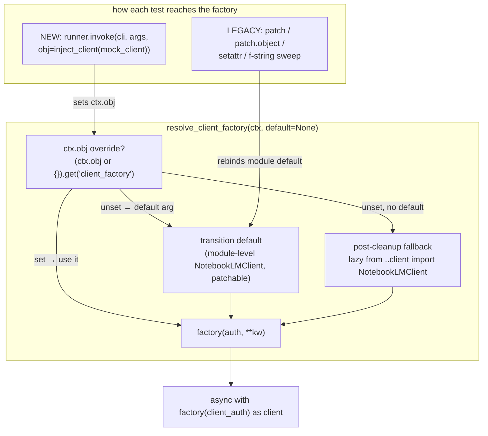

# refactor: Inject NotebookLMClient via ctx.obj and collapse cli/services/* re-export shells

Closes #1481 (ADR-0021 follow-up).

## Summary

Replace the per-command-module `NotebookLMClient` monkeypatch seam with a client
**factory** injected through Click's `ctx.obj`, then delete the eight pure
re-export `cli/services/*` shells so commands import the `_app/` cores directly.
The migration uses a **dual-path transition**: command bodies resolve the factory
from `ctx.obj` but fall back to the still-patchable module-level `NotebookLMClient`,
so the entire test suite stays green at every commit while ~443 string-patch sites
(plus a non-literal tail) move to factory injection unit by unit, before the module
imports and defaults are dropped and a recurrence gate is activated.

---

## Problem Frame

ADR-0021 relocated business logic into `_app/` but deliberately **did not** move
command bodies, preserving two seam classes so cassettes and unit tests stayed
valid without a rewrite:

1. **Client patch seam.** Each `*_cmd.py` imports `from ..client import
   NotebookLMClient`. Ten modules construct it inline (`async with
   NotebookLMClient(client_auth) as client:`); `download_cmd` and `session_cmd`
   instead pass it as `run_client_workflow(..., client_factory=NotebookLMClient)`.
   Tests rebind the module attribute. The surface is larger than a single grep shows:
   - **443** literal `patch("notebooklm.cli.X_cmd.NotebookLMClient")` sites across
     21 files (source_cmd 139, download_cmd 75, generate_cmd 59, artifact_cmd 56,
     chat_cmd 43, note_cmd 36, research_cmd 31, plus singletons).
   - A **non-literal tail** the literal grep misses: `patch.object(module,
     "NotebookLMClient", …)` (`test_language.py:96`, `test_source_symlink.py:108`,
     `test_login_io_seam.py:73`), `monkeypatch.setattr(module, "NotebookLMClient",
     …)` (`cli_vcr/test_error_contract.py:141`, which injects a **real** zero-retry
     client), and f-string sweeps `patch(f"{name}.NotebookLMClient")` across **all
     11** `*_cmd` modules (`test_json_stdout_purity.py:281`, `test_json_error_exit.py:142`).
   - Two **shared cross-module patchers**: `conftest.MultiPatcher` /
     `patch_main_cli_client` patches notebook/chat/session/share together (~79–88
     call sites, each doing `cls.return_value = mock_client; runner.invoke(...)` with
     no `obj=`); the JSON sweeps patch all 11 modules at once.
   - **~481** CLI test functions build a *local* `mock_client = create_mock_client()`,
     configure it (`mock_client.sources.list = AsyncMock(...)`), and **~110** assert
     on that exact instance afterward.

2. **Service re-export shells.** Eight `cli/services/*` modules are pure
   `from ..._app.X import (...)` + `__all__` with zero added behavior, kept so
   existing imports and call-time `service.attr(...)` lookups keep resolving.

The cost is a maintenance tax: after-construction module mutation in tests (against
ADR-0007's stated preference for constructor/factory injection) and near-empty shells
that obscure the real `cli/` ↔ `_app/` boundary. A `client_factory` injection idiom
**already exists** (`run_client_workflow(..., client_factory=NotebookLMClient)`); this
work generalizes it through `ctx.obj` and removes the shells that no longer earn their
indirection.

---

## Key Technical Decisions

- KTD1. **Generalize the existing `client_factory` seam — at every construction
  site.** `auth_runtime.run_client_workflow` already accepts `client_factory`
  defaulting to `NotebookLMClient`. The refactor threads a `resolve_client_factory(ctx,
  default)` helper through **both** construction shapes: the ten inline
  `async with NotebookLMClient(...)` bodies *and* the two
  `run_client_workflow(..., client_factory=NotebookLMClient)` calls
  (`download_cmd:154/159`, `session_cmd:459/464`). For the latter, the explicit arg
  becomes `client_factory=resolve_client_factory(ctx, default=NotebookLMClient)` so
  `ctx.obj` injection actually reaches those commands. Plain Python, no DI container
  (ADR-0008 rejected a DI framework).

- KTD2. **Null-safe, call-time resolution with a two-phase signature.** The helper is
  `resolve_client_factory(ctx, default=None)` returning
  `(ctx.obj or {}).get("client_factory") or default or _client_class()`, where
  `_client_class()` lazily does `from ..client import NotebookLMClient` (so there is a
  production fallback even after module defaults are dropped). Guarded against
  `ctx.obj is None` (the codebase already guards this at `auth_runtime.py:37, 67`).
  **During transition** call sites pass `default=NotebookLMClient` (the module
  attribute, still patchable); **after cleanup** (U10) they call
  `resolve_client_factory(ctx)` and rely on the lazy internal fallback. The factory
  type must accept keyword args — `Callable[..., AbstractAsyncContextManager[Any]]`,
  not the existing one-arg `Callable[[AuthTokens], …]` — because `source add` passes
  `timeout` and `chat ask` passes `timeout`/`chat_timeout`; a narrower type fails mypy
  under `check_untyped_defs`.

- KTD3. **Dual-path transition keeps the suite green at every commit.** Each body's
  `async with NotebookLMClient(<existing args>)` becomes
  `async with resolve_client_factory(ctx, default=NotebookLMClient)(<same existing
  args>) as client:` — preserve each site's existing arguments (most pass only
  `client_auth`; only `source add` and the `chat` commands also pass `**client_kwargs`,
  so do not append `**client_kwargs` where the original didn't). `NotebookLMClient` is
  the **module-level name still bound and still patchable**. A `ctx.obj` override wins when injected (new
  tests); every legacy patch form still works because it rebinds the module-level
  default. The module imports and `default=`/explicit-`client_factory=` args are
  dropped only in the cleanup unit, after every test and shared patcher has moved to
  `ctx.obj` injection. This supersedes a naive per-module-atomic cutover, which is
  impossible while shared cross-module patchers span modules that migrate in different
  units.

- KTD4. **Per-test injection, not one shared fixture.** The dominant test shape
  configures a *local* `mock_client` and asserts on that instance, so a single shared
  `lambda: create_mock_client()` cannot work. Add an `inject_client(mock_client)`
  helper returning `{"client_factory": lambda auth, **kw: mock_client}` (optionally
  recording `auth`/`kwargs`), injected per test via `runner.invoke(cli, args,
  obj=inject_client(mock_client))`. The factory returns the test's own configured
  instance, so existing `mock_client.X.Y.assert_awaited()` assertions keep working —
  the migration is a mechanical swap of `with patch(...) as cls: …; cls.return_value =
  mock_client` for `obj=inject_client(mock_client)`. A vanilla `create_mock_client()`
  default fixture covers tests that don't customize the instance.

- KTD5. **Shell collapse is decoupled from client injection** (Phase 2). Only the eight
  pure shells are removed; `cli/resolve.py`, `cli/services/generate.py`,
  `source_serializers.py`, and every injecting adapter stay (ADR-0021 justified
  adapter/core splits).

- KTD6. **Recurrence gate is attribute-based, scoped to `cli.*_cmd`.** Model it on
  `tests/_guardrails/test_no_session_cmd_patch_surface.py`, which asserts
  `not hasattr(<module>, "NotebookLMClient")` on the live module surface. A repo-wide
  string scan is wrong twice: it false-positives on the **legitimate**
  `patch("notebooklm.client.NotebookLMClient")` (the source-module seam, used by
  `test_cli_contract.py`/`test_completion.py`) and misses `patch.object`/`setattr`/
  f-string forms.

- KTD7. **Extend `RPC_TARGETS`; do not replace.** `test_cli_rpc_envelope.py`
  (`RPC_TARGETS = frozenset({"NotebookLMClient"})`, ~70 commands reach it today) gates
  the envelope routing. **Add** `resolve_client_factory` so converted bodies still
  count, and **keep** `NotebookLMClient`: the guardrail's own synthetic tests
  (`test_cli_rpc_envelope.py:383+`) assert raw `NotebookLMClient` usage is still
  detected, and keeping it catches any future direct re-import (the case the `hasattr`
  gate alone misses).

- KTD8. **Annotation safety before import drop.** Modules using `NotebookLMClient` in
  annotations without `from __future__ import annotations` (`artifact_cmd:115`,
  `note_cmd:70/75`) get that import added before the runtime import is dropped, else
  `NameError`. (`download_cmd:146`, `session_cmd:422` already have future-annotations;
  no other `*_cmd` annotates with the type.)

---

## High-Level Technical Design

Client resolution moves from a per-module global to a `ctx.obj` factory with a
module-level fallback, so legacy patches and new injection coexist until cleanup.
The `_app/` cores and RPC call set are untouched.

Migration order: U1 wires the dual path across all construction sites (suite stays
green, no test changes); U2–U5 move tests to `obj=` injection per module; U6 converts
the shared patchers and their call sites; U10 drops the module imports/defaults; U11
activates the recurrence gate.

---

## Output Structure

No new directory hierarchy. Net change: **−8** files (deleted shells) plus one new
guardrail test and the ADR-0021 amendment.

---

## Requirements

### Client injection

- R1. CLI command modules obtain `NotebookLMClient` from `ctx.obj["client_factory"]`
  (inline and `run_client_workflow` paths alike); after cleanup, no `*_cmd` module is
  monkeypatched for the client in any test (any patch form).
- R2. The default factory is seeded once at the root group via `setdefault`, surviving
  the root callback; resolution is null-safe when `ctx.obj is None` and has a lazy
  production fallback after module defaults are dropped.
- R3. The `**client_kwargs` (timeout / chat_timeout) passthrough is preserved through
  the factory call, and the factory type accommodates it.
- R4. A recurrence gate fails CI if any `*_cmd` module re-exposes a patchable
  `NotebookLMClient` attribute (`hasattr`-based, scoped to `cli.*_cmd`; does not flag
  the legitimate `notebooklm.client.NotebookLMClient` seam).
- R5. `RPC_TARGETS` gains `resolve_client_factory` and **retains** `NotebookLMClient`,
  so the ≥50-commands-reach-RPC invariant and the guardrail's own self-tests both hold.

### Service-shell collapse

- R6. The eight pure re-export shells (`skill_install`, `source_clean`,
  `source_content`, `source_add`, `source_wait`, `chat`, `generate_plans`,
  `artifact_generation`) are deleted; consumers import the `_app/` cores directly.
- R7. Call-time service-attribute seams (`source_add_service.build_source_add_plan` /
  `.validate_upload_path` / `.SourceAddValidationError`,
  `source_clean_service.classify_junk_sources`, the `_INFOGRAPHIC_STYLE_MAP`
  re-import) are repointed to `_app/` without breaking call-time-lookup behavior.
- R8. Justified adapters stay intact: `cli/resolve.py`, `cli/services/generate.py`,
  `source_serializers.py`, and every injecting adapter.

### Guardrails, docs & invariants

- R9. `GUARDED_PATHS` and the `cli/services/` inventory partition stay complete after
  deletions (`test_services_boundary.py` green).
- R10. `docs/architecture.md`'s tree drops the eight **`cli/services/` shell rows
  only** — the freshness check is bidirectional, so the parallel cores stay. Six
  shells share a basename with their core (`source_add/clean/content/wait`, `chat`,
  `generate_plans`) — remove only the indented `cli/services/` row; two do not
  (`skill_install`→`_app/skill.py`, `artifact_generation`→`_app/generate_retry.py`),
  so there is no collision and only the shell row is removed. Stale prose references
  (e.g. the `artifact_generation` mention) are corrected.
- R11. ADR-0021's "Patch-seam discipline" paragraph is corrected.
- R12. `--json` envelope bytes (ADR-0015) and stdout purity are unchanged.
- R13. VCR cassettes are reused with **zero** re-records.

---

## Scope Boundaries

**In scope:** dual-path factory wiring across all `*_cmd` construction sites (inline
and `run_client_workflow`); per-test injection migration of every client-patch site
(all forms, incl. cross-file, shared patchers + their call sites); deletion of the
eight pure shells with import + call-time-seam repointing; `GUARDED_PATHS` /
`architecture.md` / RPC-envelope-guardrail / recurrence-gate updates; ADR-0021
amendment.

**Outside scope (kept deliberately):**
- `cli/resolve.py`, `cli/services/generate.py`, `source_serializers.py`, and the
  injecting adapters.
- The `cli/services/login/refresh.py` client seam (`test_login_io_seam.py:73`) and the
  `NotebookLMClient.from_storage` classmethod path (`test_settings_integration.py:226`):
  these are **service-layer / classmethod** construction sites, not `*_cmd` command
  modules, and the factory never intercepts `from_storage`. Named so they aren't
  silently assumed covered.
- `cli/completion.py` `CompletionProvider._make_client` (`completion.py:180-185`): the
  shell-completion provider **already uses constructor DI** (`self._client_factory`), so
  it has neither problem #1481 targets (no monkeypatch seam, no `*_cmd` module). Completion
  callbacks also run outside the root-group invocation that seeds `ctx.obj`, so the
  `ctx.obj` factory is not reliably reachable there. Left on its own injection seam.
- Any CLI behavior, `--json` envelope shape, exit codes, or RPC traffic.

### Deferred to Follow-Up Work

- Migrating the `cli/services/login/refresh.py` client seam to the `ctx.obj` factory.
- Pushing more CLI end-to-end tests down into `_app/` direct coverage (ADR-0021 kept
  the CLI's end-to-end coverage).

---

## Implementation Units

Phase 1 (U1–U6, U10, U11) wires the factory and migrates the client seams. Phase 2
(U7–U8) collapses the shells. Phase 3 (U9) updates the records.

### U1. Wire the dual-path factory across all construction sites (backward-compatible)

- **Goal:** Land the `ctx.obj` factory seam, the per-test injection helper, and the
  guardrail updates with **no test changes** — the suite stays 100% green.
- **Requirements:** R2, R3, R5
- **Dependencies:** none
- **Files:**
  - `src/notebooklm/cli/auth_runtime.py` — add `resolve_client_factory(ctx, default=None)` (null-safe, lazy fallback, kwargs-tolerant factory type); make `run_client_workflow`'s `client_factory is None` branch read `ctx.obj`.
  - `src/notebooklm/cli/helpers.py` — re-export `resolve_client_factory`.
  - `src/notebooklm/notebooklm_cli.py` — seed `ctx.obj.setdefault("client_factory", None)` in the root callback.
  - The 10 inline `*_cmd.py` — convert each `async with NotebookLMClient(<existing args>)` to `async with resolve_client_factory(ctx, default=NotebookLMClient)(<same existing args>) as client:`, preserving each site's args verbatim (most pass only `client_auth`; `source add`/`chat` pass `**client_kwargs` — do not add `**client_kwargs` where the original lacked it). Keep the import and the `default=` reference.
  - `src/notebooklm/cli/download_cmd.py:154-159`, `src/notebooklm/cli/session_cmd.py:459-464` — change `client_factory=NotebookLMClient` to `client_factory=resolve_client_factory(ctx, default=NotebookLMClient)` (keep the import).
  - `tests/_guardrails/test_cli_rpc_envelope.py:73` — add `resolve_client_factory` to `RPC_TARGETS` (keep `NotebookLMClient`).
  - `tests/unit/cli/conftest.py` — add `inject_client(mock_client)` helper (+ optional recorder).
- **Approach:** Purely additive. The resolver prefers an injected `ctx.obj` factory and otherwise calls the module-level `NotebookLMClient` (still patchable), so all 443 string sites, the `patch.object`/`setattr` tail, the f-string sweeps, and MultiPatcher keep working untouched. Adding `resolve_client_factory` to `RPC_TARGETS` preserves the envelope invariant (both targets present in this unit).
- **Patterns to follow:** `run_client_workflow` (`auth_runtime.py:260-293`); the `ctx.obj`-None guards (`auth_runtime.py:37-39, 67`); `create_mock_client` (`conftest.py:286-402`).
- **Test scenarios:**
  - The full existing suite passes unchanged (green-at-every-commit invariant).
  - With `obj=inject_client(mock_client)`, a command resolves the injected instance and ignores the module default — for both an inline command (e.g. `source list`) and a `run_client_workflow` command (`download`/`session use`).
  - With `ctx.obj is None`, `resolve_client_factory` returns the default without raising; with no default it lazily resolves `NotebookLMClient`.
  - `inject_client`'s recorder captures `client_kwargs` (timeout passthrough); mypy passes the kwargs-tolerant factory type.
  - `test_cli_rpc_envelope` still counts ≥50 RPC commands.
  - Covers R2, R3, R5.
- **Verification:** `uv run pytest` fully green; `test_cli_rpc_envelope` green; mypy/ruff clean; no test file changed except conftest additions.

### U2. Migrate source_cmd client tests to injection

- **Goal:** Move source_cmd's client-patch sites (139 string + the tail) to `obj=`.
- **Requirements:** R1 (partial), R12, R13
- **Dependencies:** U1
- **Files:** source_cmd test files in `tests/unit/cli/`, **plus** the cross-file sites: `tests/unit/test_source_symlink.py:108`, `tests/unit/cli/test_prompt_file.py:172`, `tests/unit/cli/test_notebook.py:1127`, `tests/unit/cli/test_quiet_flag.py:271`.
- **Approach:** Replace `with patch(...) as cls: …; cls.return_value = mock_client` with `obj=inject_client(mock_client)` on the `runner.invoke`. Per-instance assertions unchanged (KTD4). Module default stays (shared sweeps still reference it). Watch `source add`'s `**client_kwargs` and the `--json` clean/add branches.
- **Patterns to follow:** U1's `inject_client`.
- **Test scenarios:**
  - Each migrated `source` command resolves the injected mock; per-instance `assert_awaited` assertions pass.
  - `source add --timeout` threads `client_kwargs` (recorder asserts).
  - `source clean --json` / `source add --json` bytes unchanged.
  - No client patch (any form) remains in source_cmd tests.
- **Verification:** source_cmd tests green via injection; `cli_vcr` source tests replay clean.

### U3. Migrate download_cmd + session_cmd client tests to injection

- **Goal:** Move download_cmd (75) + session_cmd client tests to injection — now
  effective because U1 made the `run_client_workflow` arg `ctx.obj`-aware.
- **Requirements:** R1 (partial), R12, R13
- **Dependencies:** U1
- **Files:** download_cmd + session_cmd test files. Repoint `test_settings_integration.py:226` (`patch("...session_cmd.NotebookLMClient.from_storage")`) to `notebooklm.client.NotebookLMClient.from_storage` — the classmethod path the factory does not intercept.
- **Approach:** Tests switch to `obj=inject_client(...)`. Because U1 changed `client_factory=NotebookLMClient` to `client_factory=resolve_client_factory(ctx, default=NotebookLMClient)`, the injected factory now reaches these commands. Confirm the `client_factory` key doesn't collide with `session_cmd`'s `ctx.obj["profile"]` reads.
- **Patterns to follow:** U2.
- **Test scenarios:**
  - `download` / `session` commands resolve the injected client (verify the factory is actually used, not the real client); `--json` and download paths unchanged; `session` still reads `profile`.
  - The repointed `from_storage` patch still intercepts after U10 drops the session_cmd import.
  - No client patch remains in either module's tests.
- **Verification:** both modules' tests green via injection; `cli_vcr` download tests replay clean.

### U4. Migrate generate_cmd + artifact_cmd client tests + annotation safety

- **Goal:** Move generate/artifact client tests to injection; make artifact_cmd
  annotation-safe.
- **Requirements:** R1 (partial), R3, R12, R13
- **Dependencies:** U1
- **Files:** generate_cmd + artifact_cmd test files; `src/notebooklm/cli/artifact_cmd.py` — add `from __future__ import annotations` (uses `client: NotebookLMClient` at line 115; KTD8).
- **Approach:** Per U2. Keep the `artifact_generation` shell collapse out (U8).
- **Patterns to follow:** U2.
- **Test scenarios:**
  - `generate <type>` / `artifact list|get|generate` resolve the injected client; retry/backoff and `--json` unchanged.
  - artifact_cmd imports cleanly with future-annotations.
  - No client patch remains in either module's tests.
- **Verification:** tests green via injection; cassettes replay clean.

### U5. Migrate chat_cmd + note_cmd + research_cmd client tests + annotation safety

- **Goal:** Move chat/note/research client tests to injection; make note_cmd
  annotation-safe.
- **Requirements:** R1 (partial), R3, R12, R13
- **Dependencies:** U1
- **Files:** chat_cmd + note_cmd + research_cmd test files; `src/notebooklm/cli/note_cmd.py` — add `from __future__ import annotations` (uses `client: NotebookLMClient` at lines 70/75; KTD8).
- **Approach:** Per U2. `chat ask`/`configure`/`history` pass `**client_kwargs` (`timeout`/`chat_timeout`) — preserve via the factory call. Keep the `cli/services/chat.py` collapse out (U8).
- **Patterns to follow:** U2.
- **Test scenarios:**
  - `ask`/`configure`/`history`, `note` CRUD, `research` resolve the injected client; `chat ask --timeout` threads kwargs; `--json` unchanged.
  - note_cmd imports cleanly with future-annotations.
  - No client patch remains in the three modules' tests.
- **Verification:** tests green via injection; cassettes replay clean.

### U6. Convert shared cross-module patchers and their call sites + stragglers

- **Goal:** Retire `MultiPatcher`/`patch_main_cli_client`, the all-module JSON sweeps,
  the real-factory `cli_vcr` seam, and the remaining straggler tests — all to `obj=`
  injection.
- **Requirements:** R1 (partial), R12, R13
- **Dependencies:** U2, U3, U4, U5
- **Files:**
  - `tests/unit/cli/conftest.py` — convert `MultiPatcher`/`patch_main_cli_client`/`MultiMockProxy` (notebook/chat/session/share) to inject via `obj=`, **and** edit the ~79–88 consumer call sites (e.g. `test_notebook.py:44`, `test_share.py:42`) that do `cls.return_value = mock_client; runner.invoke(...)` with no `obj` — or provide a compatibility wrapper that injects `obj`. (conftest-only is insufficient; the call sites set the instance.)
  - `tests/unit/test_json_stdout_purity.py`, `tests/unit/test_json_error_exit.py` — convert the all-11-module f-string sweeps to `obj=` injection.
  - `tests/integration/cli_vcr/test_error_contract.py:141` — migrate the `monkeypatch.setattr(notebook_cmd, "NotebookLMClient", _factory)` real zero-retry factory to `obj=inject_client_factory(real_factory)` (the factory path must accept real factories, not only mocks).
  - `tests/unit/cli/test_language.py:96` (canary `patch.object`); `tests/unit/cli/test_label_cmd.py` — migrate the patch **helper at line 35** and delete the `hasattr(label_cmd, "NotebookLMClient")` assertion (`test_label_cmd.py:408`, in the seam-existence test at `:404`); share/notebook straggler tests.
- **Approach:** Once these are injection-based, no test depends on a `*_cmd` module-level `NotebookLMClient` attribute. Module defaults still exist (dropped in U10), so the suite stays green here.
- **Patterns to follow:** U1's `inject_client`; the converted per-module tests.
- **Test scenarios:**
  - MultiPatcher consumers, JSON sweeps, the real-factory `cli_vcr` path, and stragglers resolve injected clients/factories; cassettes unchanged (zero re-records).
  - `test_label_cmd` no longer patches or asserts the module seam.
  - Repo-wide: no test (any form) relies on a `*_cmd.NotebookLMClient` attribute.
- **Verification:** full suite green; `cli_vcr` replays clean.

### U10. Drop module imports, defaults, and explicit-factory args

- **Goal:** Remove the now-dead module-level client surface across all 12 `*_cmd`.
- **Requirements:** R1 (completes)
- **Dependencies:** U6 (every test and patcher now injects)
- **Files:** All 12 `*_cmd.py` — drop `from ..client import NotebookLMClient`, the inline `default=NotebookLMClient` args (→ `resolve_client_factory(ctx)`), and the `download_cmd`/`session_cmd` `client_factory=resolve_client_factory(ctx, default=NotebookLMClient)` → `resolve_client_factory(ctx)`. Verify no residual `NotebookLMClient` references (isinstance, `cli/__init__.py` re-exports, `__all__`). Re-tighten `tests/_guardrails/test_module_size_ratchet.py` `cli/source_cmd.py` ceiling to the new (smaller) measured LOC — the ratchet **fails on shrink-without-update**, so this is self-enforced (U1 bumped it 964→966 transiently).
- **Approach:** With `default` gone, the resolver's lazy `from ..client import
  NotebookLMClient` fallback (KTD2) supplies production behavior. Annotation users
  (artifact_cmd, note_cmd) are already future-annotations-safe (U4/U5); download/session
  already are. Confirm mypy passes with the imports removed.
- **Patterns to follow:** the resolver fallback from KTD2.
- **Test scenarios:**
  - Every command still constructs a client via the resolver (production path) — smoke-test one command per module without injection (real fallback) and one with injection.
  - mypy/ruff clean with all `NotebookLMClient` imports removed from `*_cmd`.
  - Test expectation: behavior parity (no new behavior).
- **Verification:** `hasattr(<*_cmd>, "NotebookLMClient")` is False for all command modules; full suite green; mypy/ruff clean; cassettes unchanged.

### U11. Activate the recurrence gate

- **Goal:** Lock the pattern shut.
- **Requirements:** R4, R5
- **Dependencies:** U10
- **Files:** `tests/_guardrails/test_no_cli_client_patch_surface.py` (new) — `hasattr`-based gate asserting every `notebooklm.cli.*_cmd` module lacks a `NotebookLMClient` attribute, modeled on `test_no_session_cmd_patch_surface.py`. `RPC_TARGETS` keeps **both** `NotebookLMClient` (its self-tests at `test_cli_rpc_envelope.py:383+` depend on it; detects future direct re-imports) and `resolve_client_factory`.
- **Approach:** Must land after U10 (the attribute is gone). The gate catches string/`patch.object`/`setattr`/f-string rebinds and ignores `notebooklm.client.NotebookLMClient`.
- **Patterns to follow:** `tests/_guardrails/test_no_session_cmd_patch_surface.py`.
- **Test scenarios:**
  - Gate self-test: a synthetic `*_cmd` with a `NotebookLMClient` attribute is detected; the live tree asserts the attribute absent on every `*_cmd`.
  - `test_cli_rpc_envelope` self-tests still pass with both targets present.
  - Covers R4, R5.
- **Verification:** gate green; RPC-envelope self-tests green; full suite green.

### U7. Collapse source_* re-export shells + repoint call-time seams + guardrails

- **Goal:** Delete `source_add`/`source_clean`/`source_content`/`source_wait` shells.
- **Requirements:** R6, R7, R8, R9, R10, R12, R13
- **Dependencies:** U2 (both edit `source_cmd.py`; sequence after U2)
- **Files:**
  - Delete `src/notebooklm/cli/services/{source_add,source_clean,source_content,source_wait}.py`.
  - `src/notebooklm/cli/source_cmd.py` (80–121) and `src/notebooklm/cli/_source_render.py` (29–58, call-time seams at 66/72/73/80) — repoint to `_app.source_*`; preserve the call-time form via `from .._app import source_add as source_add_service` aliases (two dots — these files sit directly under `notebooklm/cli/`, one level above the deleted shells, so the three-dot `..._app` form used inside `cli/services/` is wrong here).
  - Test importers by **rewrite shape**: `tests/unit/test_source_add_service.py:16` (package import), `tests/unit/test_cli_source_services.py:14-35` (individual modules), `tests/unit/cli/test_source_cmd_coverage.py:28` (single symbol). Repoint each to `_app`.
  - `tests/unit/cli/test_services_boundary.py` — remove the 4 `GUARDED_PATHS` entries.
  - `docs/architecture.md` — remove only the 4 `cli/services/` indented rows (e.g. 1149/1150/1151/1156); keep the `_app/` core rows.
- **Approach:** Atomic delete + inventory edit + tree edit (the boundary and freshness tests scan the filesystem). The alias preserves call-time-attribute discipline.
- **Patterns to follow:** the `generate.py` adapter's call-time alias style; ADR-0008.
- **Test scenarios:**
  - `source add|clean|get|fulltext|guide|stale|wait` behave identically; `--json` unchanged.
  - Call-time seams resolve from `_app/` (a test patching `_app.source_add.validate_url` still intercepts).
  - `test_services_boundary` inventory + `test_claude_md_freshness` pass.
  - Test expectation: characterization parity only.
- **Verification:** the 4 files gone; importers resolve; boundary + freshness green; `cli_vcr` source tests replay clean.

### U8. Collapse remaining re-export shells + guardrails

- **Goal:** Delete `skill_install`/`chat`/`generate_plans`/`artifact_generation` shells.
- **Requirements:** R6, R7, R8, R9, R10, R12
- **Dependencies:** U4 (artifact_generation ↔ generate_cmd), U5 (chat ↔ chat_cmd)
- **Files:**
  - Delete `src/notebooklm/cli/services/{skill_install,chat,generate_plans,artifact_generation}.py`.
  - `chat_cmd.py:30` → `_app.chat`; `generate_cmd.py:43` → `_app.generate_retry`; `cli/services/generate.py:44-46` → keep the explicit `_INFOGRAPHIC_STYLE_MAP` alias, sourced from `_app.generate_plans` (preserve the 2-hop private re-export chain).
  - `tests/unit/cli/test_generate.py`, `tests/unit/app/test_app_generate_retry.py` — repoint.
  - `tests/unit/cli/test_services_boundary.py` — remove the 4 `GUARDED_PATHS` entries.
  - `docs/architecture.md` — remove the 4 `cli/services/` shell rows (no `_app/` collision for `skill_install`→`skill.py` / `artifact_generation`→`generate_retry.py`); fix the stale **prose** reference to `cli/services/artifact_generation.py`.
- **Approach:** `skill_install` has **no live consumers** — `skill_cmd.py:17` already imports `report_mixed_no_clobber_up_to_date` from `_app.skill`, so deletion is inventory-only. Same atomicity as U7.
- **Patterns to follow:** U7.
- **Test scenarios:**
  - `chat` / `generate` / artifact-retry / skill-install behaviors unchanged; `_INFOGRAPHIC_STYLE_MAP` still importable via `cli/services/generate.py`.
  - `test_services_boundary` + `test_claude_md_freshness` green.
  - Test expectation: characterization parity only.
- **Verification:** the 4 files gone; importers resolve; boundary + freshness green; suite green; mypy/ruff clean.

### U9. ADR update

- **Goal:** Correct the record so docs don't contradict the code.
- **Requirements:** R11
- **Dependencies:** U11, U8
- **Files:** `docs/adr/0021-transport-neutral-app-layer.md` — amend the "Patch-seam
  discipline" paragraph (client injected via `ctx.obj`; the `patch(...NotebookLMClient)`
  seams retired; the eight shells collapsed). Record the `ctx.obj` factory decision and
  the RPC-envelope/recurrence-gate changes inline. Note that `ctx.obj['client_factory']`
  is the **CLI adapter's** seam — a future MCP/HTTP front-end injects through `_app/`'s
  `execute_<verb>(plan, client)` signature, not this Click-specific key.
- **Approach:** Amend in place (no stratification). Verify against
  `tests/_guardrails/test_adr_reference_format.py`. A standalone new ADR is **not**
  required by the issue; fold the decision into the ADR-0021 amendment.
- **Patterns to follow:** ADR-0015's amendment-note style.
- **Test scenarios:** Test expectation: none — documentation. `test_adr_reference_format` stays green.
- **Verification:** ADR format guardrail green; ADR-0021 no longer asserts the removed seams.

---

## Risks & Dependencies

- **`run_client_workflow` explicit-factory sites (R1).** `download_cmd`/`session_cmd`
  bypass `ctx.obj` unless U1 rewrites their `client_factory=` arg; the rewrite must land
  in U1 (wiring) and the args drop in U10 (cleanup), or injection silently no-ops and the
  import drop `NameError`s.
- **Post-cleanup resolver fallback (R2).** After U10 drops `default=NotebookLMClient`, the
  resolver must lazily import the real client; specify `resolve_client_factory(ctx,
  default=None)` with the internal fallback or production breaks.
- **Factory typing (R3).** Type the factory `Callable[..., AbstractAsyncContextManager[Any]]`
  to accept `**client_kwargs`; a one-arg type fails mypy under `check_untyped_defs`.
- **Shared-patcher call sites (U6).** Converting `MultiPatcher` requires editing the ~79–88
  consumer invokes (or a compat wrapper) — conftest-only is insufficient.
- **RPC-envelope targets (R5).** Keep `NotebookLMClient` in `RPC_TARGETS`; its self-tests
  depend on it and it guards future direct re-imports.
- **Cassette drift (R13).** Construction-site-only edits should not move RPC traffic; replay
  `cli_vcr` with no `record_mode` per unit. Watch the real-factory path (U6).
- **`--json` byte drift (R12).** Keep the contract/purity sweeps green per unit; never touch
  envelope-builder code.
- **architecture.md basenames (R10).** Six shells collide with their core basename (remove
  only the `cli/services/` row); two (`skill_install`, `artifact_generation`) do not.
- **Inventory/freshness coupling.** Bundle each shell delete with its `GUARDED_PATHS` and
  tree-row edits (U7/U8).

## Sources / Research

- Issue #1481 (this plan closes it). The referenced
  `docs/scratch/2026-06-08-cli-refactor-log.md` does **not** exist — plan built from the
  issue + ADRs + three reviewer rounds (ce-doc-review; momus/claude + momus/codex ×2).
- ADR-0021 — "Patch-seam discipline" (superseded clause) + kept-adapter rule (`cli/resolve.py`).
- ADR-0007 — forbidden-pattern-4 is private-`notebooklm._*` scoped; the public
  `patch(...NotebookLMClient)` seams are not lint violations today. Lint:
  `tests/_guardrails/test_no_forbidden_monkeypatches.py`.
- ADR-0008 (services extraction; no DI container); ADR-0015 (`--json` byte-stability).
- Factory idiom: `auth_runtime.py:260-293` (`run_client_workflow`, one-arg `client_factory`
  type at `:267`); explicit-arg sites `download_cmd.py:154/159`, `session_cmd.py:459/464`;
  `ctx.obj` seeding `notebooklm_cli.py:218-228`; null guards `auth_runtime.py:37-39, 67`.
- Test surface: `create_mock_client` (`conftest.py:286-402`); `MultiPatcher` /
  `patch_main_cli_client` (`conftest.py:428-473`, ~79–88 call sites set the instance with no
  `obj=`); f-string sweeps (`test_json_stdout_purity.py:266-281`, `test_json_error_exit.py:127-142`);
  `patch.object` tail (`test_language.py:96`, `test_source_symlink.py:108`,
  `test_login_io_seam.py:73`); real-factory `setattr` (`cli_vcr/test_error_contract.py:141`);
  label patch helper + assertion (`test_label_cmd.py:35, 404`); `from_storage` path
  (`test_settings_integration.py:226`).
- Guardrails: RPC-envelope `RPC_TARGETS` (`test_cli_rpc_envelope.py:73`) + its self-tests
  (`:383+`); recurrence precedent (`test_no_session_cmd_patch_surface.py:105`); inventory
  (`test_services_boundary.py`); freshness (`scripts/check_claude_md_freshness.py:189/194`
  over `docs/architecture.md` — bidirectional; double rows e.g. 977 vs 1149).
- Annotations needing future-import: `artifact_cmd.py:115`, `note_cmd.py:70/75`
  (download/session already have it).
- Typing constraint: `pyproject.toml:157` (`check_untyped_defs = true`).
